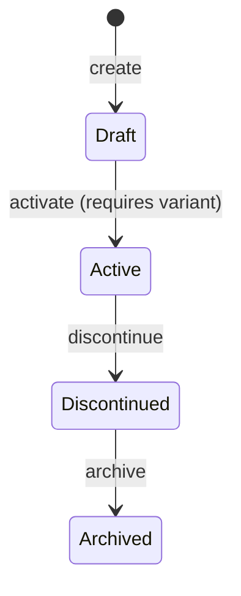

# Catalogue

> Manages the product catalogue: products, variants, categories, pricing, and images.

## Business Context

The Catalogue context is the storefront window of ShopStream. It owns everything
that describes what is for sale: products with their variants, pricing (including
tier-specific discounts), images, SEO metadata, and the category hierarchy that
organizes them for browsing.

This is a separate bounded context because product information has different
consistency needs and change patterns than customer identity or order processing.
Products are created and updated by sellers, while orders are created by customers.
A product can exist without any customer ever buying it. And critically, product
data changes (price updates, new images) must not retroactively alter existing
orders -- the Ordering context snapshots product data at purchase time.

Think of the Catalogue as a retail store's merchandising department. They manage
what's on the shelves, set prices, organize departments and aisles (categories),
and take product photos. They don't handle the cash register (Ordering) or
customer membership cards (Identity).

## Ubiquitous Language

| Term | Definition | Code Element |
|------|-----------|-------------|
| Product | A sellable item identified by a unique SKU, with a lifecycle from Draft to Active to Archived | `Product` ([source](../../src/catalogue/product/product.py)) |
| Category | A node in the browsing hierarchy (up to 5 levels), organizing products | `Category` ([source](../../src/catalogue/category/category.py)) |
| Variant | A purchasable configuration of a Product with its own SKU, price, and physical attributes | `Variant` ([source](../../src/catalogue/product/product.py)) |
| Image | A product photo with URL, alt text, display order, and primary flag | `Image` ([source](../../src/catalogue/product/product.py)) |
| SKU | Stock Keeping Unit -- a unique alphanumeric code identifying a product or variant | `SKU` ([source](../../src/catalogue/shared/sku.py)) |
| Price | A variant's pricing: base price, currency, and optional tier-specific discounts | `Price` ([source](../../src/catalogue/product/product.py)) |
| SEO | Search engine metadata: title, description, URL slug | `SEO` ([source](../../src/catalogue/product/product.py)) |
| Dimensions | Physical measurements (length, width, height) in cm or in | `Dimensions` ([source](../../src/catalogue/product/product.py)) |
| Weight | Physical weight in kg, lb, g, or oz | `Weight` ([source](../../src/catalogue/product/product.py)) |
| Product Status | Lifecycle: Draft &rarr; Active &rarr; Discontinued &rarr; Archived | `ProductStatus` ([source](../../src/catalogue/product/product.py)) |
| Product Visibility | Who can see it: Public, Unlisted, Tier Restricted | `ProductVisibility` ([source](../../src/catalogue/product/product.py)) |

Full definitions: [Glossary](../glossary.md#catalogue-context)

## Domain Model

### Product (Aggregate)

A Product represents a sellable item in the catalogue. It is the aggregate root
because products, their variants, and their images must be consistent: you cannot
activate a product without at least one variant, and you must always have exactly
one primary image when images exist.

Products follow a strict lifecycle (Draft &rarr; Active &rarr; Discontinued &rarr; Archived)
that gates what operations are available. Draft products can be freely edited.
Active products are visible and purchasable. Discontinued products are no longer
sold but remain visible. Archived products are removed from visibility entirely.

**Entities:**

| Entity | Role | Identity |
|--------|------|----------|
| Variant | A purchasable configuration (size, color, etc.) with its own SKU and price | System-generated ID within the Product |
| Image | A product photograph or rendering with URL and display ordering | System-generated ID within the Product |

**Value Objects:**

| Value Object | Captures | Key Constraints |
|-------------|----------|----------------|
| SKU | Unique product/variant identifier code | 3-50 chars, alphanumeric + hyphens, no leading/trailing/consecutive hyphens |
| Price | Variant pricing with tier support | Base price > 0, tier prices must be less than base price |
| SEO | Search engine metadata | Title max 70, description max 160, slug is lowercase alphanumeric + hyphens |
| Dimensions | Physical measurements | Length/width/height >= 0, unit must be cm or in |
| Weight | Physical weight | Value >= 0, unit must be kg/lb/g/oz |

**Invariants (rules that must always hold):**

- A product cannot have more than 10 images.
- When images exist, exactly one must be marked as primary.
- Only draft products can be activated.
- A product must have at least one variant to be activated.
- Only active products can be discontinued.
- Only discontinued products can be archived.
- Tier prices must be valid JSON, each price must be positive, and each must be less than the base price.
- SEO slugs must be URL-safe: lowercase alphanumeric + hyphens, no leading/trailing/consecutive hyphens.

**State Machine: Product Status**

A Product begins as a Draft when first created by a seller. In Draft state, the
seller adds variants, images, pricing, and descriptions. When ready for sale,
the product is Activated (requires at least one variant). Active products appear
in the catalogue and can be purchased.

When a product is no longer sold, it moves to Discontinued -- still visible for
reference (existing orders, reviews) but not purchasable. Finally, it can be
Archived to remove it from all visibility.

The lifecycle is strictly forward -- there is no path back from Discontinued to
Active, for example. If a discontinued product needs to be re-listed, business
process would create a new product.

### Category (Aggregate)

A Category organizes products into a browsable hierarchy up to 5 levels deep
(levels 0-4). Categories are a separate aggregate from Product because they have
independent identity, independent lifecycle (deactivation), and multiple products
can belong to the same category.

Categories reference their parent via `parent_category_id`, forming a tree. Each
category has a `display_order` for controlling the sequence within its level and a
set of `attributes` (JSON) that define what metadata products in this category
should have.

**Invariants:**

- Category level must be 0-4 (max 5 levels deep).
- A category that is already inactive cannot be deactivated again.

**Lifecycle:**

Categories are created, can be updated (name, attributes), reordered (change
display_order), and deactivated. Deactivation is soft-delete -- the category
remains in the database but is hidden from navigation. There is no hard delete
to protect referential integrity with products.

## Events

### Product Events

| Event | Trigger | Consequence |
|-------|---------|-------------|
| `ProductCreated` | Seller creates a new product | ProductCard, ProductDetail, SellerCatalogue projections created |
| `ProductDetailsUpdated` | Seller updates title, description, brand, or SEO | ProductCard, ProductDetail projections updated |
| `VariantAdded` | Seller adds a variant to a product | ProductDetail projection updated |
| `VariantPriceChanged` | Seller changes a variant's base price | ProductDetail, PriceHistory projections updated |
| `TierPriceSet` | Seller sets a tier-specific discount price | ProductDetail projection updated |
| `ProductImageAdded` | Seller uploads a product image | ProductDetail projection updated |
| `ProductImageRemoved` | Seller removes a product image | ProductDetail projection updated |
| `ProductActivated` | Product moves from Draft to Active | ProductCard (status), SellerCatalogue updated |
| `ProductDiscontinued` | Product moves from Active to Discontinued | ProductCard (status), SellerCatalogue updated |
| `ProductArchived` | Product moves from Discontinued to Archived | ProductCard (status), SellerCatalogue updated |

### Category Events

| Event | Trigger | Consequence |
|-------|---------|-------------|
| `CategoryCreated` | Admin creates a new category | CategoryTree projection updated |
| `CategoryDetailsUpdated` | Admin updates name or attributes | CategoryTree projection updated |
| `CategoryReordered` | Admin changes display order | CategoryTree projection updated |
| `CategoryDeactivated` | Admin deactivates a category | CategoryTree projection updated |

## Command Flows

### Product Commands

| Command | Who Initiates | What Happens | Events Raised |
|---------|--------------|-------------|---------------|
| `CreateProduct` | Seller | Creates a new product in Draft status with a unique SKU | `ProductCreated` |
| `UpdateProductDetails` | Seller | Updates title, description, brand, attributes, and/or SEO | `ProductDetailsUpdated` |
| `AddVariant` | Seller | Adds a purchasable variant with SKU, price, and physical attributes | `VariantAdded` |
| `UpdateVariantPrice` | Seller | Changes a variant's base price | `VariantPriceChanged` |
| `SetTierPrice` | Seller | Sets a tier-specific discount price on a variant | `TierPriceSet` |
| `AddProductImage` | Seller | Uploads an image (first image auto-primary) | `ProductImageAdded` |
| `RemoveProductImage` | Seller | Removes an image (reassigns primary if needed) | `ProductImageRemoved` |
| `ActivateProduct` | Seller | Moves product from Draft to Active | `ProductActivated` |
| `DiscontinueProduct` | Seller/Admin | Moves product from Active to Discontinued | `ProductDiscontinued` |
| `ArchiveProduct` | Admin | Moves product from Discontinued to Archived | `ProductArchived` |

### Category Commands

| Command | Who Initiates | What Happens | Events Raised |
|---------|--------------|-------------|---------------|
| `CreateCategory` | Admin | Creates a new category at a given level | `CategoryCreated` |
| `UpdateCategory` | Admin | Updates category name and/or attributes | `CategoryDetailsUpdated` |
| `ReorderCategory` | Admin | Changes the display order of a category | `CategoryReordered` |
| `DeactivateCategory` | Admin | Soft-deletes a category (hides from navigation) | `CategoryDeactivated` |

## Read Models (Projections)

| Projection | Purpose | Built From |
|-----------|---------|-----------|
| `ProductCard` | Lightweight product listing for search/browse: title, SKU, status, category | `ProductCreated`, `ProductDetailsUpdated`, `ProductActivated`, `ProductDiscontinued`, `ProductArchived` |
| `ProductDetail` | Full product view with all variants, images, pricing, and SEO | All Product events |
| `SellerCatalogue` | Products grouped by seller_id for seller dashboards | `ProductCreated`, `ProductActivated`, `ProductDiscontinued`, `ProductArchived` |
| `PriceHistory` | Audit trail of price changes per variant | `VariantPriceChanged` |
| `CategoryTree` | Hierarchical category navigation with breadcrumbs and product counts | All Category events, `ProductCreated` |

## Cross-Context Relationships

| This Context Provides | To Other Context | How |
|----------------------|-----------------|-----|
| `product_id`, `variant_id`, `sku` | Ordering | Order Items snapshot these at order creation time, along with title and price |
| `category_id` | (internal) | Products reference categories by ID for organization |

The Catalogue context is upstream of Ordering -- it provides product data that
Ordering snapshots at purchase time. The Ordering context never queries the
Catalogue after an order is created.

## Design Decisions

### Two Aggregates: Product and Category

**Problem:** Should Category be part of Product, or its own aggregate?

**Decision:** Category is a separate aggregate.

**Rationale:** Categories have independent identity (they exist before any products
are added to them), independent lifecycle (deactivation), and are shared across many
products. Embedding categories in products would mean duplicating category data and
losing the ability to manage the hierarchy independently.

**Trade-off:** Category validation (does the category_id on a Product actually exist?)
is not enforced at the aggregate level. It would need to be checked in the command handler
or via eventual consistency.

### Tier Pricing on Variants, Not Products

**Problem:** Where should tier-specific pricing live?

**Decision:** Tier prices are stored on the Price value object within each Variant.

**Rationale:** In most e-commerce systems, different variants (sizes, materials) have
different base prices, and tier discounts may differ per variant. Storing tier prices
at the variant level gives sellers full control over per-configuration pricing.

**Trade-off:** Setting tier prices requires specifying the variant_id, adding a step
for sellers who want the same tier discount across all variants.

### Forward-Only Product Lifecycle

**Problem:** Should discontinued products be re-activatable?

**Decision:** No. The lifecycle is strictly forward: Draft &rarr; Active &rarr; Discontinued &rarr; Archived.

**Rationale:** Re-activating a product after discontinuation creates confusion for
customers ("I thought this was discontinued?") and for inventory systems. If a product
needs to be re-listed, creating a new product entry is cleaner and preserves the history
of the original.

**Trade-off:** Sellers must create a new product if they want to re-list a discontinued item.

## Source Code Map

| Concern | Location |
|---------|----------|
| Product aggregate + entities + value objects | [`src/catalogue/product/product.py`](../../src/catalogue/product/product.py) |
| Product events | [`src/catalogue/product/events.py`](../../src/catalogue/product/events.py) |
| Product creation command + handler | [`src/catalogue/product/creation.py`](../../src/catalogue/product/creation.py) |
| Product details command + handler | [`src/catalogue/product/details.py`](../../src/catalogue/product/details.py) |
| Variant commands + handler | [`src/catalogue/product/variants.py`](../../src/catalogue/product/variants.py) |
| Image commands + handler | [`src/catalogue/product/images.py`](../../src/catalogue/product/images.py) |
| Product lifecycle commands + handler | [`src/catalogue/product/lifecycle.py`](../../src/catalogue/product/lifecycle.py) |
| Category aggregate | [`src/catalogue/category/category.py`](../../src/catalogue/category/category.py) |
| Category events | [`src/catalogue/category/events.py`](../../src/catalogue/category/events.py) |
| Category commands + handler | [`src/catalogue/category/management.py`](../../src/catalogue/category/management.py) |
| Projections + projectors | [`src/catalogue/projections/`](../../src/catalogue/projections/) |
| API routes | [`src/catalogue/api/routes.py`](../../src/catalogue/api/routes.py) |
| API schemas (Pydantic) | [`src/catalogue/api/schemas.py`](../../src/catalogue/api/schemas.py) |
| Shared value objects | [`src/catalogue/shared/`](../../src/catalogue/shared/) |
