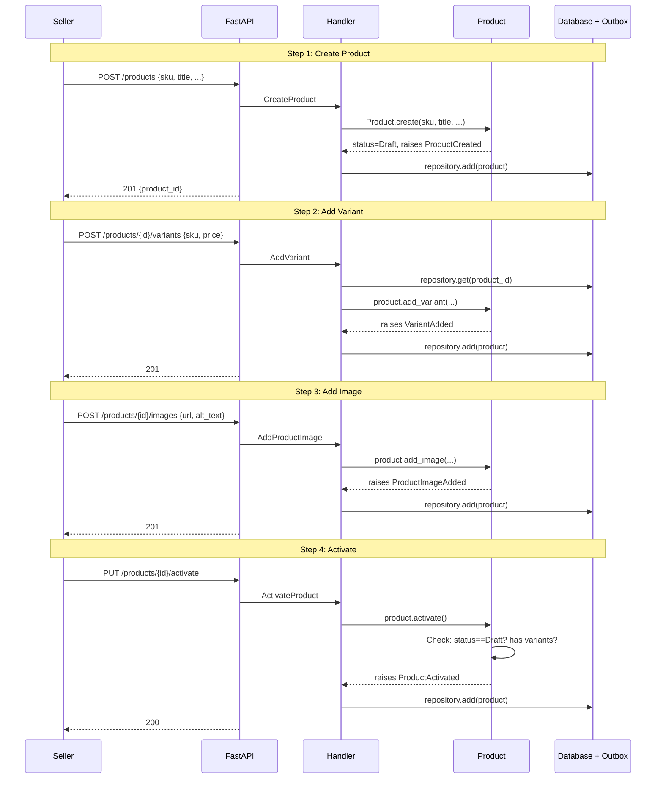

# Product Lifecycle: From Draft to Active

> A seller creates a new product, adds a variant with pricing, uploads an image,
> and activates it for sale.

## The Story

Alex runs a small electronics shop on ShopStream. He wants to list a new wireless
mouse for sale. He starts by creating the product listing with a title, description,
and SKU. The product starts as a Draft -- invisible to buyers.

Next, Alex adds a variant (the specific model with its own SKU and price), then
uploads a product photo. Finally, he activates the product, making it live in the
catalogue and available for purchase.

This draft-then-activate flow is intentional: sellers can prepare their listings
completely before exposing them to customers. A half-finished listing with no
variant or image will never appear in search results.

## The Flow

### 1. Create the Product (Draft)

```
POST /products
{
  "sku": "ELEC-MOU-WL01",
  "title": "ProGlide Wireless Mouse",
  "description": "Ergonomic wireless mouse with 30-day battery life",
  "brand": "ProGlide",
  "seller_id": "seller-42",
  "category_id": "cat-electronics-peripherals"
}
```

&rarr; [source](../../src/catalogue/api/routes.py)

**Command:** `CreateProduct` &rarr; [source](../../src/catalogue/product/creation.py)

**Aggregate behavior:**
- `Product.create()` constructs the product with status=Draft and visibility=Public.
- The `SKU` value object validates the format (alphanumeric + hyphens, 3-50 chars).
- Raises `ProductCreated` with the product_id, sku, title, seller_id, and status.

**After commit:** ProductCard, ProductDetail, and SellerCatalogue projections are created
with status=Draft.

### 2. Add a Variant (SKU + Price)

```
POST /products/{product_id}/variants
{
  "variant_sku": "ELEC-MOU-WL01-BLK",
  "price_amount": 49.99,
  "price_currency": "USD"
}
```

**Command:** `AddVariant` &rarr; [source](../../src/catalogue/product/variants.py)

**Aggregate behavior:**
- Handler loads the Product, calls `product.add_variant()`.
- Creates a `Price` value object (validates base_price > 0).
- Creates a `Variant` entity with its own `SKU` value object.
- Raises `VariantAdded` with variant_id, variant_sku, price_amount, price_currency.

### 3. Upload a Product Image

```
POST /products/{product_id}/images
{
  "url": "https://cdn.shopstream.io/products/proglide-mouse-blk.jpg",
  "alt_text": "ProGlide Wireless Mouse in Black"
}
```

**Command:** `AddProductImage` &rarr; [source](../../src/catalogue/product/images.py)

**Aggregate behavior:**
- Handler loads the Product, calls `product.add_image()`.
- Since this is the first image, it is automatically set as primary.
- An `Image` entity is created with display_order=0.
- Raises `ProductImageAdded`.

**Invariant check:** After adding, the aggregate verifies that no more than 10 images
exist and that exactly one is marked primary.

### 4. Activate the Product

```
PUT /products/{product_id}/activate
```

**Command:** `ActivateProduct` &rarr; [source](../../src/catalogue/product/lifecycle.py)

**Aggregate behavior:**
- Handler loads the Product, calls `product.activate()`.
- **Guards checked:**
  - Product must be in Draft state (not Active, Discontinued, or Archived).
  - Product must have at least one variant (cannot sell a product with no purchasable configurations).
- Status changes from Draft to Active.
- Raises `ProductActivated`.

**After commit:** ProductCard, SellerCatalogue projections update to show status=Active.
The product now appears in search and browse results.

## Sequence Diagram



## Edge Cases

| Scenario | What Happens | Why |
|----------|-------------|-----|
| Activate without variants | `ValidationError`: "Product must have at least one variant to be activated" | Cannot sell a product with nothing to purchase |
| Activate from Active state | `ValidationError`: "Only draft products can be activated" | Lifecycle is forward-only |
| SKU with consecutive hyphens (e.g., "ELEC--MOU") | `ValidationError` from `SKU` invariant | SKU format rules prevent ambiguous codes |
| Add 11th image | `ValidationError`: "Cannot have more than 10 images" | Aggregate invariant limits collection size |
| Add second image without marking primary | First image retains primary automatically | Only first image auto-primary; subsequent images must be explicitly marked |
| Tier price higher than base price | `ValidationError` from `Price` invariant | Tier discounts must always be less than the standard price |
