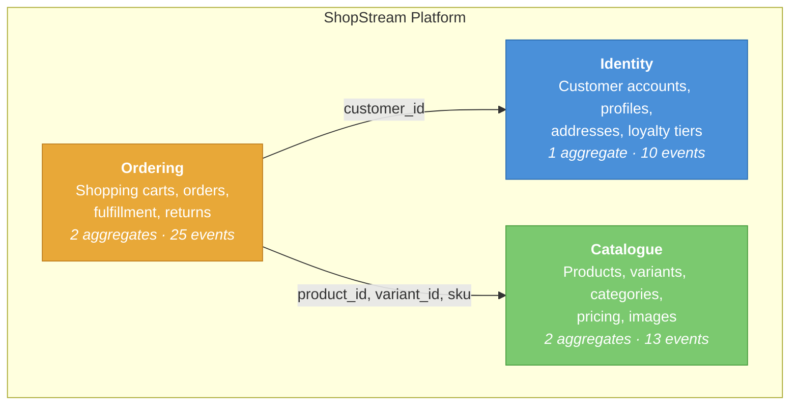

# Context Map

> How ShopStream's bounded contexts relate to each other.

## Overview

ShopStream is decomposed into three bounded contexts, each owning a distinct
area of business responsibility. The contexts share **no domain objects** --
they communicate only through opaque identifiers and asynchronous domain events.

This separation exists because each context has fundamentally different
consistency requirements, change rates, and scalability needs:

- **Identity** changes slowly (customers register once, update profiles occasionally)
  and demands strong consistency on account status.
- **Catalogue** changes at a medium pace (products added/updated by sellers) and
  tolerates eventual consistency for search and browse views.
- **Ordering** changes rapidly (orders placed, paid, shipped throughout the day) and
  requires both strong consistency for financial transactions and a complete audit
  trail for disputes.

## Context Relationships

### Ordering &rarr; Identity

The Ordering context references customers by their `customer_id` -- an opaque
identifier. When an order is created, the customer ID is stored on the Order aggregate,
but the Ordering context never loads, queries, or validates the Customer aggregate.

This is a **conformist** relationship: Ordering accepts Identity's ID format without
interpretation. If a customer is suspended or closed in Identity, existing orders
continue unaffected -- the Ordering context does not subscribe to Identity events
(in this version of ShopStream).

In a production system, you might add a subscriber that reacts to `AccountSuspended`
or `AccountClosed` events to prevent new orders from suspended accounts.

### Ordering &rarr; Catalogue

The Ordering context references products by `product_id`, `variant_id`, and snapshots
the `sku`, `title`, and `unit_price` at order creation time. This snapshot is critical:
if a product's price or title changes after an order is placed, the order retains the
values that were in effect when the customer committed.

This is a **customer-supplier** relationship: the Catalogue context supplies product
data, and the Ordering context consumes a snapshot of it. The Ordering context is
insulated from changes to the product after the order is placed.

Shopping Carts store only `product_id` and `variant_id` (no price snapshot) because
prices are resolved at checkout time, not when items are added to the cart.

## Communication Patterns

| Pattern | Where Used | Why |
|---------|-----------|-----|
| **Opaque IDs** (no shared objects) | All cross-context references | Keeps bounded contexts decoupled. Each context has its own data model. |
| **Data snapshots** | Order Items capture sku, title, unit_price from Catalogue | Orders must be immutable once placed, even if product data changes later. |
| **Domain events via outbox + Redis Streams** | All async reactions within each context | Events are written atomically with aggregate state changes. Engine workers consume them and update projections. |
| **Synchronous command processing** | All write operations within each context | Commands are processed in the same request. The API returns only after the aggregate state change is committed. |

## What This Context Map Does NOT Show (Yet)

ShopStream currently has no cross-context event subscriptions. In a production
e-commerce system, you would likely see:

- **Ordering subscribes to Catalogue's `ProductDiscontinued`** -- to prevent new orders
  for discontinued products.
- **Ordering subscribes to Identity's `AccountSuspended`** -- to block new orders from
  suspended customers.
- **A Notification context** -- subscribing to `OrderShipped`, `OrderDelivered`,
  `ReturnApproved` events to send emails and push notifications.
- **An Inventory context** -- subscribing to `OrderConfirmed` to reserve stock and
  `OrderCancelled` to release it.

These extensions would be natural additions as ShopStream evolves.
