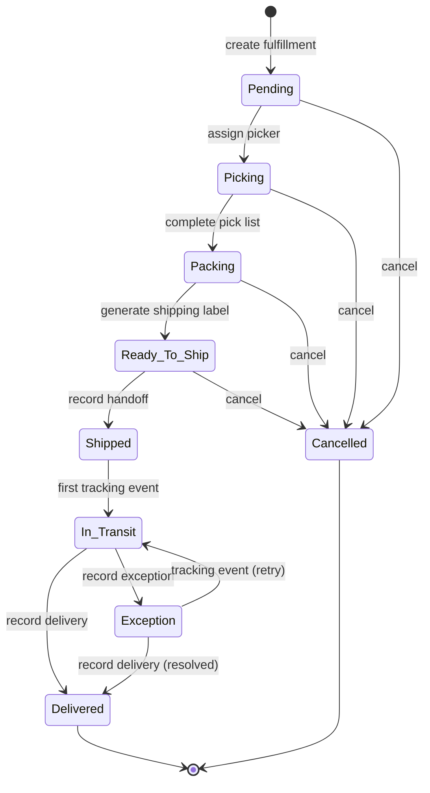

# Fulfillment & Logistics

> Manages the warehouse-to-delivery pipeline: picking, packing, carrier handoff,
> tracking, and delivery confirmation for customer orders.

## Business Context

After a customer pays for an order, someone has to get it off the shelf, into a
box, and onto a truck. The Fulfillment context owns this entire pipeline -- from
the moment payment succeeds to the moment the carrier confirms delivery (or
reports an exception).

The Fulfillment context is a separate bounded context because warehouse logistics
has fundamentally different concerns than order management or payment processing.
Warehouse workers think in terms of pick lists, packing stations, and carrier
manifests. They don't care about payment retries or customer tiers -- they need
to know which items to pull from which shelf, how to pack them, and when the
carrier truck arrives.

Think of the Fulfillment context as the warehouse operations floor. A picker gets
a list of items to pull from shelves, walks the warehouse collecting them, brings
them to a packing station, where they're boxed up, labeled, and handed to a
carrier. From there, the carrier takes over: tracking events arrive via webhooks
as the package moves through the delivery network. If something goes wrong (wrong
address, customer not home, weather delay), the carrier reports an exception, and
the warehouse must decide how to handle it.

The Fulfillment context contains one aggregate:

- **Fulfillment** -- the core warehouse-to-delivery tracking unit. Uses standard
  **CQRS** (not event sourcing) because fulfillment workflows are largely linear
  and external carriers are the source of truth for shipment tracking state.
  There is no business need for temporal queries or event replay -- once a package
  is shipped, the carrier owns the tracking data.

## Ubiquitous Language

| Term | Definition | Code Element |
|------|-----------|-------------|
| Fulfillment | A warehouse-to-delivery pipeline for one order, tracking the full lifecycle from creation through delivery | `Fulfillment` ([source](../../src/fulfillment/fulfillment/fulfillment.py)) |
| Fulfillment Item | A single line item being fulfilled (one product variant at a quantity) | `FulfillmentItem` ([source](../../src/fulfillment/fulfillment/fulfillment.py)) |
| Pick List | The picking assignment: who is picking, when assigned, when completed | `PickList` ([source](../../src/fulfillment/fulfillment/fulfillment.py)) |
| Packing Info | Packing completion details: who packed, when, and the shipping label URL | `PackingInfo` ([source](../../src/fulfillment/fulfillment/fulfillment.py)) |
| Shipment Info | Carrier shipment details: carrier name, service level, tracking number, delivery dates | `ShipmentInfo` ([source](../../src/fulfillment/fulfillment/fulfillment.py)) |
| Package | A physical shipping package with weight, dimensions, and the items it contains | `Package` ([source](../../src/fulfillment/fulfillment/fulfillment.py)) |
| Package Dimensions | Physical dimensions of a package: weight, length, width, height | `PackageDimensions` ([source](../../src/fulfillment/fulfillment/fulfillment.py)) |
| Tracking Event | A carrier-reported tracking update: status, location, description, timestamp | `TrackingEvent` ([source](../../src/fulfillment/fulfillment/fulfillment.py)) |
| Carrier | External shipping provider (FedEx, UPS, etc.) abstracted behind a port | `CarrierPort` ([source](../../src/fulfillment/carrier/port.py)) |
| Handoff | The moment a shipment leaves the warehouse and is given to the carrier | `record_handoff()` ([source](../../src/fulfillment/fulfillment/fulfillment.py)) |
| Delivery Exception | A carrier-reported problem during delivery (wrong address, weather, etc.) | `record_exception()` ([source](../../src/fulfillment/fulfillment/fulfillment.py)) |

Full definitions: [Glossary](../glossary.md#fulfillment-context)

## Domain Model

### Fulfillment Aggregate (CQRS)

A Fulfillment tracks the warehouse-to-delivery lifecycle for a single order. It
is the aggregate root because items, packages, pick list, packing info, shipment
details, and tracking events must all be consistent. For example, completing the
pick list must atomically verify all items are picked and transition to the
PACKING phase.

Each Fulfillment is identified by a system-generated ID and is scoped to a
specific `order_id` and `customer_id`. One order has one fulfillment (partial
shipments are not yet supported).

**Why CQRS (not event sourcing)?** Fulfillment workflows are largely linear and
the external carrier is the source of truth for tracking state. Unlike payments
or inventory, there is no business requirement for temporal queries ("what was
the fulfillment state at 3pm?") or event replay for reconciliation. Standard
CQRS is simpler and sufficient.

```
Fulfillment (aggregate root)
  |-- PickList (value object: assigned_to, assigned_at, completed_at)
  |-- PackingInfo (value object: packed_by, packed_at, shipping_label_url)
  |-- ShipmentInfo (value object: carrier, service_level, tracking_number, estimated/actual delivery)
  |-- FulfillmentItem (entity: order_item_id, product_id, sku, quantity, pick_location, status)
  |-- Package (entity: weight, dimensions, item_ids)
  |     |-- PackageDimensions (value object: weight, length, width, height)
  |-- TrackingEvent (entity: status, location, description, occurred_at)
```

**State Machine:**



**Entities:**

| Entity | Role | Identity |
|--------|------|----------|
| FulfillmentItem | A single line item being fulfilled (product variant, quantity, pick status) | System-generated UUID within the Fulfillment |
| Package | A physical shipping package containing one or more items | System-generated UUID within the Fulfillment |
| TrackingEvent | A carrier-reported tracking update | System-generated UUID within the Fulfillment |

**Value Objects:**

| Value Object | Captures | Key Constraints |
|-------------|----------|----------------|
| PickList | Picking assignment details | assigned_to (max 100 chars), assigned_at, completed_at |
| PackingInfo | Packing completion details | packed_by (max 100 chars), packed_at, shipping_label_url (max 500 chars) |
| ShipmentInfo | Carrier shipment details | carrier (max 100 chars), service_level (Standard/Express/Overnight), tracking_number (max 255 chars) |
| PackageDimensions | Physical package dimensions | weight, length, width, height (all floats) |

**Enums:**

| Enum | Values |
|------|--------|
| `FulfillmentStatus` | Pending, Picking, Packing, Ready_To_Ship, Shipped, In_Transit, Delivered, Exception, Cancelled |
| `FulfillmentItemStatus` | Pending, Picked, Packed |
| `ServiceLevel` | Standard, Express, Overnight |

**Invariants (rules that must always hold):**

- Status transitions must follow the valid transitions map (enforced by `_assert_can_transition`).
- All items must be picked before the pick list can be completed.
- Items must be packed before a shipping label can be generated.
- Fulfillments can only be cancelled before shipment (PENDING, PICKING, PACKING, READY_TO_SHIP).
- Items can only be picked during the PICKING phase.
- Packing can only be recorded during the PACKING phase.
- Tracking events can only be added after shipment (SHIPPED, IN_TRANSIT, EXCEPTION).

## Events

### Fulfillment Events (11)

| Event | Trigger | Consequence |
|-------|---------|-------------|
| `FulfillmentCreated` | New fulfillment created for a paid order | FulfillmentStatusView, WarehouseQueueView projections created |
| `PickerAssigned` | Warehouse picker assigned, picking begins | FulfillmentStatusView, WarehouseQueueView updated |
| `ItemPicked` | Single item picked from warehouse location | (Tracked on aggregate, no projection update) |
| `PickingCompleted` | All items picked, ready for packing | FulfillmentStatusView, WarehouseQueueView updated |
| `PackingCompleted` | Items packed into shipping packages | FulfillmentStatusView, WarehouseQueueView updated |
| `ShippingLabelGenerated` | Shipping label generated, ready to ship | FulfillmentStatusView updated |
| `ShipmentHandedOff` | Shipment given to carrier, left the warehouse | FulfillmentStatusView, ShipmentTrackingView, DeliveryPerformanceView, DailyShipmentsView updated; cross-domain: Ordering updates order to Shipped, Inventory commits reserved stock |
| `TrackingEventReceived` | Carrier reported a tracking update | ShipmentTrackingView updated |
| `DeliveryConfirmed` | Carrier confirmed delivery to customer | FulfillmentStatusView, ShipmentTrackingView, DeliveryPerformanceView, DailyShipmentsView updated; cross-domain: Ordering updates order to Delivered |
| `DeliveryException` | Carrier reported a delivery problem | FulfillmentStatusView, ShipmentTrackingView, DeliveryPerformanceView, DailyShipmentsView updated |
| `FulfillmentCancelled` | Fulfillment cancelled before shipment | FulfillmentStatusView updated |

## Command Flows

| Command | Handler | Action | Events Raised |
|---------|---------|--------|---------------|
| `CreateFulfillment` | `CreateFulfillmentHandler` | Create Fulfillment aggregate with items | `FulfillmentCreated` |
| `AssignPicker` | `PickingHandler` | Assign picker, transition to PICKING | `PickerAssigned` |
| `RecordItemPicked` | `PickingHandler` | Mark item as picked with location | `ItemPicked` |
| `CompletePickList` | `PickingHandler` | Validate all items picked, transition to PACKING | `PickingCompleted` |
| `RecordPacking` | `PackingHandler` | Record packages, mark items as packed | `PackingCompleted` |
| `GenerateShippingLabel` | `PackingHandler` | Set label URL + carrier, transition to READY_TO_SHIP | `ShippingLabelGenerated` |
| `RecordHandoff` | `ShippingHandler` | Set tracking number, transition to SHIPPED | `ShipmentHandedOff` |
| `UpdateTrackingEvent` | `TrackingHandler` | Add carrier tracking event, auto-transition to IN_TRANSIT | `TrackingEventReceived` |
| `RecordDeliveryConfirmation` | `DeliveryHandler` | Transition to DELIVERED, set actual delivery | `DeliveryConfirmed` |
| `RecordDeliveryException` | `DeliveryHandler` | Transition to EXCEPTION, add tracking event | `DeliveryException` |
| `CancelFulfillment` | `CancelFulfillmentHandler` | Cancel fulfillment (pre-shipment only) | `FulfillmentCancelled` |

## Read Models (Projections)

| Projection | Purpose | Built From |
|-----------|---------|-----------|
| `FulfillmentStatusView` | Real-time fulfillment state for status queries | FulfillmentCreated, PickerAssigned, PickingCompleted, PackingCompleted, ShippingLabelGenerated, ShipmentHandedOff, DeliveryConfirmed, DeliveryException, FulfillmentCancelled |
| `WarehouseQueueView` | Active fulfillments in the warehouse for operations dashboard | FulfillmentCreated, PickerAssigned, PickingCompleted, PackingCompleted, ShipmentHandedOff |
| `ShipmentTrackingView` | Shipment tracking details with carrier event history | ShipmentHandedOff, TrackingEventReceived, DeliveryConfirmed, DeliveryException |
| `DeliveryPerformanceView` | Carrier performance metrics by carrier and service level | ShipmentHandedOff, DeliveryConfirmed, DeliveryException |
| `DailyShipmentsView` | Daily volume metrics: created, shipped, delivered, exceptions | FulfillmentCreated, ShipmentHandedOff, DeliveryConfirmed, DeliveryException |

## Carrier Abstraction

The `CarrierPort` defines the interface for carrier integrations:

```python
class CarrierPort(ABC):
    def create_shipment(...) -> dict   # shipment_id, tracking_number, label_url
    def get_tracking(...) -> dict      # status, location, events
    def cancel_shipment(...) -> dict   # cancelled, reason
    def verify_webhook_signature(...) -> bool
```

### Adapters

| Adapter | Environment | Description |
|---------|------------|-------------|
| `FakeCarrier` | dev, test | Configurable success/failure, generates mock tracking numbers and label URLs |

### Real-Time API Testing

The FakeCarrier + configure endpoint enables manual API testing:

```bash
# 1. Configure carrier to succeed (default)
curl -X POST http://localhost:8000/fulfillments/carrier/configure \
  -H "Content-Type: application/json" \
  -d '{"should_succeed": true}'

# 2. Create fulfillment
curl -X POST http://localhost:8000/fulfillments \
  -H "Content-Type: application/json" \
  -d '{"order_id":"ord-1","customer_id":"cust-1","items":[{"order_item_id":"oi-1","product_id":"prod-1","sku":"SKU-001","quantity":2}]}'

# 3. Walk through lifecycle
curl -X PUT http://localhost:8000/fulfillments/{id}/assign-picker \
  -d '{"picker_name":"Alice"}'
# ... pick items, complete pick list, pack, label, handoff

# 4. Test failure flow
curl -X POST http://localhost:8000/fulfillments/carrier/configure \
  -d '{"should_succeed": false, "failure_reason": "Address undeliverable"}'
```

## Cross-Context Relationships

### Inbound: Fulfillment Reacts to Other Domains

| Source Domain | Event | Fulfillment Reaction |
|--------------|-------|---------------------|
| Ordering | `OrderCancelled` | Cancel in-progress fulfillment (if still cancellable) |

The event handler is in [`src/fulfillment/fulfillment/order_events.py`](../../src/fulfillment/fulfillment/order_events.py).
External events are registered via `fulfillment.register_external_event()` and consumed
from the `ordering::order` stream category.

### Outbound: Other Domains React to Fulfillment

| Fulfillment Event | Consuming Domain | Reaction |
|-------------------|-----------------|----------|
| `ShipmentHandedOff` | Ordering | Issues `RecordShipment` command on Order (updates to Shipped) |
| `ShipmentHandedOff` | Inventory | Issues `CommitStock` command to commit reserved stock (reduce on-hand) |
| `DeliveryConfirmed` | Ordering | Issues `RecordDelivery` command on Order (updates to Delivered) |

Event handlers live in the consuming domains:
- [`src/ordering/order/fulfillment_events.py`](../../src/ordering/order/fulfillment_events.py) -- Ordering reacts to fulfillment events
- [`src/inventory/stock/fulfillment_events.py`](../../src/inventory/stock/fulfillment_events.py) -- Inventory reacts to fulfillment events

### Shared Events Module

```
src/shared/events/
  fulfillment.py  -- ShipmentHandedOff, DeliveryConfirmed, DeliveryException, FulfillmentCancelled
  ordering.py     -- OrderCancelled
```

### Opaque References

| This Context References | From Other Context | How |
|------------------------|-------------------|-----|
| `order_id` | Ordering | Stored on Fulfillment to link back to the originating order |
| `customer_id` | Identity | Stored on Fulfillment for customer correlation |
| `product_id`, `sku` | Catalogue | Stored on FulfillmentItems to identify what is being shipped |

## Design Decisions

### CQRS (Not Event Sourcing) for Fulfillment

**Problem:** Should the Fulfillment aggregate use event sourcing like Order and Payment?

**Decision:** Standard CQRS with domain events raised from aggregate methods.

**Rationale:** Fulfillment workflows are largely linear -- items move through a
fixed pipeline (pick, pack, ship, deliver). The external carrier is the source of
truth for tracking state once the package leaves the warehouse. There is no business
requirement for temporal queries ("what was the fulfillment state at 3pm?") or
event replay for reconciliation. The audit trail is adequately served by domain
events persisted to the outbox + event store.

**Trade-off:** Less flexibility for complex auditing scenarios, but significantly
simpler aggregate implementation and persistence. Event sourcing can be retrofitted
later if business requirements change.

### Cancellation Only Before Shipment

**Problem:** Can a fulfillment be cancelled at any point?

**Decision:** Cancellation is only allowed in PENDING, PICKING, PACKING, and
READY_TO_SHIP states. After SHIPPED, cancellation is not possible.

**Rationale:** Once a package has left the warehouse, the carrier owns it. Cancellation
would require a return flow (which is a different business process). The warehouse
can only stop what it controls -- items still on the floor.

**Trade-off:** This means a customer who changes their mind after shipment must go
through the returns process in the Ordering domain, not cancel the fulfillment.

### One Fulfillment Per Order (No Partial Shipments)

**Problem:** Should an order with multiple items support multiple fulfillments?

**Decision:** One fulfillment per order. All items ship together.

**Rationale:** Simplifies the initial implementation and covers the common case.
Most orders ship from a single warehouse in a single package. Partial shipments
(splitting an order across multiple fulfillments from different warehouses) adds
significant complexity in tracking, customer communication, and inventory coordination.

**Trade-off:** Orders with items in different warehouses must wait until all items
are available at one location, or the business must implement a transfer process.
Partial shipment support would be a natural Phase 2 enhancement.

### Carrier as a Port/Adapter

**Problem:** How should the system interact with external carriers?

**Decision:** Abstract `CarrierPort` interface with `FakeCarrier` adapter for
development and testing, mirroring the Payments gateway pattern.

**Rationale:** Carrier APIs vary wildly (FedEx, UPS, DHL each have different SDKs,
webhook formats, and authentication). The port/adapter pattern lets the domain code
program against a stable interface while adapters handle carrier-specific details.
The FakeCarrier enables end-to-end testing without real carrier credentials.

**Trade-off:** The FakeCarrier is simple and always succeeds by default. Real carrier
integration requires implementing the port for each carrier and handling their
specific error modes, rate limiting, and webhook verification.

### Auto-Transition to IN_TRANSIT on First Tracking Event

**Problem:** When does a shipment move from SHIPPED to IN_TRANSIT?

**Decision:** The first tracking event after handoff automatically transitions the
fulfillment from SHIPPED to IN_TRANSIT.

**Rationale:** The distinction between "left the warehouse" (SHIPPED) and "carrier
has scanned it" (IN_TRANSIT) is meaningful for operations. The carrier's first
scan confirms the handoff was successful. Auto-transitioning avoids a separate
manual step and matches how carriers actually work -- the first scan event
implicitly confirms the shipment is moving.

**Trade-off:** If a tracking event arrives out of order (e.g., delayed webhook),
the transition still happens. This is acceptable because tracking events are
carrier-sourced and generally reliable.

## Source Code Map

| Concern | Location |
|---------|----------|
| Fulfillment aggregate + entities + VOs + enums + state machine | [`src/fulfillment/fulfillment/fulfillment.py`](../../src/fulfillment/fulfillment/fulfillment.py) |
| Domain events (11) | [`src/fulfillment/fulfillment/events.py`](../../src/fulfillment/fulfillment/events.py) |
| CreateFulfillment command + handler | [`src/fulfillment/fulfillment/creation.py`](../../src/fulfillment/fulfillment/creation.py) |
| Picking commands + handler (AssignPicker, RecordItemPicked, CompletePickList) | [`src/fulfillment/fulfillment/picking.py`](../../src/fulfillment/fulfillment/picking.py) |
| Packing commands + handler (RecordPacking, GenerateShippingLabel) | [`src/fulfillment/fulfillment/packing.py`](../../src/fulfillment/fulfillment/packing.py) |
| Shipping command + handler (RecordHandoff) | [`src/fulfillment/fulfillment/shipping.py`](../../src/fulfillment/fulfillment/shipping.py) |
| Tracking command + handler (UpdateTrackingEvent) | [`src/fulfillment/fulfillment/tracking.py`](../../src/fulfillment/fulfillment/tracking.py) |
| Delivery commands + handler (RecordDeliveryConfirmation, RecordDeliveryException) | [`src/fulfillment/fulfillment/delivery.py`](../../src/fulfillment/fulfillment/delivery.py) |
| Cancellation command + handler (CancelFulfillment) | [`src/fulfillment/fulfillment/cancellation.py`](../../src/fulfillment/fulfillment/cancellation.py) |
| Inbound event handler (Ordering events) | [`src/fulfillment/fulfillment/order_events.py`](../../src/fulfillment/fulfillment/order_events.py) |
| Carrier port (abstract interface) | [`src/fulfillment/carrier/port.py`](../../src/fulfillment/carrier/port.py) |
| FakeCarrier adapter | [`src/fulfillment/carrier/fake_adapter.py`](../../src/fulfillment/carrier/fake_adapter.py) |
| Projections + projectors (5) | [`src/fulfillment/projections/`](../../src/fulfillment/projections/) |
| API routes (12 endpoints) | [`src/fulfillment/api/routes.py`](../../src/fulfillment/api/routes.py) |
| API schemas (Pydantic) | [`src/fulfillment/api/schemas.py`](../../src/fulfillment/api/schemas.py) |
| Cross-domain event contracts | [`src/shared/events/fulfillment.py`](../../src/shared/events/fulfillment.py) |
| Outbound: Ordering reacts to fulfillment events | [`src/ordering/order/fulfillment_events.py`](../../src/ordering/order/fulfillment_events.py) |
| Outbound: Inventory reacts to fulfillment events | [`src/inventory/stock/fulfillment_events.py`](../../src/inventory/stock/fulfillment_events.py) |
