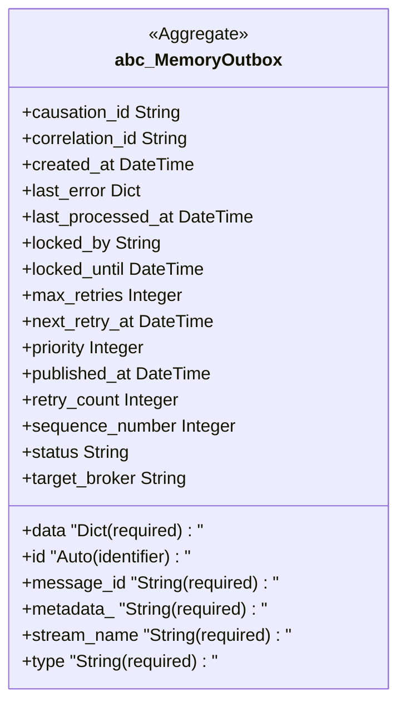
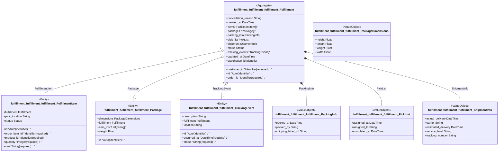

## Cluster: DefaultOutbox

```mermaid
classDiagram
    class abc_DefaultOutbox {
        <<Aggregate>>
        +causation_id String
        +correlation_id String
        +created_at DateTime
        +data "Dict (required)"
        +id "Auto (identifier)"
        +last_error Dict
        +last_processed_at DateTime
        +locked_by String
        +locked_until DateTime
        +max_retries Integer
        +message_id "String (required)"
        +metadata_ "String (required)"
        +next_retry_at DateTime
        +priority Integer
        +published_at DateTime
        +retry_count Integer
        +sequence_number Integer
        +status String
        +stream_name "String (required)"
        +target_broker String
        +type "String (required)"
    }
```

## Cluster: MemoryOutbox

```mermaid
classDiagram
    class abc_MemoryOutbox {
        <<Aggregate>>
        +causation_id String
        +correlation_id String
        +created_at DateTime
        +data "Dict (required)"
        +id "Auto (identifier)"
        +last_error Dict
        +last_processed_at DateTime
        +locked_by String
        +locked_until DateTime
        +max_retries Integer
        +message_id "String (required)"
        +metadata_ "String (required)"
        +next_retry_at DateTime
        +priority Integer
        +published_at DateTime
        +retry_count Integer
        +sequence_number Integer
        +status String
        +stream_name "String (required)"
        +target_broker String
        +type "String (required)"
    }
```

## Cluster: Fulfillment

```mermaid
classDiagram
    class fulfillment_fulfillment_fulfillment_Fulfillment {
        <<Aggregate>>
        +cancellation_reason String
        +created_at DateTime
        +customer_id "Identifier (required)"
        +id "Auto (identifier)"
        +items "FulfillmentItem[]"
        +order_id "Identifier (required)"
        +packages "Package[]"
        +packing_info PackingInfo
        +pick_list PickList
        +shipment ShipmentInfo
        +status Status
        +tracking_events "TrackingEvent[]"
        +updated_at DateTime
        +warehouse_id Identifier
    }
    class fulfillment_fulfillment_fulfillment_FulfillmentItem {
        <<Entity>>
        +fulfillment Fulfillment
        +id "Auto (identifier)"
        +order_item_id "Identifier (required)"
        +pick_location String
        +product_id "Identifier (required)"
        +quantity "Integer (required)"
        +sku "String (required)"
        +status Status
    }
    fulfillment_fulfillment_fulfillment_Fulfillment "1" o-- "*" fulfillment_fulfillment_fulfillment_FulfillmentItem : FulfillmentItem
    class fulfillment_fulfillment_fulfillment_Package {
        <<Entity>>
        +dimensions PackageDimensions
        +fulfillment Fulfillment
        +id "Auto (identifier)"
        +item_ids "List[String]"
        +weight Float
    }
    fulfillment_fulfillment_fulfillment_Fulfillment "1" o-- "*" fulfillment_fulfillment_fulfillment_Package : Package
    class fulfillment_fulfillment_fulfillment_TrackingEvent {
        <<Entity>>
        +description String
        +fulfillment Fulfillment
        +id "Auto (identifier)"
        +location String
        +occurred_at "DateTime (required)"
        +status "String (required)"
    }
    fulfillment_fulfillment_fulfillment_Fulfillment "1" o-- "*" fulfillment_fulfillment_fulfillment_TrackingEvent : TrackingEvent
    class fulfillment_fulfillment_fulfillment_PackageDimensions {
        <<ValueObject>>
        +height Float
        +length Float
        +weight Float
        +width Float
    }
    class fulfillment_fulfillment_fulfillment_PackingInfo {
        <<ValueObject>>
        +packed_at DateTime
        +packed_by String
        +shipping_label_url String
    }
    fulfillment_fulfillment_fulfillment_Fulfillment *-- fulfillment_fulfillment_fulfillment_PackingInfo : PackingInfo
    class fulfillment_fulfillment_fulfillment_PickList {
        <<ValueObject>>
        +assigned_at DateTime
        +assigned_to String
        +completed_at DateTime
    }
    fulfillment_fulfillment_fulfillment_Fulfillment *-- fulfillment_fulfillment_fulfillment_PickList : PickList
    class fulfillment_fulfillment_fulfillment_ShipmentInfo {
        <<ValueObject>>
        +actual_delivery DateTime
        +carrier String
        +estimated_delivery DateTime
        +service_level String
        +tracking_number String
    }
    fulfillment_fulfillment_fulfillment_Fulfillment *-- fulfillment_fulfillment_fulfillment_ShipmentInfo : ShipmentInfo
```
