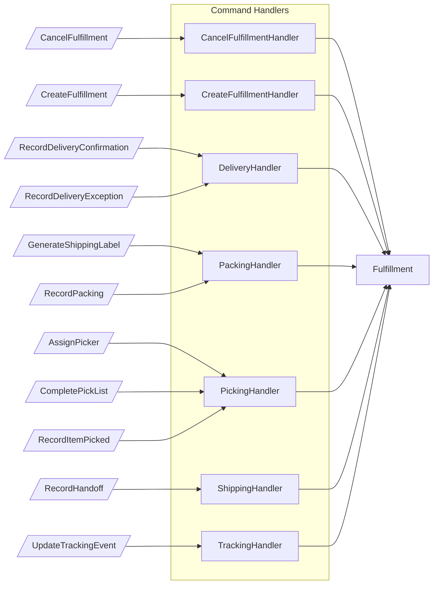
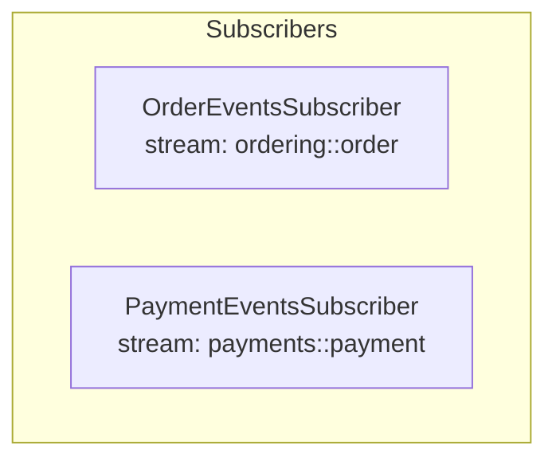
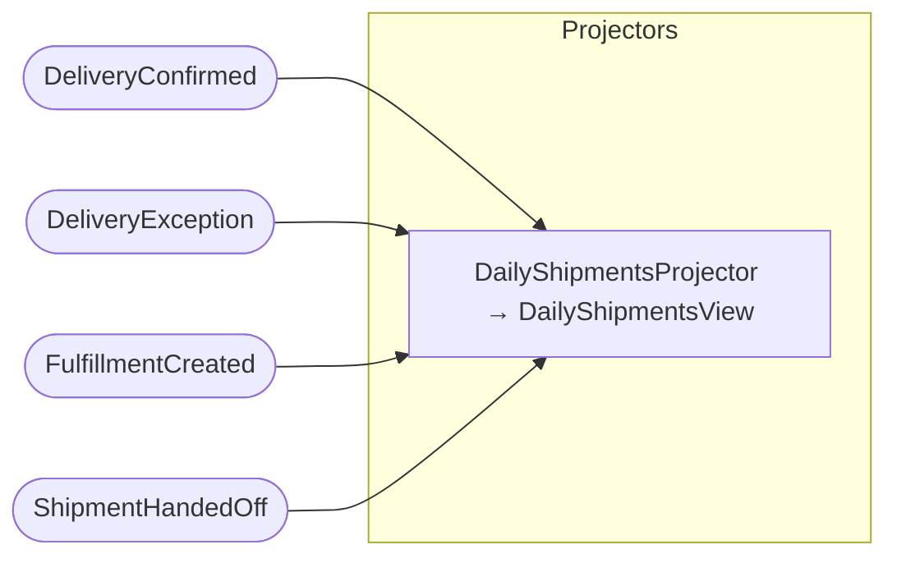
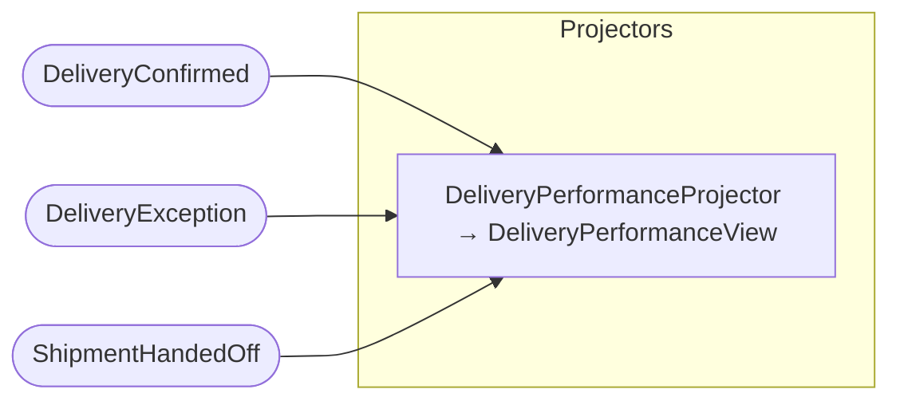
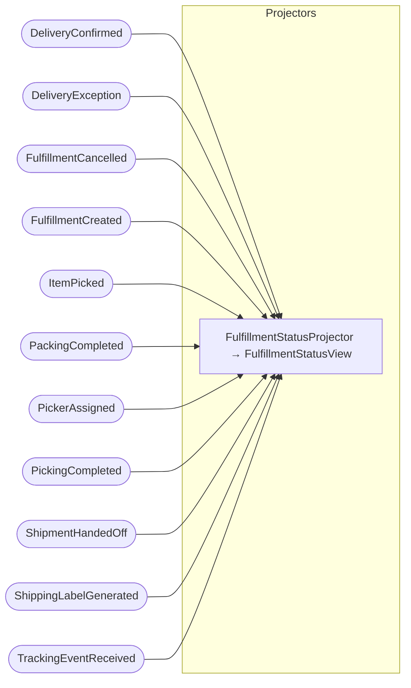
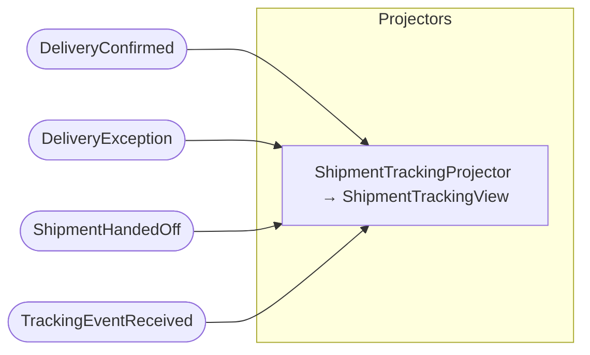
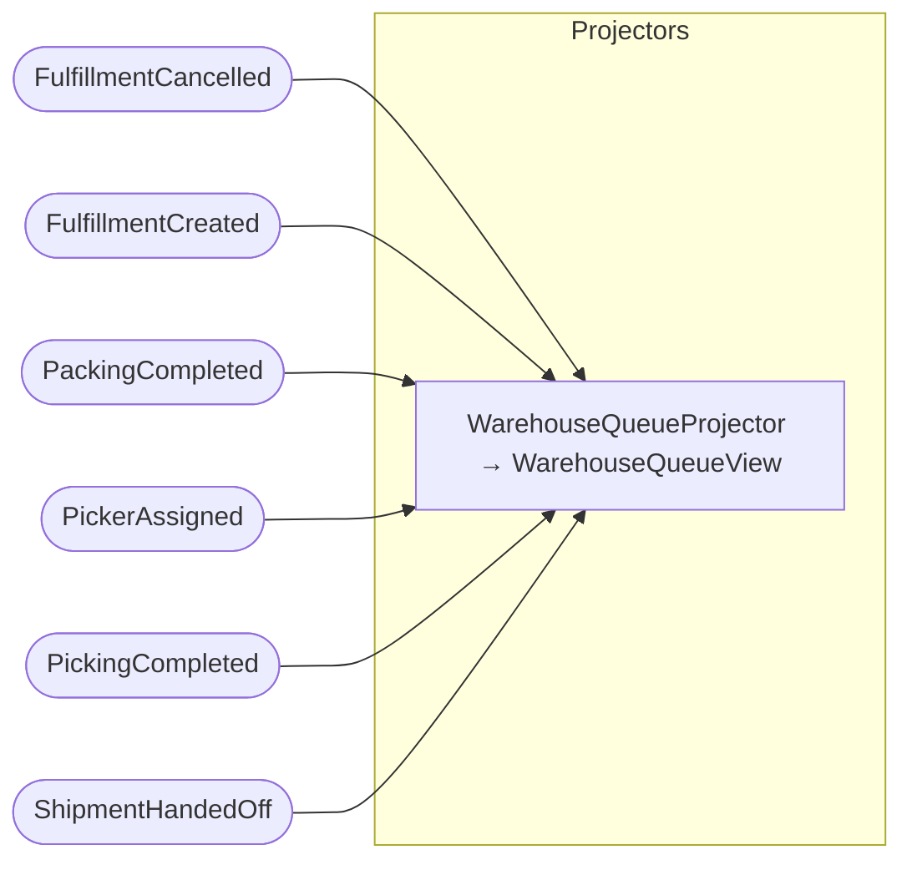

## Command Handlers: Fulfillment

## Subscribers

## Projector: DailyShipmentsView

## Projector: DeliveryPerformanceView

## Projector: FulfillmentStatusView

## Projector: ShipmentTrackingView

## Projector: WarehouseQueueView

