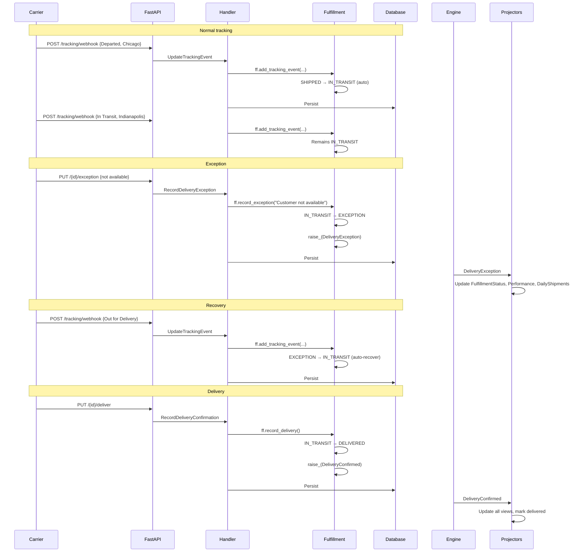

# Delivery Exception: Handle and Recover

> A shipped package encounters a delivery problem -- the carrier reports an
> exception, the system tracks it, and the package eventually gets delivered
> or must be investigated.

## The Story

Priya orders a laptop stand from ShopStream. The fulfillment goes smoothly through
picking, packing, and carrier handoff. Two tracking events arrive as the package
moves through the carrier network. Then a problem: the carrier reports an exception
-- "Customer not available, delivery attempted." The package sits at the local depot.
The next day, the carrier retries and this time succeeds -- delivery is confirmed.

This exception-recovery pattern -- **IN_TRANSIT &rarr; EXCEPTION &rarr; IN_TRANSIT
&rarr; DELIVERED** -- handles the real-world messiness of last-mile delivery. Not
every package arrives on the first try. The state machine allows exceptions to be
resolved either by a new tracking event (carrier retries) or by confirmed delivery.

## The Flow

### 1. Setup: Fulfillment Through Handoff

Priya's fulfillment has already moved through the happy path to SHIPPED state:

```
PENDING → PICKING → PACKING → READY_TO_SHIP → SHIPPED
```

The fulfillment has:
- tracking_number: "UPS-111222333"
- carrier: "UPS"
- service_level: "Express"

### 2. Normal Tracking Events

Two tracking updates arrive via webhook:

```
POST /fulfillments/tracking/webhook
X-Carrier-Signature: test-signature
{
  "fulfillment_id": "<uuid>",
  "status": "Departed",
  "location": "Chicago, IL",
  "description": "Package departed origin facility"
}
```

**First tracking event:** Status transitions from SHIPPED &rarr; IN_TRANSIT
automatically. A `TrackingEvent` entity is added to the aggregate.

```
POST /fulfillments/tracking/webhook
{
  "fulfillment_id": "<uuid>",
  "status": "In Transit",
  "location": "Indianapolis, IN",
  "description": "Package in transit to destination"
}
```

**Second tracking event:** Status remains IN_TRANSIT. Another `TrackingEvent`
entity is added.

### 3. Delivery Exception

The carrier attempts delivery but fails:

```
PUT /fulfillments/{fulfillment_id}/exception
{
  "reason": "Customer not available, delivery attempted",
  "location": "Priya's address, Columbus, OH"
}
```

&rarr; [source](../../src/fulfillment/api/routes.py) (`record_exception`)

**Command:** `RecordDeliveryException` with `fulfillment_id`, `reason`, `location`.

&rarr; [source](../../src/fulfillment/fulfillment/delivery.py)

**Aggregate behavior:**

1. **Validates:** Transition IN_TRANSIT &rarr; EXCEPTION is valid.
2. Sets `status = "Exception"`.
3. Creates a `TrackingEvent` entity with `status="EXCEPTION"`, `description="Customer
   not available, delivery attempted"`.
4. **Raises `DeliveryException`** with fulfillment_id, order_id, reason, location.

**After commit:**
- Status: Exception
- 3 tracking events (2 transit + 1 exception)

**Projection updates:**
- `FulfillmentStatusView`: Status updated to Exception
- `ShipmentTrackingView`: New exception event appended, current_status updated
- `DeliveryPerformanceView`: Exception count incremented for carrier/service_level
- `DailyShipmentsView`: Daily exception count incremented

### 4. Recovery: Carrier Retries

The next day, the carrier retries delivery and scans the package:

```
POST /fulfillments/tracking/webhook
X-Carrier-Signature: test-signature
{
  "fulfillment_id": "<uuid>",
  "status": "Out for Delivery",
  "location": "Columbus, OH",
  "description": "Package out for delivery, retry attempt"
}
```

**Aggregate behavior:**

1. **Validates:** Status is EXCEPTION -- tracking events are allowed (SHIPPED, IN_TRANSIT, EXCEPTION).
2. **Auto-recovery:** When a tracking event arrives while in EXCEPTION state, the
   fulfillment automatically transitions back to IN_TRANSIT. This represents the
   carrier resuming delivery.
3. Creates a `TrackingEvent` entity.
4. **Raises `TrackingEventReceived`**.

**After commit:**
- Status: In_Transit (recovered from Exception)
- 4 tracking events

### 5. Delivery Confirmed

The carrier confirms delivery:

```
PUT /fulfillments/{fulfillment_id}/deliver
```

**Aggregate behavior:**

1. **Validates:** IN_TRANSIT &rarr; DELIVERED is valid.
2. Sets `status = "Delivered"`, `shipment.actual_delivery = now`.
3. **Raises `DeliveryConfirmed`**.

**Cross-domain:** Ordering domain receives `DeliveryConfirmed`, updates order to Delivered.

**Final state:**
- Status: Delivered
- 4 tracking events showing the full journey: transit → transit → exception → retry

## Sequence Diagram



## Alternative: Delivery Directly From Exception

If the carrier resolves the exception and confirms delivery without an intermediate
tracking event:

```
PUT /fulfillments/{fulfillment_id}/deliver
```

This works because the state machine allows EXCEPTION &rarr; DELIVERED directly.
The exception is resolved by successful delivery.

## Alternative: Multiple Exceptions

A package might encounter multiple exceptions (weather delay, then wrong address):

```
IN_TRANSIT → EXCEPTION (weather)
           → IN_TRANSIT (tracking event: carrier retrying)
           → EXCEPTION (wrong address)
           → IN_TRANSIT (tracking event: address corrected)
           → DELIVERED
```

Each exception creates a `TrackingEvent` entity and raises `DeliveryException`.
Each recovery tracking event transitions back to IN_TRANSIT. The
`ShipmentTrackingView` accumulates all events as a complete history.

## Edge Cases

| Scenario | What Happens | Why |
|----------|-------------|-----|
| Exception from SHIPPED (no tracking yet) | Not allowed -- must be IN_TRANSIT | SHIPPED &rarr; EXCEPTION is not a valid transition; need at least one tracking event first |
| Exception from PENDING/PICKING/PACKING | `ValidationError`: "Cannot transition from X to Exception" | Only in-transit shipments can have exceptions |
| Deliver from EXCEPTION | Success -- resolves the exception | EXCEPTION &rarr; DELIVERED is explicitly allowed in the state machine |
| Tracking event during EXCEPTION | Auto-recovers to IN_TRANSIT | Carrier activity implies the package is moving again |
| Cancel after EXCEPTION | `ValidationError`: "Cannot cancel fulfillment in Exception state" | Package is already with the carrier; cancellation is pre-shipment only |
