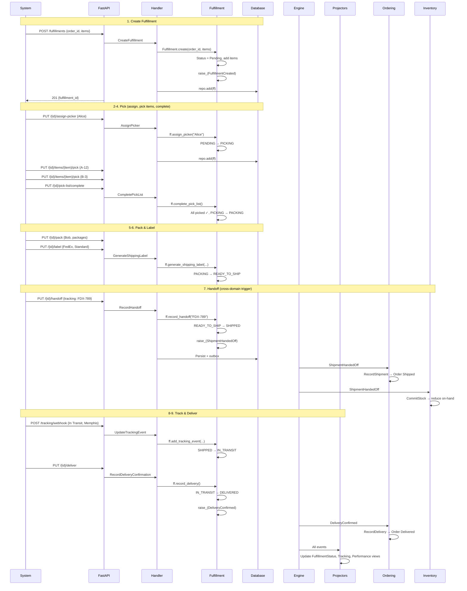

# Fulfillment Lifecycle: Pick, Pack, Ship, Deliver

> A paid order moves through the warehouse floor -- picked from shelves, packed
> into boxes, handed to a carrier, and tracked until delivery.

## The Story

Carlos orders a mechanical keyboard and a mousepad from ShopStream. After payment
succeeds, the system creates a fulfillment. At the warehouse, picker Alice is
assigned the fulfillment. She walks the aisles, picks the keyboard from shelf A-12
and the mousepad from shelf B-3, brings them to the packing station. Packer Bob
boxes them up, generates a shipping label via the carrier, and hands the package
to the FedEx driver. Over the next two days, tracking events arrive as the package
moves through the carrier network. Finally, FedEx confirms delivery.

This linear pipeline -- **create &rarr; pick &rarr; pack &rarr; label &rarr;
handoff &rarr; track &rarr; deliver** -- is the happy path. Each step transitions
the fulfillment through its state machine, raising events that update projections
and notify other domains.

## The Flow

### 1. Create Fulfillment (Payment Succeeds)

When Carlos's payment is captured, the system creates a fulfillment:

```
POST /fulfillments
{
  "order_id": "ord-carlos-001",
  "customer_id": "cust-carlos",
  "items": [
    {"order_item_id": "oi-1", "product_id": "prod-kb", "sku": "KB-MECH-001", "quantity": 1},
    {"order_item_id": "oi-2", "product_id": "prod-mp", "sku": "MP-XL-BLK", "quantity": 1}
  ]
}
```

&rarr; [source](../../src/fulfillment/api/routes.py) (`create_fulfillment`)

**Command:** `CreateFulfillment` with `order_id`, `customer_id`, and `items` (JSON).

&rarr; [source](../../src/fulfillment/fulfillment/creation.py)

**Aggregate behavior:**

1. The handler deserializes the items JSON into a list of dicts.
2. Calls `Fulfillment.create(order_id, customer_id, items_data)`.
3. The factory method creates the aggregate with status PENDING, generates a UUID,
   adds FulfillmentItem entities for each item.
4. **Raises `FulfillmentCreated`** with fulfillment_id, order_id, customer_id, items
   JSON, and item_count.
5. The handler persists the aggregate via `repo.add(ff)`.

**After commit:**
- Fulfillment: `{status: "Pending", items: [{sku: "KB-MECH-001", status: "Pending"}, {sku: "MP-XL-BLK", status: "Pending"}]}`
- Response: `{"fulfillment_id": "<uuid>"}`

### 2. Assign Picker (Warehouse Operations)

The warehouse manager assigns picker Alice:

```
PUT /fulfillments/{fulfillment_id}/assign-picker
{
  "picker_name": "Alice"
}
```

&rarr; [source](../../src/fulfillment/api/routes.py) (`assign_picker`)

**Command:** `AssignPicker` with `fulfillment_id` and `picker_name`.

&rarr; [source](../../src/fulfillment/fulfillment/picking.py)

**Aggregate behavior:**

1. The handler loads the Fulfillment from the repository.
2. Calls `ff.assign_picker("Alice")`.
3. **Validates:** Current status must allow transition to PICKING (only PENDING &rarr; PICKING is valid).
4. Sets `status = "Picking"`, creates `PickList(assigned_to="Alice", assigned_at=now)`.
5. **Raises `PickerAssigned`** with fulfillment_id, assigned_to, assigned_at.

**After commit:**
- Status: Picking
- PickList: `{assigned_to: "Alice", assigned_at: "2026-02-20T10:00:00Z"}`

### 3. Pick Items (Warehouse Floor)

Alice walks the warehouse and picks each item:

```
PUT /fulfillments/{fulfillment_id}/items/{item_id}/pick
{
  "pick_location": "A-12"
}
```

&rarr; [source](../../src/fulfillment/api/routes.py) (`record_item_picked`)

**Command:** `RecordItemPicked` with `fulfillment_id`, `item_id`, `pick_location`.

**Aggregate behavior:**

1. **Validates:** Status must be PICKING. Item must exist and be in PENDING status.
2. Sets `item.status = "Picked"` and `item.pick_location = "A-12"`.
3. **Raises `ItemPicked`** with fulfillment_id, item_id, pick_location, picked_at.

Alice picks the keyboard from A-12, then the mousepad from B-3. Two separate
API calls, two `ItemPicked` events.

### 4. Complete Pick List (All Items Picked)

Alice brings everything to the packing station and completes the pick list:

```
PUT /fulfillments/{fulfillment_id}/pick-list/complete
```

&rarr; [source](../../src/fulfillment/api/routes.py) (`complete_pick_list`)

**Command:** `CompletePickList` with `fulfillment_id`.

**Aggregate behavior:**

1. **Validates:** Status must be PICKING.
2. **Validates:** All items must be in PICKED status. If any are still PENDING,
   raises `ValidationError: "2 item(s) have not been picked yet"`.
3. Transitions to PACKING, sets `pick_list.completed_at`.
4. **Raises `PickingCompleted`** with fulfillment_id, completed_at.

**After commit:**
- Status: Packing
- All items: status "Picked"

### 5. Record Packing (Packing Station)

Packer Bob boxes the items and records the packing:

```
PUT /fulfillments/{fulfillment_id}/pack
{
  "packed_by": "Bob",
  "packages": [{"weight": 1.5}]
}
```

&rarr; [source](../../src/fulfillment/api/routes.py) (`record_packing`)

**Command:** `RecordPacking` with `fulfillment_id`, `packed_by`, `packages` (JSON).

**Aggregate behavior:**

1. **Validates:** Status must be PACKING.
2. Creates Package entities from the packages data.
3. Marks all items as PACKED.
4. Sets `packing_info = PackingInfo(packed_by="Bob", packed_at=now)`.
5. **Raises `PackingCompleted`** with fulfillment_id, packed_by, package_count, packed_at.

### 6. Generate Shipping Label (Carrier Integration)

The system generates a shipping label:

```
PUT /fulfillments/{fulfillment_id}/label
{
  "label_url": "https://carrier.example.com/labels/lbl-123",
  "carrier": "FedEx",
  "service_level": "Standard"
}
```

&rarr; [source](../../src/fulfillment/api/routes.py) (`generate_shipping_label`)

**Command:** `GenerateShippingLabel` with `fulfillment_id`, `label_url`, `carrier`, `service_level`.

**Aggregate behavior:**

1. **Validates:** Status must be PACKING.
2. **Validates:** Items must be packed (`packing_info.packed_at` must exist).
3. Transitions to READY_TO_SHIP.
4. Sets `packing_info.shipping_label_url` and `shipment = ShipmentInfo(carrier, service_level)`.
5. **Raises `ShippingLabelGenerated`** with fulfillment_id, label_url, carrier, service_level.

**After commit:**
- Status: Ready_To_Ship
- ShipmentInfo: `{carrier: "FedEx", service_level: "Standard"}`

### 7. Record Handoff (Carrier Pickup)

The FedEx driver picks up the package:

```
PUT /fulfillments/{fulfillment_id}/handoff
{
  "tracking_number": "FDX-789456123",
  "estimated_delivery": "2026-02-22T17:00:00"
}
```

&rarr; [source](../../src/fulfillment/api/routes.py) (`record_handoff`)

**Command:** `RecordHandoff` with `fulfillment_id`, `tracking_number`, `estimated_delivery`.

**Aggregate behavior:**

1. **Validates:** Transition READY_TO_SHIP &rarr; SHIPPED is valid.
2. Sets `status = "Shipped"`, `shipment.tracking_number = "FDX-789456123"`.
3. Collects `shipped_item_ids` from all fulfillment items (the `order_item_id` values).
4. **Raises `ShipmentHandedOff`** with fulfillment_id, order_id, carrier, tracking_number,
   shipped_item_ids (JSON), estimated_delivery, shipped_at.

**After commit -- Cross-Domain Reactions:**

- **Ordering domain** receives `ShipmentHandedOff` from the `fulfillment::fulfillment` stream.
  Issues `RecordShipment(order_id, shipment_id, carrier, tracking_number, shipped_item_ids)`.
  Order transitions to Shipped.
- **Inventory domain** receives `ShipmentHandedOff`. Finds active reservations for the
  order and issues `CommitStock` for each, reducing on-hand and clearing reservations.

### 8. Tracking Updates (Carrier Network)

As the package moves through the FedEx network, tracking webhooks arrive:

```
POST /fulfillments/tracking/webhook
X-Carrier-Signature: test-signature
{
  "fulfillment_id": "<uuid>",
  "status": "In Transit",
  "location": "Memphis, TN",
  "description": "Package arrived at sort facility"
}
```

&rarr; [source](../../src/fulfillment/api/routes.py) (`tracking_webhook`)

**Webhook verification:** The carrier signature is verified via `carrier.verify_webhook_signature()`.
Invalid signatures return 401.

**Aggregate behavior:**

1. **Validates:** Status must be SHIPPED, IN_TRANSIT, or EXCEPTION.
2. **Auto-transition:** If status is SHIPPED (first tracking event after handoff),
   automatically transitions to IN_TRANSIT.
3. Creates a `TrackingEvent` entity with status, location, description, occurred_at.
4. **Raises `TrackingEventReceived`**.

### 9. Delivery Confirmed (Final Mile)

FedEx confirms delivery:

```
PUT /fulfillments/{fulfillment_id}/deliver
```

&rarr; [source](../../src/fulfillment/api/routes.py) (`record_delivery`)

**Command:** `RecordDeliveryConfirmation` with `fulfillment_id`.

**Aggregate behavior:**

1. **Validates:** Transition IN_TRANSIT &rarr; DELIVERED (or EXCEPTION &rarr; DELIVERED).
2. Sets `status = "Delivered"`, `shipment.actual_delivery = now`.
3. **Raises `DeliveryConfirmed`** with fulfillment_id, order_id, actual_delivery.

**After commit -- Cross-Domain Reaction:**
- **Ordering domain** receives `DeliveryConfirmed`. Issues `RecordDelivery(order_id)`.
  Order transitions to Delivered.

**Final state:**
- Status: Delivered
- ShipmentInfo: `{carrier: "FedEx", tracking_number: "FDX-789456123", actual_delivery: "2026-02-22T15:30:00Z"}`

### 10. Async Reactions (Projections)

| Event | Projector | Effect |
|-------|----------|--------|
| `FulfillmentCreated` | `FulfillmentStatusProjector` | Creates status view entry (Pending) |
| `FulfillmentCreated` | `WarehouseQueueProjector` | Adds to warehouse queue |
| `PickerAssigned` | `FulfillmentStatusProjector` | Status updated to Picking |
| `PickerAssigned` | `WarehouseQueueProjector` | Records assigned picker |
| `PickingCompleted` | `FulfillmentStatusProjector` | Status updated to Packing |
| `PackingCompleted` | `FulfillmentStatusProjector` | Status remains Packing (items packed) |
| `ShipmentHandedOff` | `FulfillmentStatusProjector` | Status updated to Shipped with tracking |
| `ShipmentHandedOff` | `ShipmentTrackingProjector` | Creates tracking view entry |
| `ShipmentHandedOff` | `DeliveryPerformanceProjector` | Increments shipment count for carrier |
| `ShipmentHandedOff` | `DailyShipmentsProjector` | Increments daily shipped count |
| `TrackingEventReceived` | `ShipmentTrackingProjector` | Appends to events JSON, updates location |
| `DeliveryConfirmed` | `FulfillmentStatusProjector` | Status updated to Delivered |
| `DeliveryConfirmed` | `ShipmentTrackingProjector` | Sets delivered_at |
| `DeliveryConfirmed` | `DeliveryPerformanceProjector` | Increments delivered count |
| `DeliveryConfirmed` | `DailyShipmentsProjector` | Increments daily delivered count |

## Sequence Diagram



## Alternative Path: Cancellation

If Carlos cancels his order before shipping:

```
PUT /fulfillments/{fulfillment_id}/cancel
{
  "reason": "Customer changed mind"
}
```

**Aggregate behavior:**

1. **Validates:** Current status is in `_CANCELLABLE_STATUSES` (PENDING, PICKING, PACKING, READY_TO_SHIP).
2. Sets `status = "Cancelled"`, `cancellation_reason = "Customer changed mind"`.
3. **Raises `FulfillmentCancelled`** with fulfillment_id, order_id, reason.

If the status is SHIPPED or later, cancellation is rejected:
`ValidationError: "Cannot cancel fulfillment in Shipped state"`

## Alternative Path: Order Cancelled (Cross-Domain)

If the Ordering domain raises `OrderCancelled`, the fulfillment domain reacts:

1. The `OrderEventHandler` in [`order_events.py`](../../src/fulfillment/fulfillment/order_events.py)
   receives the event from the `ordering::order` stream.
2. Finds the fulfillment by `order_id`.
3. If the fulfillment is in a cancellable state, calls `ff.cancel(reason)`.
4. If already shipped, logs a warning -- the fulfillment cannot be stopped.

## Edge Cases

| Scenario | What Happens | Why |
|----------|-------------|-----|
| Assign picker when not Pending | `ValidationError`: "Cannot transition from X to Picking" | State machine enforces valid transitions |
| Complete pick list with unpicked items | `ValidationError`: "2 item(s) have not been picked yet" | All items must be picked before packing |
| Pick item that was already picked | `ValidationError`: "Item has already been picked" | Prevents double-picking |
| Pick item in wrong phase | `ValidationError`: "Items can only be picked during PICKING phase" | Must be in PICKING state |
| Generate label before packing | `ValidationError`: "Items must be packed before generating a shipping label" | Packing must complete first |
| Cancel after shipped | `ValidationError`: "Cannot cancel fulfillment in Shipped state" | Once carrier has the package, use returns instead |
| Tracking event before shipment | `ValidationError`: "Tracking events can only be added after shipment" | No tracking before handoff |
| Invalid webhook signature | `401 Unauthorized`: "Invalid carrier webhook signature" | Prevents fake tracking updates |
| Deliver from Exception state | Success -- EXCEPTION &rarr; DELIVERED is valid | Exception can be resolved by delivery |
