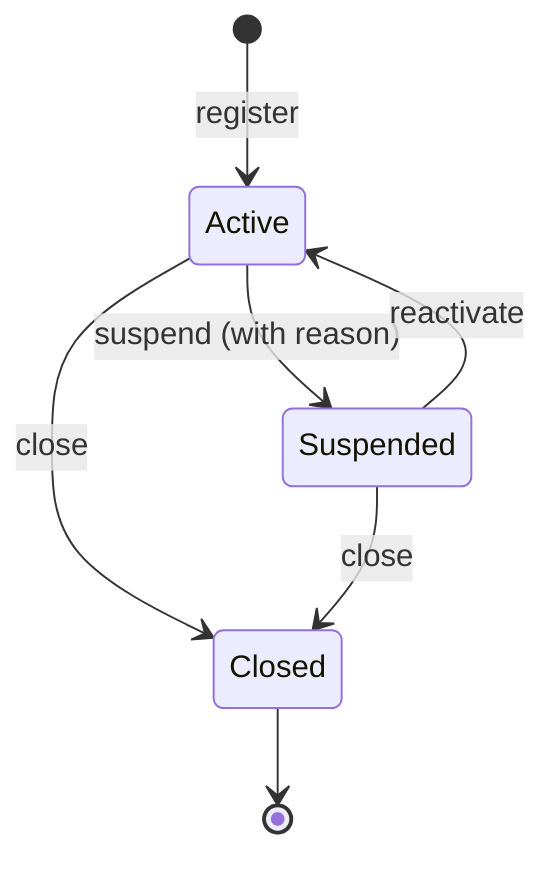
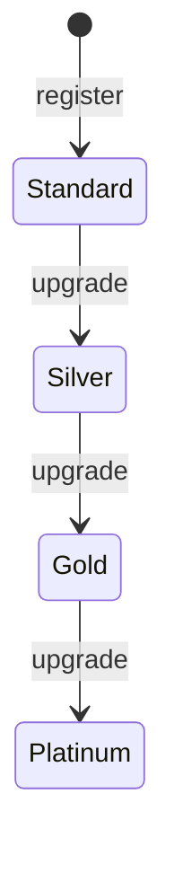

# Identity

> Manages customer accounts, personal profiles, addresses, and loyalty tiers.

## Business Context

Every e-commerce platform needs to know who its customers are. The Identity context
owns everything about a customer's relationship with the platform: who they are
(profile), where they live (addresses), whether their account is in good standing
(status), and how loyal they are (tier).

This is a separate bounded context because customer identity is fundamentally
different from what customers buy (Catalogue) or how they buy it (Ordering).
A customer's profile can change without affecting their orders. A customer can
exist without ever placing an order. And the rules governing account status
(suspension, closure) are independent of product or order rules.

Think of the Identity context as the membership desk at a department store -- it
handles registration, membership cards, address books, and loyalty programs, but
knows nothing about the merchandise on the shelves or the transactions at the
register.

## Ubiquitous Language

> These terms mean the same thing whether spoken by a domain expert,
> written in a user story, or expressed in code.

| Term | Definition | Code Element |
|------|-----------|-------------|
| Customer | A registered person on the platform, identified by a system ID and an external ID | `Customer` ([source](../../src/identity/customer/customer.py)) |
| Profile | A customer's personal information (name, phone, date of birth) | `Profile` ([source](../../src/identity/customer/customer.py)) |
| Address | A physical location with label, street, city, state, postal code, country | `Address` ([source](../../src/identity/customer/customer.py)) |
| Email Address | A validated email with format enforcement | `EmailAddress` ([source](../../src/identity/shared/email.py)) |
| Phone Number | A validated phone number accepting digits, spaces, hyphens, parens | `PhoneNumber` ([source](../../src/identity/shared/phone.py)) |
| Geo Coordinates | A latitude/longitude pair for address geolocation | `GeoCoordinates` ([source](../../src/identity/customer/customer.py)) |
| Customer Status | Account lifecycle: Active, Suspended, Closed | `CustomerStatus` ([source](../../src/identity/customer/customer.py)) |
| Customer Tier | Loyalty progression: Standard &rarr; Silver &rarr; Gold &rarr; Platinum | `CustomerTier` ([source](../../src/identity/customer/customer.py)) |
| Address Label | Address classification: Home, Work, Other | `AddressLabel` ([source](../../src/identity/customer/customer.py)) |

Full definitions: [Glossary](../glossary.md#identity-context)

## Domain Model

### Customer (Aggregate)

A Customer is the central concept and the aggregate root. It groups together
everything that must be consistent about a single person's relationship with
the platform: their email (unique), profile information, physical addresses,
account status, and loyalty tier.

The Customer is the transactional boundary because these elements must change
together consistently. For example, when adding a new address that is marked as
default, the previous default must be unset in the same transaction. If addresses
were a separate aggregate, maintaining the "exactly one default" invariant would
require distributed coordination.

**Entities:**

| Entity | Role | Identity |
|--------|------|----------|
| Address | A physical location the customer can ship to or bill to | System-generated ID within the Customer |

**Value Objects:**

| Value Object | Captures | Key Constraints |
|-------------|----------|----------------|
| Profile | Personal info: first name, last name, phone, date of birth | First and last name required, max 100 chars each |
| EmailAddress | Customer's email | Validated format: exactly one @, valid local/domain parts, no whitespace |
| PhoneNumber | Customer's phone number | Must contain a digit, only allows digits/spaces/hyphens/parens/leading + |
| GeoCoordinates | Latitude/longitude for an address | Both must be present if either is; lat -90..90, lng -180..180 |

**Invariants (rules that must always hold):**

- A customer cannot have more than 10 addresses.
- When addresses exist, exactly one must be marked as default.
- Only active accounts can be suspended.
- Only suspended accounts can be reactivated.
- An already-closed account cannot be closed again.
- Tier can only be upgraded, never downgraded (Standard &rarr; Silver &rarr; Gold &rarr; Platinum).

**State Machine: Account Status**

A customer account starts Active upon registration. Active accounts can be
Suspended (with a reason) for policy violations or other concerns. Suspended
accounts can be Reactivated to return to Active. Both Active and Suspended
accounts can be Closed permanently. There is no way to reopen a Closed account.

**State Machine: Loyalty Tier**

Tiers progress upward only: Standard &rarr; Silver &rarr; Gold &rarr; Platinum.
The business decides when to upgrade a customer (e.g., based on purchase history
or engagement metrics). Downgrade is not supported -- if a customer becomes
inactive, they retain their tier.

## Events

> Events capture facts -- things that have happened. They are named in past
> tense and are immutable once raised.

| Event | Trigger | Consequence |
|-------|---------|-------------|
| `CustomerRegistered` | A new customer signs up | CustomerCard, CustomerLookup, CustomerSegments projections created |
| `ProfileUpdated` | Customer changes their name, phone, or date of birth | CustomerCard projection updated |
| `AddressAdded` | Customer adds a new address | AddressBook projection updated |
| `AddressUpdated` | Customer modifies an existing address | AddressBook projection updated |
| `AddressRemoved` | Customer deletes an address | AddressBook projection updated |
| `DefaultAddressChanged` | Customer sets a different address as default | AddressBook projection updated |
| `AccountSuspended` | Admin/system suspends a customer account (with reason) | CustomerCard and CustomerSegments projections updated |
| `AccountReactivated` | Suspended account is restored to active | CustomerCard and CustomerSegments projections updated |
| `AccountClosed` | Customer or admin closes the account permanently | CustomerCard and CustomerSegments projections updated |
| `TierUpgraded` | Customer loyalty tier is upgraded | CustomerCard and CustomerSegments projections updated |

## Command Flows

> Commands express intent -- things a user or system wants to do.

| Command | Who Initiates | What Happens | Events Raised |
|---------|--------------|-------------|---------------|
| `RegisterCustomer` | Customer (via signup) | Creates a new Customer with profile and email | `CustomerRegistered` |
| `UpdateProfile` | Customer | Updates name, phone, and/or date of birth | `ProfileUpdated` |
| `AddAddress` | Customer | Adds a new address (first address auto-defaults) | `AddressAdded` |
| `UpdateAddress` | Customer | Modifies fields of an existing address | `AddressUpdated` |
| `RemoveAddress` | Customer | Removes an address (cannot remove the last one) | `AddressRemoved` |
| `SetDefaultAddress` | Customer | Changes which address is the default | `DefaultAddressChanged` |
| `SuspendAccount` | Admin/System | Suspends an active account with a reason | `AccountSuspended` |
| `ReactivateAccount` | Admin | Restores a suspended account to active | `AccountReactivated` |
| `CloseAccount` | Customer/Admin | Permanently closes the account | `AccountClosed` |
| `UpgradeTier` | System/Admin | Promotes customer to a higher loyalty tier | `TierUpgraded` |

## Read Models (Projections)

| Projection | Purpose | Built From |
|-----------|---------|-----------|
| `CustomerCard` | Full customer view for detail pages: profile, email, status, tier, timestamps | All Customer events |
| `CustomerLookup` | Search/lookup by external_id or email (thin index) | `CustomerRegistered` |
| `AddressBook` | All addresses for a customer, with default flag | `AddressAdded`, `AddressUpdated`, `AddressRemoved`, `DefaultAddressChanged` |
| `CustomerSegments` | Customers grouped by tier and status for analytics/marketing | `CustomerRegistered`, `AccountSuspended`, `AccountReactivated`, `AccountClosed`, `TierUpgraded` |

## Cross-Context Relationships

| This Context Provides | To Other Context | How |
|----------------------|-----------------|-----|
| `customer_id` | Ordering | Ordering stores customer_id on Orders and Carts as an opaque reference |

The Identity context is upstream -- it provides customer identity that other
contexts reference. Currently, no other context subscribes to Identity events.
In a production system, Ordering might react to `AccountSuspended` to block
new orders from suspended customers.

## Design Decisions

### Single Aggregate for Customer

**Problem:** Should Address be its own aggregate, or part of Customer?

**Decision:** Address is an entity within the Customer aggregate.

**Rationale:** The "exactly one default address" invariant requires atomic
coordination between addresses. If addresses were a separate aggregate,
enforcing this rule would require saga-like coordination or eventual consistency,
both of which add complexity without business value. The 10-address limit also
naturally scopes the aggregate size.

**Trade-off:** All address operations require loading the entire Customer aggregate,
including the profile and all other addresses. This is acceptable because the data
is small (max 10 addresses) and address operations are infrequent.

### Tier Upgrades Only (No Downgrades)

**Problem:** Should loyalty tiers support both upgrades and downgrades?

**Decision:** Only upgrades are permitted (Standard &rarr; Silver &rarr; Gold &rarr; Platinum).

**Rationale:** In most loyalty programs, reaching a tier is a milestone that customers
earn. Losing a tier feels punitive and damages customer satisfaction. If the business
later wants tier expiry, that would be modeled as a separate process (e.g., an
annual re-evaluation) rather than arbitrary downgrades.

**Trade-off:** A customer who stops engaging retains their tier indefinitely.

## Source Code Map

| Concern | Location |
|---------|----------|
| Aggregate root + entities + value objects | [`src/identity/customer/customer.py`](../../src/identity/customer/customer.py) |
| Domain events | [`src/identity/customer/events.py`](../../src/identity/customer/events.py) |
| Registration command + handler | [`src/identity/customer/registration.py`](../../src/identity/customer/registration.py) |
| Profile command + handler | [`src/identity/customer/profile.py`](../../src/identity/customer/profile.py) |
| Address commands + handler | [`src/identity/customer/addresses.py`](../../src/identity/customer/addresses.py) |
| Account lifecycle commands + handler | [`src/identity/customer/account.py`](../../src/identity/customer/account.py) |
| Tier command + handler | [`src/identity/customer/tier.py`](../../src/identity/customer/tier.py) |
| Projections + projectors | [`src/identity/projections/`](../../src/identity/projections/) |
| API routes | [`src/identity/api/routes.py`](../../src/identity/api/routes.py) |
| API schemas (Pydantic) | [`src/identity/api/schemas.py`](../../src/identity/api/schemas.py) |
| Shared value objects | [`src/identity/shared/`](../../src/identity/shared/) |
