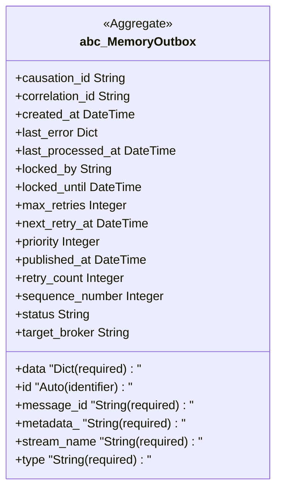

## Cluster: DefaultOutbox


## Cluster: MemoryOutbox



## Cluster: Customer

```mermaid
classDiagram
    class identity_customer_customer_Customer {
        <<Aggregate>>
        +addresses "Address[]"
        +email "EmailAddress (required)"
        +external_id "String (required, unique)"
        +id "Auto (identifier)"
        +last_login_at DateTime
        +profile Profile
        +registered_at DateTime
        +status Status
        +tier Status
    }
    note for identity_customer_customer_Customer addresses_cannot_exceed_maximum, exactly_one_default_address_when_addresses_exist
    class identity_customer_customer_Address {
        <<Entity>>
        +city "String (required)"
        +country "String (required)"
        +customer Customer
        +geo_coordinates GeoCoordinates
        +id "Auto (identifier)"
        +is_default Boolean
        +label String
        +postal_code "String (required)"
        +state String
        +street "String (required)"
    }
    identity_customer_customer_Customer "1" o-- "*" identity_customer_customer_Address : Address
    class identity_customer_customer_GeoCoordinates {
        <<ValueObject>>
        +latitude Float
        +longitude Float
    }
    note for identity_customer_customer_GeoCoordinates both_coordinates_required
    class identity_customer_customer_Profile {
        <<ValueObject>>
        +date_of_birth Date
        +first_name "String (required)"
        +last_name "String (required)"
        +phone String
    }
    identity_customer_customer_Customer *-- identity_customer_customer_Profile : Profile
    class identity_shared_email_EmailAddress {
        <<ValueObject>>
        +address "String (required)"
    }
    note for identity_shared_email_EmailAddress verify_email_address
    identity_customer_customer_Customer *-- identity_shared_email_EmailAddress : EmailAddress
```
