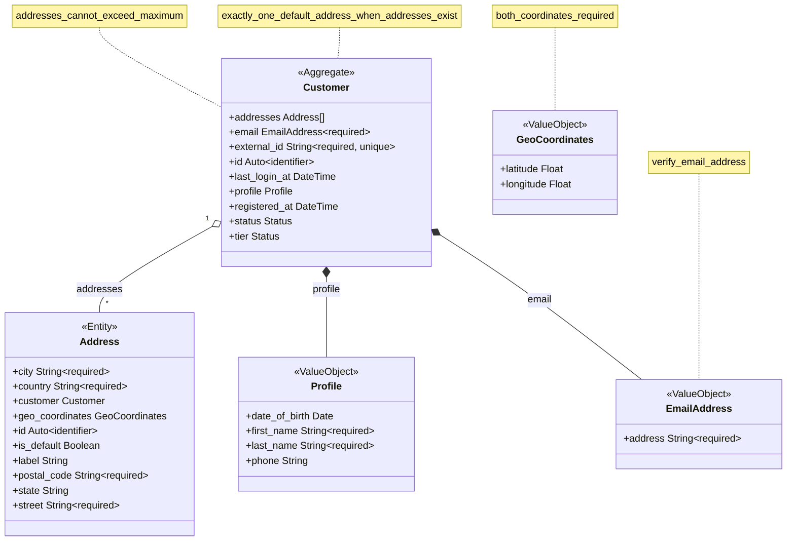

## Cluster: Customer

```mermaid
classDiagram
    class identity_customer_customer_Customer["Customer"] {
        <<Aggregate>>
        +addresses Address[]
        +email EmailAddress~required~
        +external_id String~required, unique~
        +id Auto~identifier~
        +last_login_at DateTime
        +profile Profile
        +registered_at DateTime
        +status Status
        +tier Status
    }
    note for identity_customer_customer_Customer "addresses_cannot_exceed_maximum"
    note for identity_customer_customer_Customer "exactly_one_default_address_when_addresses_exist"
    class identity_customer_customer_Address["Address"] {
        <<Entity>>
        +city String~required~
        +country String~required~
        +customer Customer
        +geo_coordinates GeoCoordinates
        +id Auto~identifier~
        +is_default Boolean
        +label String
        +postal_code String~required~
        +state String
        +street String~required~
    }
    identity_customer_customer_Customer "1" o-- "*" identity_customer_customer_Address : addresses
    class identity_customer_customer_GeoCoordinates["GeoCoordinates"] {
        <<ValueObject>>
        +latitude Float
        +longitude Float
    }
    note for identity_customer_customer_GeoCoordinates "both_coordinates_required"
    class identity_customer_customer_Profile["Profile"] {
        <<ValueObject>>
        +date_of_birth Date
        +first_name String~required~
        +last_name String~required~
        +phone String
    }
    identity_customer_customer_Customer *-- identity_customer_customer_Profile : profile
    class identity_shared_email_EmailAddress["EmailAddress"] {
        <<ValueObject>>
        +address String~required~
    }
    note for identity_shared_email_EmailAddress "verify_email_address"
    identity_customer_customer_Customer *-- identity_shared_email_EmailAddress : email
```
