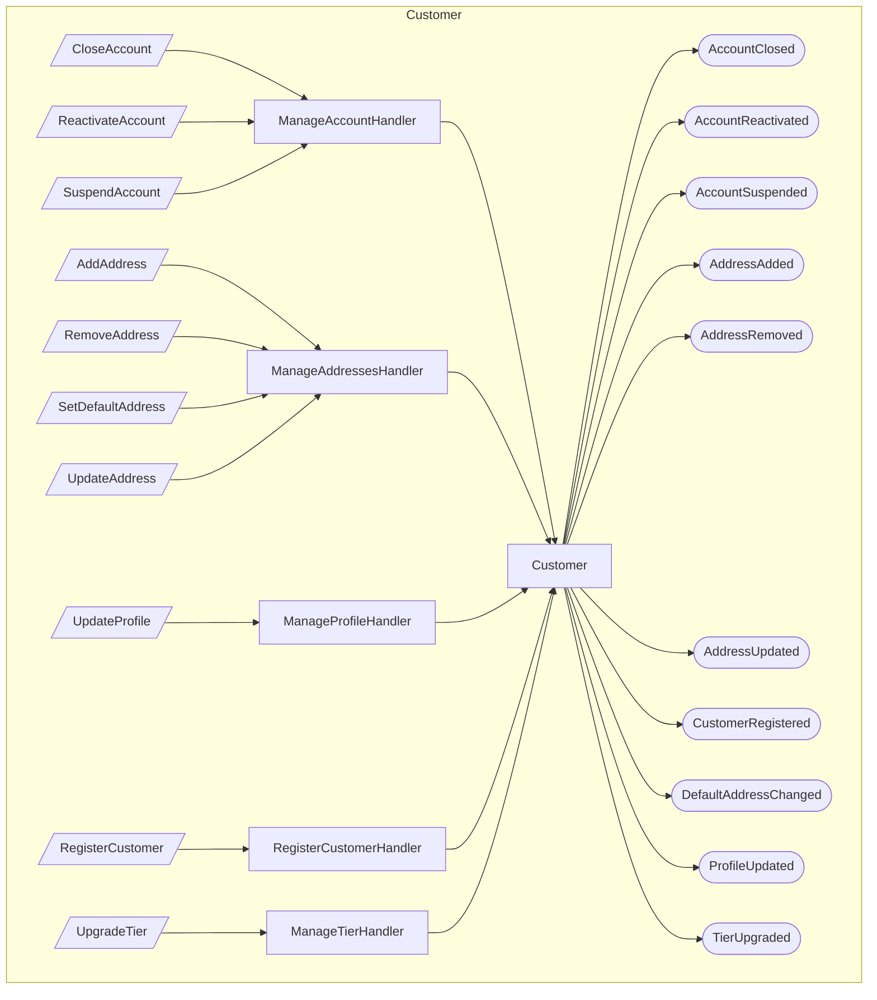
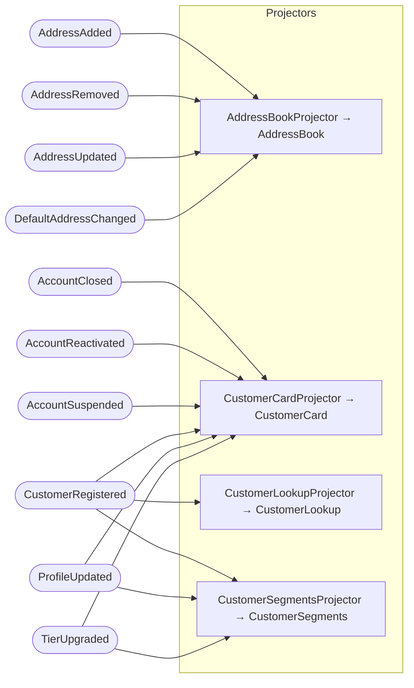

## Event Flow: Customer

```mermaid
flowchart TD
    subgraph identity_customer_customer_Customer[Customer]
        agg_identity_customer_customer_Customer[Customer]
        cmd_identity_customer_account_CloseAccount[/CloseAccount/]
        cmd_identity_customer_account_ReactivateAccount[/ReactivateAccount/]
        cmd_identity_customer_account_SuspendAccount[/SuspendAccount/]
        cmd_identity_customer_addresses_AddAddress[/AddAddress/]
        cmd_identity_customer_addresses_RemoveAddress[/RemoveAddress/]
        cmd_identity_customer_addresses_SetDefaultAddress[/SetDefaultAddress/]
        cmd_identity_customer_addresses_UpdateAddress[/UpdateAddress/]
        cmd_identity_customer_profile_UpdateProfile[/UpdateProfile/]
        cmd_identity_customer_registration_RegisterCustomer[/RegisterCustomer/]
        cmd_identity_customer_tier_UpgradeTier[/UpgradeTier/]
        evt_identity_customer_events_AccountClosed([AccountClosed])
        evt_identity_customer_events_AccountReactivated([AccountReactivated])
        evt_identity_customer_events_AccountSuspended([AccountSuspended])
        evt_identity_customer_events_AddressAdded([AddressAdded])
        evt_identity_customer_events_AddressRemoved([AddressRemoved])
        evt_identity_customer_events_AddressUpdated([AddressUpdated])
        evt_identity_customer_events_CustomerRegistered([CustomerRegistered])
        evt_identity_customer_events_DefaultAddressChanged([DefaultAddressChanged])
        evt_identity_customer_events_ProfileUpdated([ProfileUpdated])
        evt_identity_customer_events_TierUpgraded([TierUpgraded])
        hdlr_identity_customer_account_ManageAccountHandler[ManageAccountHandler]
        hdlr_identity_customer_addresses_ManageAddressesHandler[ManageAddressesHandler]
        hdlr_identity_customer_profile_ManageProfileHandler[ManageProfileHandler]
        hdlr_identity_customer_registration_RegisterCustomerHandler[RegisterCustomerHandler]
        hdlr_identity_customer_tier_ManageTierHandler[ManageTierHandler]
    end
    cmd_identity_customer_account_CloseAccount --> hdlr_identity_customer_account_ManageAccountHandler
    cmd_identity_customer_account_ReactivateAccount --> hdlr_identity_customer_account_ManageAccountHandler
    cmd_identity_customer_account_SuspendAccount --> hdlr_identity_customer_account_ManageAccountHandler
    hdlr_identity_customer_account_ManageAccountHandler --> agg_identity_customer_customer_Customer
    cmd_identity_customer_addresses_AddAddress --> hdlr_identity_customer_addresses_ManageAddressesHandler
    cmd_identity_customer_addresses_RemoveAddress --> hdlr_identity_customer_addresses_ManageAddressesHandler
    cmd_identity_customer_addresses_SetDefaultAddress --> hdlr_identity_customer_addresses_ManageAddressesHandler
    cmd_identity_customer_addresses_UpdateAddress --> hdlr_identity_customer_addresses_ManageAddressesHandler
    hdlr_identity_customer_addresses_ManageAddressesHandler --> agg_identity_customer_customer_Customer
    cmd_identity_customer_profile_UpdateProfile --> hdlr_identity_customer_profile_ManageProfileHandler
    hdlr_identity_customer_profile_ManageProfileHandler --> agg_identity_customer_customer_Customer
    cmd_identity_customer_registration_RegisterCustomer --> hdlr_identity_customer_registration_RegisterCustomerHandler
    hdlr_identity_customer_registration_RegisterCustomerHandler --> agg_identity_customer_customer_Customer
    cmd_identity_customer_tier_UpgradeTier --> hdlr_identity_customer_tier_ManageTierHandler
    hdlr_identity_customer_tier_ManageTierHandler --> agg_identity_customer_customer_Customer
    agg_identity_customer_customer_Customer --> evt_identity_customer_events_AccountClosed
    agg_identity_customer_customer_Customer --> evt_identity_customer_events_AccountReactivated
    agg_identity_customer_customer_Customer --> evt_identity_customer_events_AccountSuspended
    agg_identity_customer_customer_Customer --> evt_identity_customer_events_AddressAdded
    agg_identity_customer_customer_Customer --> evt_identity_customer_events_AddressRemoved
    agg_identity_customer_customer_Customer --> evt_identity_customer_events_AddressUpdated
    agg_identity_customer_customer_Customer --> evt_identity_customer_events_CustomerRegistered
    agg_identity_customer_customer_Customer --> evt_identity_customer_events_DefaultAddressChanged
    agg_identity_customer_customer_Customer --> evt_identity_customer_events_ProfileUpdated
    agg_identity_customer_customer_Customer --> evt_identity_customer_events_TierUpgraded
```

## Downstream Consumers

```mermaid
flowchart LR
    evt_identity_customer_events_AccountClosed([AccountClosed])
    evt_identity_customer_events_AccountReactivated([AccountReactivated])
    evt_identity_customer_events_AccountSuspended([AccountSuspended])
    evt_identity_customer_events_AddressAdded([AddressAdded])
    evt_identity_customer_events_AddressRemoved([AddressRemoved])
    evt_identity_customer_events_AddressUpdated([AddressUpdated])
    evt_identity_customer_events_CustomerRegistered([CustomerRegistered])
    evt_identity_customer_events_DefaultAddressChanged([DefaultAddressChanged])
    evt_identity_customer_events_ProfileUpdated([ProfileUpdated])
    evt_identity_customer_events_TierUpgraded([TierUpgraded])
    subgraph projectors["Projectors"]
        proj_identity_projections_address_book_AddressBookProjector[AddressBookProjector → AddressBook]
        proj_identity_projections_customer_card_CustomerCardProjector[CustomerCardProjector → CustomerCard]
        proj_identity_projections_customer_lookup_CustomerLookupProjector[CustomerLookupProjector → CustomerLookup]
        proj_identity_projections_customer_segments_CustomerSegmentsProjector[CustomerSegmentsProjector → CustomerSegments]
    end
    evt_identity_customer_events_AddressAdded --> proj_identity_projections_address_book_AddressBookProjector
    evt_identity_customer_events_AddressRemoved --> proj_identity_projections_address_book_AddressBookProjector
    evt_identity_customer_events_AddressUpdated --> proj_identity_projections_address_book_AddressBookProjector
    evt_identity_customer_events_DefaultAddressChanged --> proj_identity_projections_address_book_AddressBookProjector
    evt_identity_customer_events_AccountClosed --> proj_identity_projections_customer_card_CustomerCardProjector
    evt_identity_customer_events_AccountReactivated --> proj_identity_projections_customer_card_CustomerCardProjector
    evt_identity_customer_events_AccountSuspended --> proj_identity_projections_customer_card_CustomerCardProjector
    evt_identity_customer_events_CustomerRegistered --> proj_identity_projections_customer_card_CustomerCardProjector
    evt_identity_customer_events_ProfileUpdated --> proj_identity_projections_customer_card_CustomerCardProjector
    evt_identity_customer_events_TierUpgraded --> proj_identity_projections_customer_card_CustomerCardProjector
    evt_identity_customer_events_CustomerRegistered --> proj_identity_projections_customer_lookup_CustomerLookupProjector
    evt_identity_customer_events_CustomerRegistered --> proj_identity_projections_customer_segments_CustomerSegmentsProjector
    evt_identity_customer_events_ProfileUpdated --> proj_identity_projections_customer_segments_CustomerSegmentsProjector
    evt_identity_customer_events_TierUpgraded --> proj_identity_projections_customer_segments_CustomerSegmentsProjector
```
