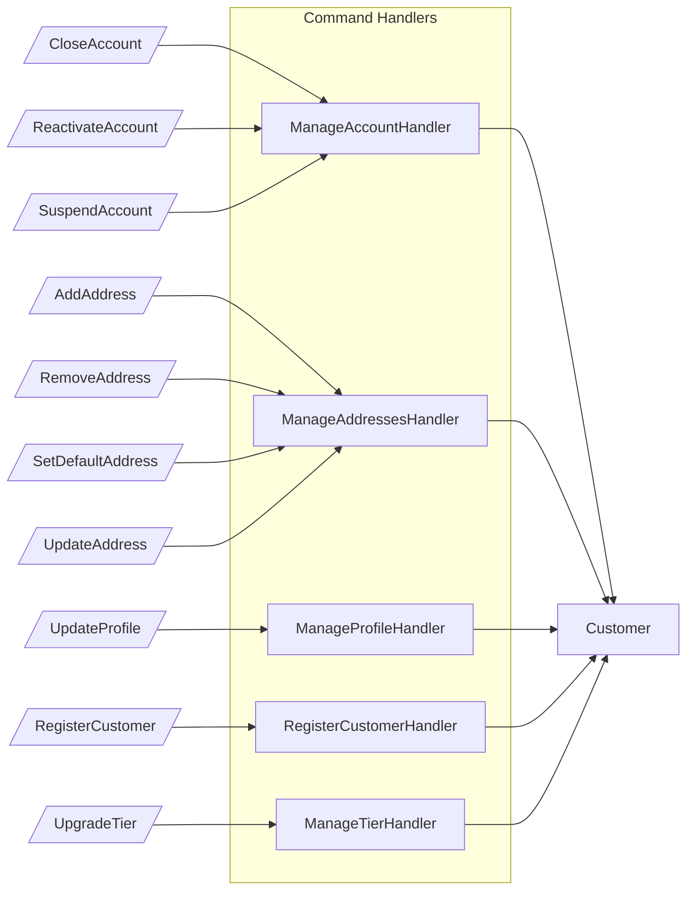
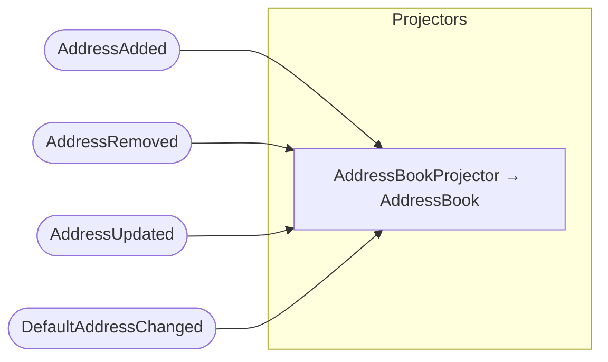
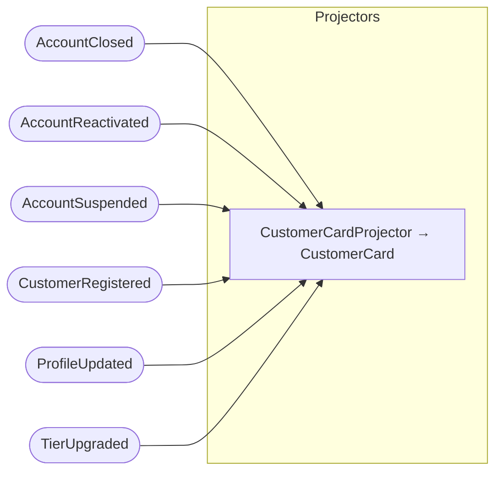
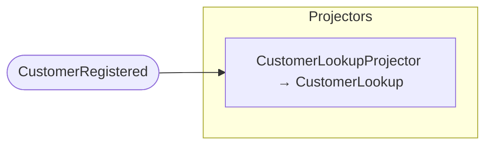
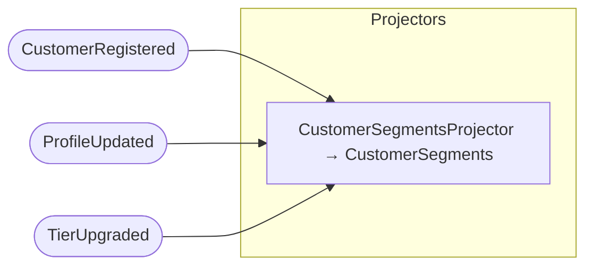

## Command Handlers: Customer

```mermaid
flowchart LR
    subgraph command_handlers["Command Handlers"]
        ch_identity_customer_account_ManageAccountHandler[ManageAccountHandler]
        ch_identity_customer_addresses_ManageAddressesHandler[ManageAddressesHandler]
        ch_identity_customer_profile_ManageProfileHandler[ManageProfileHandler]
        ch_identity_customer_registration_RegisterCustomerHandler[RegisterCustomerHandler]
        ch_identity_customer_tier_ManageTierHandler[ManageTierHandler]
    end
    cmd_identity_customer_account_CloseAccount[/CloseAccount/] --> ch_identity_customer_account_ManageAccountHandler
    cmd_identity_customer_account_ReactivateAccount[/ReactivateAccount/] --> ch_identity_customer_account_ManageAccountHandler
    cmd_identity_customer_account_SuspendAccount[/SuspendAccount/] --> ch_identity_customer_account_ManageAccountHandler
    ch_identity_customer_account_ManageAccountHandler --> agg_identity_customer_customer_Customer[Customer]
    cmd_identity_customer_addresses_AddAddress[/AddAddress/] --> ch_identity_customer_addresses_ManageAddressesHandler
    cmd_identity_customer_addresses_RemoveAddress[/RemoveAddress/] --> ch_identity_customer_addresses_ManageAddressesHandler
    cmd_identity_customer_addresses_SetDefaultAddress[/SetDefaultAddress/] --> ch_identity_customer_addresses_ManageAddressesHandler
    cmd_identity_customer_addresses_UpdateAddress[/UpdateAddress/] --> ch_identity_customer_addresses_ManageAddressesHandler
    ch_identity_customer_addresses_ManageAddressesHandler --> agg_identity_customer_customer_Customer[Customer]
    cmd_identity_customer_profile_UpdateProfile[/UpdateProfile/] --> ch_identity_customer_profile_ManageProfileHandler
    ch_identity_customer_profile_ManageProfileHandler --> agg_identity_customer_customer_Customer[Customer]
    cmd_identity_customer_registration_RegisterCustomer[/RegisterCustomer/] --> ch_identity_customer_registration_RegisterCustomerHandler
    ch_identity_customer_registration_RegisterCustomerHandler --> agg_identity_customer_customer_Customer[Customer]
    cmd_identity_customer_tier_UpgradeTier[/UpgradeTier/] --> ch_identity_customer_tier_ManageTierHandler
    ch_identity_customer_tier_ManageTierHandler --> agg_identity_customer_customer_Customer[Customer]
```

## Projector: AddressBook

```mermaid
flowchart LR
    subgraph projectors["Projectors"]
        proj_identity_projections_address_book_AddressBookProjector[AddressBookProjector → AddressBook]
    end
    evt_identity_customer_events_AddressAdded([AddressAdded]) --> proj_identity_projections_address_book_AddressBookProjector
    evt_identity_customer_events_AddressRemoved([AddressRemoved]) --> proj_identity_projections_address_book_AddressBookProjector
    evt_identity_customer_events_AddressUpdated([AddressUpdated]) --> proj_identity_projections_address_book_AddressBookProjector
    evt_identity_customer_events_DefaultAddressChanged([DefaultAddressChanged]) --> proj_identity_projections_address_book_AddressBookProjector
```

## Projector: CustomerCard

```mermaid
flowchart LR
    subgraph projectors["Projectors"]
        proj_identity_projections_customer_card_CustomerCardProjector[CustomerCardProjector → CustomerCard]
    end
    evt_identity_customer_events_AccountClosed([AccountClosed]) --> proj_identity_projections_customer_card_CustomerCardProjector
    evt_identity_customer_events_AccountReactivated([AccountReactivated]) --> proj_identity_projections_customer_card_CustomerCardProjector
    evt_identity_customer_events_AccountSuspended([AccountSuspended]) --> proj_identity_projections_customer_card_CustomerCardProjector
    evt_identity_customer_events_CustomerRegistered([CustomerRegistered]) --> proj_identity_projections_customer_card_CustomerCardProjector
    evt_identity_customer_events_ProfileUpdated([ProfileUpdated]) --> proj_identity_projections_customer_card_CustomerCardProjector
    evt_identity_customer_events_TierUpgraded([TierUpgraded]) --> proj_identity_projections_customer_card_CustomerCardProjector
```

## Projector: CustomerLookup

```mermaid
flowchart LR
    subgraph projectors["Projectors"]
        proj_identity_projections_customer_lookup_CustomerLookupProjector[CustomerLookupProjector → CustomerLookup]
    end
    evt_identity_customer_events_CustomerRegistered([CustomerRegistered]) --> proj_identity_projections_customer_lookup_CustomerLookupProjector
```

## Projector: CustomerSegments

```mermaid
flowchart LR
    subgraph projectors["Projectors"]
        proj_identity_projections_customer_segments_CustomerSegmentsProjector[CustomerSegmentsProjector → CustomerSegments]
    end
    evt_identity_customer_events_CustomerRegistered([CustomerRegistered]) --> proj_identity_projections_customer_segments_CustomerSegmentsProjector
    evt_identity_customer_events_ProfileUpdated([ProfileUpdated]) --> proj_identity_projections_customer_segments_CustomerSegmentsProjector
    evt_identity_customer_events_TierUpgraded([TierUpgraded]) --> proj_identity_projections_customer_segments_CustomerSegmentsProjector
```
