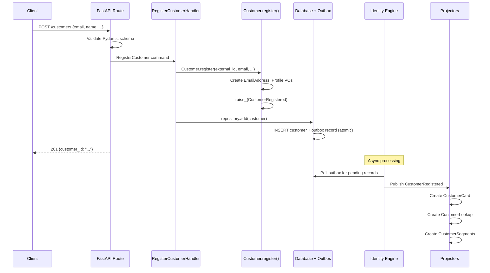

# Register a New Customer

> A person signs up for the platform, creating their account with profile information.

## The Story

Maria discovers ShopStream and wants to create an account. She provides her email,
name, phone number, and date of birth through the registration form. The platform
creates her account, assigns her a unique ID, starts her at the Standard loyalty
tier, and marks her account as Active. She can now browse, add items to her cart,
and place orders.

Behind the scenes, the platform also creates several read-optimized views of Maria's
data: a customer card for her profile page, a lookup index for finding her by email,
and a segment entry for marketing analytics.

## The Flow

### 1. API Request

The client application sends a registration request:

```
POST /customers
{
  "external_id": "auth0|abc123",
  "email": "maria@example.com",
  "first_name": "Maria",
  "last_name": "Santos",
  "phone": "+1-555-0123",
  "date_of_birth": "1990-05-15"
}
```

&rarr; [source](../../src/identity/api/routes.py) (`register_customer`)

The API layer receives a Pydantic `RegisterCustomerRequest` and translates it into
a Protean command. This is the anti-corruption boundary: the external schema (Pydantic)
is separate from the internal domain concept (Protean command).

### 2. Command

The API route creates a `RegisterCustomer` command:

- **`RegisterCustomer`** -- the intent to create a new customer account.
- Key data: `external_id`, `email`, `first_name`, `last_name`, `phone` (optional),
  `date_of_birth` (optional).

&rarr; [source](../../src/identity/customer/registration.py)

The command is processed synchronously via `current_domain.process(command, asynchronous=False)`.
Protean routes it to the matching command handler based on the `part_of` relationship.

### 3. Aggregate Behavior

`RegisterCustomerHandler.register_customer()` receives the command and delegates
to the aggregate's factory method:

1. The handler parses `date_of_birth` from ISO string to `date` if provided.
2. Calls `Customer.register()` -- the factory method that:
   - Creates a `PhoneNumber` value object (if phone provided) and validates its format.
   - Creates a `Profile` value object with first name, last name, phone, and date of birth.
   - Creates an `EmailAddress` value object and validates the email format.
   - Constructs the `Customer` aggregate with Active status and Standard tier.
   - Raises a `CustomerRegistered` event with all the registration data.
3. The handler persists the customer: `current_domain.repository_for(Customer).add(customer)`.
4. Returns the new customer's ID.

&rarr; [source](../../src/identity/customer/customer.py) (`Customer.register`)

**What invariants are checked?**
- `EmailAddress` validates the email format (structure, no whitespace, valid local/domain parts).
- `PhoneNumber` validates the phone format (digits, spaces, hyphens, parens, optional leading +).
- Since this is a new customer with no addresses yet, the address invariants are not triggered.

**What could fail?**
- Invalid email format &rarr; `ValueError` from `EmailAddress` invariant.
- Invalid phone format &rarr; `ValueError` from `PhoneNumber` invariant.
- Duplicate `external_id` &rarr; unique constraint violation at the database level.

### 4. Persistence

The Unit of Work commits the new Customer aggregate to the database and writes an
outbox record for the `CustomerRegistered` event -- both atomically in the same
database transaction. The API returns the customer ID to the client.

This is the **transactional outbox pattern**: the event is guaranteed to be published
eventually because it is stored in the same transaction as the aggregate state change.

### 5. Async Reactions

The Identity Engine's OutboxProcessor picks up the pending outbox record and publishes
the `CustomerRegistered` event to Redis Streams. Stream subscriptions deliver it to
registered projectors:

| Event | Handled By | Effect |
|-------|-----------|--------|
| `CustomerRegistered` | `CustomerCardProjector` | Creates a `CustomerCard` with full profile, email, status=Active, tier=Standard |
| `CustomerRegistered` | `CustomerLookupProjector` | Creates a `CustomerLookup` entry indexed by external_id and email |
| `CustomerRegistered` | `CustomerSegmentsProjector` | Creates a `CustomerSegments` entry with tier=Standard, status=Active |

## Sequence Diagram



## Edge Cases

| Scenario | What Happens | Why |
|----------|-------------|-----|
| Email with spaces or missing @ | `ValueError` raised during `EmailAddress` construction, before aggregate is created | Value object invariant catches invalid data early |
| Phone like "abc" (no digits) | `ValueError` raised during `PhoneNumber` construction | Phone must contain at least one digit |
| Duplicate external_id | Database unique constraint violation, repository raises error | Prevents duplicate accounts from the same auth provider |
| No phone or date_of_birth | Customer created successfully with `None` values | Both fields are optional on the `Profile` value object |
| Projector fails after commit | Event remains in outbox, retried on next poll cycle | At-least-once delivery ensures projections are eventually consistent |
