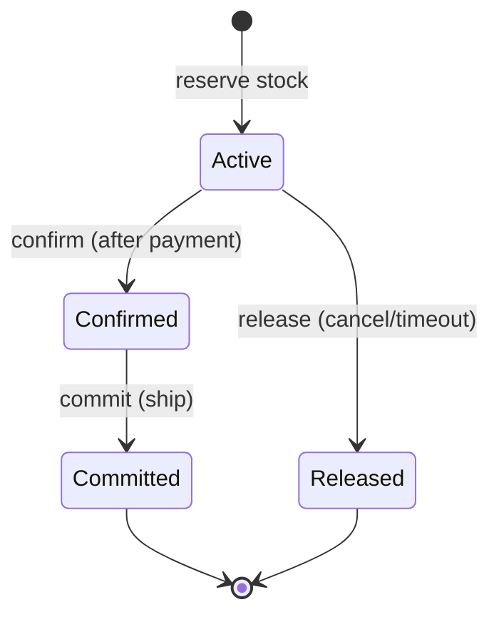
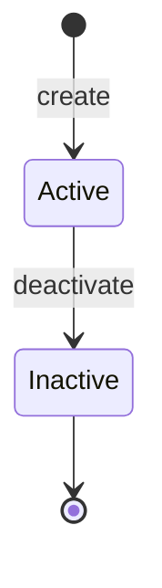

# Inventory

> Manages stock levels, warehouse locations, reservations, damage tracking,
> and the complete audit trail of every stock movement.

## Business Context

When a customer places an order, the platform needs to know whether the item is
in stock, reserve it so no one else can claim it, and eventually remove it from
inventory when it ships. If it comes back as a return, it needs to go back on the
shelf. If a forklift drops a pallet, the damaged units need to be tracked and
eventually written off. And at all times, the purchasing team needs to know what's
running low so they can reorder.

The Inventory context owns this entire lifecycle. It is a separate bounded context
because stock management has fundamentally different consistency requirements and
change patterns than product cataloguing or order processing. Stock levels change
at high frequency during flash sales, require optimistic concurrency for
reservation conflicts, and demand a complete audit trail for shrinkage analysis
and financial reconciliation.

Think of the Inventory context as the warehouse operations team. They receive
shipments from suppliers, put items on shelves, pick and pack orders, track
damaged goods, and count stock during physical inventory checks. They don't
manage the product catalogue (Catalogue context), customer accounts (Identity),
or order lifecycle (Ordering) -- they just need to know which product variant
to track and which warehouse it sits in.

The Inventory context contains two aggregates that serve different purposes:

- **InventoryItem** -- the core stock tracking unit. Uses **event sourcing**
  because every stock movement (receive, reserve, ship, damage, adjust, return)
  must be auditable, replayable, and temporally queryable. Event sourcing is not
  optional here -- it is a business requirement for financial reconciliation and
  shrinkage analysis.
- **Warehouse** -- the physical location where stock is stored. Uses standard
  CQRS because warehouses change infrequently and don't need an audit trail of
  every configuration change.

## Ubiquitous Language

| Term | Definition | Code Element |
|------|-----------|-------------|
| Inventory Item | A stock tracking record for one product variant at one warehouse | `InventoryItem` ([source](../../src/inventory/stock/stock.py)) |
| Warehouse | A physical location where inventory is stored, containing zones | `Warehouse` ([source](../../src/inventory/warehouse/warehouse.py)) |
| Stock Levels | The five-part quantity model: on_hand, reserved, available, in_transit, damaged | `StockLevels` ([source](../../src/inventory/stock/stock.py)) |
| Reservation | A hold on inventory for a specific order, with expiration | `Reservation` ([source](../../src/inventory/stock/stock.py)) |
| Zone | A logical area within a warehouse (regular, cold storage, hazmat) | `Zone` ([source](../../src/inventory/warehouse/warehouse.py)) |
| Warehouse Address | The physical location of a warehouse | `WarehouseAddress` ([source](../../src/inventory/warehouse/warehouse.py)) |
| Reservation Status | Reservation lifecycle: Active &rarr; Confirmed &rarr; committed, or Active &rarr; Released | `ReservationStatus` ([source](../../src/inventory/stock/stock.py)) |
| Adjustment Type | Why stock was manually changed: Count, Shrinkage, Correction, Receiving Error | `AdjustmentType` ([source](../../src/inventory/stock/stock.py)) |
| Zone Type | Classification of warehouse storage: Regular, Cold, Hazmat | `ZoneType` ([source](../../src/inventory/warehouse/warehouse.py)) |
| Low Stock | Available quantity at or below the reorder point | `LowStockDetected` ([source](../../src/inventory/stock/events.py)) |

Full definitions: [Glossary](../glossary.md#inventory-context)

## Domain Model

### InventoryItem (Aggregate, Event Sourced)

An InventoryItem tracks the stock of one product variant at one warehouse. It is
the aggregate root because stock levels, reservations, and damage counts must all
be consistent. For example, reserving stock must atomically decrease available
quantity and create a Reservation entity.

Each InventoryItem is identified by a system-generated ID and is scoped to a
specific `product_id`, `variant_id`, and `warehouse_id`. If the same product
variant exists in three warehouses, there are three separate InventoryItem
aggregates.

**Why event sourcing?** Stock movements are financially significant. An
event-sourced InventoryItem provides:
- A complete, immutable audit trail of every stock change (receives, reservations,
  shipments, adjustments, damage, returns).
- The ability to answer "what was the stock level at 3pm yesterday?" by replaying
  events up to that point.
- Reliable concurrency handling for flash sales -- optimistic concurrency on the
  event stream prevents double-selling.
- Natural alignment with warehouse operations, where each movement is a discrete,
  meaningful business event.

**Stock Level Model:**

| Level | Meaning | Updated By |
|-------|---------|-----------|
| `on_hand` | Physical units in the warehouse | Receiving, commitment (shipping), adjustments, damage, returns |
| `reserved` | Held for orders (not yet shipped) | Reservations, releases, commitments |
| `available` | What can be sold (`on_hand - reserved`) | Derived from on_hand and reserved |
| `in_transit` | Ordered from supplier (not yet received) | Future: supplier order integration |
| `damaged` | Write-off pending | Damage marking, write-off |

**Entities:**

| Entity | Role | Identity |
|--------|------|----------|
| Reservation | A hold on inventory for a specific order, with quantity, status, and expiration | System-generated UUID within the InventoryItem |

**Value Objects:**

| Value Object | Captures | Key Constraints |
|-------------|----------|----------------|
| StockLevels | All five stock quantities (on_hand, reserved, available, in_transit, damaged) | Available is always on_hand - reserved |

**Invariants (rules that must always hold):**

- Available stock cannot be negative (`levels.available >= 0`).
- Reserved cannot exceed on-hand (`levels.reserved <= levels.on_hand`).
- Damaged cannot be negative (`levels.damaged >= 0`).
- Reservations can only be released or confirmed from ACTIVE state.
- Only CONFIRMED reservations can be committed (shipped).
- Damage cannot exceed unreserved stock (cannot damage items held for orders).
- Stock adjustments cannot result in negative on-hand.

**Reservation Lifecycle:**

Reservations represent a hold on inventory for a specific order. They follow
a strict state machine:

- **Active** -- Stock is held. The order has been placed but not yet paid.
  The reservation has an expiration time (default 15 minutes).
- **Confirmed** -- The order has been paid. The reservation is locked in.
- **Released** -- The reservation was cancelled (order cancelled, payment failed,
  or timeout expired). Stock returns to available.
- **Committed** -- The order has shipped. Stock is physically removed from the
  warehouse (on_hand decreases, reserved decreases).

**Low Stock Detection:**

After any operation that changes available stock (reserve, adjust, mark damaged),
the aggregate checks whether `available <= reorder_point`. If so, it raises a
`LowStockDetected` event. This is a **notification-only event** -- it does not
change aggregate state. It exists to trigger cross-domain alerts (e.g., a
purchasing system that auto-generates reorder requests).

### Warehouse (Aggregate, CQRS)

A Warehouse represents a physical location where inventory is stored. It contains
Zones (logical areas like cold storage or hazmat) and tracks overall capacity.

Warehouses are a separate aggregate from InventoryItem because they have independent
identity and lifecycle. A warehouse can be created, configured with zones, and
deactivated independently of the stock it holds. InventoryItems reference a
warehouse by its `warehouse_id`.

**Why NOT event sourced?** Warehouses change infrequently (created once, updated
occasionally, deactivated rarely). There is no business need to audit warehouse
configuration changes or reconstruct warehouse state at a point in time. Standard
CQRS is simpler and sufficient.

**Entities:**

| Entity | Role | Identity |
|--------|------|----------|
| Zone | A logical storage area within a warehouse (e.g., cold, hazmat) | System-generated UUID within the Warehouse |

**Value Objects:**

| Value Object | Captures | Key Constraints |
|-------------|----------|----------------|
| WarehouseAddress | Physical location: street, city, state, postal_code, country | Street, city, postal_code, and country required |

**Invariants:**

- An already-inactive warehouse cannot be deactivated again.

**Lifecycle:**

## Events

### InventoryItem Events (13)

| Event | Trigger | Consequence |
|-------|---------|-------------|
| `StockInitialized` | New inventory record created for a product variant at a warehouse | InventoryLevel, ProductAvailability, WarehouseStock, StockMovementLog projections created |
| `StockReceived` | Goods received into warehouse, increasing on-hand | InventoryLevel, ProductAvailability, WarehouseStock, StockMovementLog updated; LowStockReport may be removed |
| `StockReserved` | Stock reserved for an order, decreasing available | InventoryLevel, ProductAvailability, WarehouseStock, StockMovementLog, ReservationStatus updated |
| `ReservationReleased` | Reservation cancelled/expired, returning stock to available | InventoryLevel, ProductAvailability, WarehouseStock, StockMovementLog, ReservationStatus updated |
| `ReservationConfirmed` | Reservation confirmed after payment | StockMovementLog, ReservationStatus updated |
| `StockCommitted` | Order shipped, reducing on-hand and reserved | InventoryLevel, ProductAvailability, WarehouseStock, StockMovementLog, ReservationStatus updated |
| `StockAdjusted` | Manual stock correction (count, shrinkage, error) | InventoryLevel, ProductAvailability, WarehouseStock, StockMovementLog updated |
| `StockMarkedDamaged` | Stock identified as damaged, moved from on-hand to damaged | InventoryLevel, ProductAvailability, WarehouseStock, StockMovementLog updated |
| `DamagedStockWrittenOff` | Damaged stock removed from inventory | InventoryLevel, WarehouseStock, StockMovementLog updated |
| `StockReturned` | Returned items added back to on-hand | InventoryLevel, ProductAvailability, WarehouseStock, StockMovementLog updated; LowStockReport may be removed |
| `StockCheckRecorded` | Physical stock count recorded (may trigger auto-adjustment) | StockMovementLog updated |
| `LowStockDetected` | Available stock dropped below reorder point (notification only) | LowStockReport created/updated |

All InventoryItem events include previous/new values (e.g., `previous_on_hand`,
`new_on_hand`) to enable projections to update without loading the aggregate and
to provide a complete audit trail.

### Warehouse Events (5)

| Event | Trigger | Consequence |
|-------|---------|-------------|
| `WarehouseCreated` | New warehouse registered | (Future: WarehouseDirectory projection) |
| `WarehouseUpdated` | Warehouse name or capacity changed | (Future: WarehouseDirectory projection) |
| `ZoneAdded` | Storage zone added to warehouse | (Future: WarehouseDirectory projection) |
| `ZoneRemoved` | Storage zone removed from warehouse | (Future: WarehouseDirectory projection) |
| `WarehouseDeactivated` | Warehouse taken offline | (Future: WarehouseDirectory projection) |

## Command Flows

### Stock Commands

| Command | Who Initiates | What Happens | Events Raised |
|---------|--------------|-------------|---------------|
| `InitializeStock` | System / Warehouse | Creates a new InventoryItem for a product variant at a warehouse | `StockInitialized` |
| `ReceiveStock` | Warehouse / Receiving | Adds quantity to on-hand stock (goods arrival) | `StockReceived` |
| `ReserveStock` | Ordering context | Holds stock for an order (default 15-min expiry) | `StockReserved`, possibly `LowStockDetected` |
| `ReleaseReservation` | Ordering / System | Cancels a reservation, returning stock to available | `ReservationReleased` |
| `ConfirmReservation` | Ordering (after payment) | Locks in the reservation for the order | `ReservationConfirmed` |
| `CommitStock` | Fulfillment / Shipping | Removes committed stock from on-hand (order shipped) | `StockCommitted` |
| `AdjustStock` | Warehouse / Admin | Manual correction with reason and type | `StockAdjusted`, possibly `LowStockDetected` |
| `RecordStockCheck` | Warehouse staff | Records physical count; auto-adjusts if discrepancy found | `StockCheckRecorded`, possibly `StockAdjusted` + `LowStockDetected` |
| `MarkDamaged` | Warehouse staff | Flags units as damaged (moves from on-hand to damaged) | `StockMarkedDamaged`, possibly `LowStockDetected` |
| `WriteOffDamaged` | Manager / Admin | Removes damaged units from inventory | `DamagedStockWrittenOff` |
| `ReturnToStock` | Returns processing | Adds returned items back to on-hand | `StockReturned` |

### Warehouse Commands

| Command | Who Initiates | What Happens | Events Raised |
|---------|--------------|-------------|---------------|
| `CreateWarehouse` | Admin | Creates a new warehouse with name, address, capacity | `WarehouseCreated` |
| `UpdateWarehouse` | Admin | Updates warehouse name and/or capacity | `WarehouseUpdated` |
| `AddZone` | Admin | Adds a storage zone (regular, cold, hazmat) | `ZoneAdded` |
| `RemoveZone` | Admin | Removes a storage zone | `ZoneRemoved` |
| `DeactivateWarehouse` | Admin | Takes a warehouse offline | `WarehouseDeactivated` |

## Read Models (Projections)

| Projection | Purpose | Built From |
|-----------|---------|-----------|
| `InventoryLevel` | Per-item stock levels for real-time display: all five quantities, reorder point, active reservation count | StockInitialized, StockReceived, StockReserved, ReservationReleased, StockCommitted, StockAdjusted, StockMarkedDamaged, DamagedStockWrittenOff, StockReturned |
| `ProductAvailability` | Aggregated availability across all warehouses for "In Stock" display on product pages | StockInitialized, StockReceived, StockReserved, ReservationReleased, StockCommitted, StockAdjusted, StockMarkedDamaged, StockReturned |
| `WarehouseStock` | Per-warehouse stock dashboard: on-hand, reserved, available, damaged per item | StockInitialized, StockReceived, StockReserved, ReservationReleased, StockCommitted, StockAdjusted, StockMarkedDamaged, DamagedStockWrittenOff, StockReturned |
| `LowStockReport` | Items below reorder point for purchasing alerts, with criticality flag | LowStockDetected (create/update), StockReceived and StockReturned (remove if above threshold) |
| `StockMovementLog` | Append-only audit trail of every stock movement with quantities and actors | All stock events (append-only, never mutated) |
| `ReservationStatus` | Active reservations view for order status checks | StockReserved, ReservationReleased, ReservationConfirmed, StockCommitted |

**Design note: ProductAvailability** uses a composite key of `product_id::variant_id`
to aggregate stock across all warehouses. This enables the product detail page
"In Stock" display without warehouse-level detail. The `is_in_stock` boolean is
derived from `total_available > 0`.

**Design note: StockMovementLog** follows the same append-only pattern as
`OrderTimeline` in the Ordering context. Each event creates a new entry; entries
are never updated or deleted. This provides a complete, immutable audit trail for
shrinkage analysis and regulatory compliance.

## Cross-Context Relationships

| This Context References | From Other Context | How |
|------------------------|-------------------|-----|
| `product_id`, `variant_id` | Catalogue | Stored on InventoryItem as opaque references to identify which product variant is being tracked |
| `warehouse_id` | (internal) | Links InventoryItems to the Warehouse where they are physically stored |
| `order_id` | Ordering | Stored on Reservations and stock return events to link stock movements to specific orders |

The Inventory context is downstream of Catalogue (it references product/variant IDs)
and has a bidirectional relationship with Ordering: the Ordering context issues
reservation commands to Inventory, and Inventory's stock events inform Ordering
whether fulfillment can proceed.

Currently, cross-context communication uses opaque identifiers. In a production
system, you would add:
- **Ordering subscribes to Inventory's `StockReserved`** to confirm reservation success.
- **Inventory subscribes to Ordering's `OrderCancelled`** to automatically release reservations.
- **Inventory subscribes to Ordering's `OrderShipped`** to automatically commit stock.
- **A Purchasing context subscribes to `LowStockDetected`** to generate reorder requests.

## Design Decisions

### Event Sourcing for InventoryItem, CQRS for Warehouse

**Problem:** Both aggregates manage state changes. Should both use event sourcing?

**Decision:** InventoryItem is event-sourced; Warehouse uses standard CQRS.

**Rationale:** Stock movements are financially significant. Every receive, reserve,
ship, adjust, damage, and return must be auditable for shrinkage analysis, financial
reconciliation, and regulatory compliance. Event sourcing provides this naturally --
the event stream _is_ the audit trail.

Warehouses change slowly (created once, zones added/removed occasionally,
deactivated rarely). Event sourcing would add storage and reconstruction overhead
without business justification.

**Trade-off:** Two persistence patterns in the same bounded context adds cognitive
overhead, but the business rationale is clear.

### Five-Part Stock Level Model

**Problem:** How should stock quantities be tracked?

**Decision:** Five distinct quantities: on_hand, reserved, available, in_transit,
damaged. Available is denormalized as `on_hand - reserved`.

**Rationale:** Each quantity serves a different business purpose:
- `on_hand` is what the warehouse physically holds (finance cares about this).
- `reserved` is what's committed to orders but not yet shipped (operations cares).
- `available` is what can be sold right now (the customer-facing number).
- `in_transit` is what's been ordered from suppliers (purchasing cares).
- `damaged` is what needs to be written off (warehouse management cares).

Collapsing these into fewer quantities would lose operationally important
distinctions. Denormalizing `available` avoids computing it on every read.

**Trade-off:** More fields to maintain consistency across, but the StockLevels
value object (immutable, replaced on every mutation) makes this safe.

### Reservation with Expiration

**Problem:** What happens when stock is reserved but the order never completes?

**Decision:** Reservations have an `expires_at` field (default 15 minutes) and
a state machine (Active &rarr; Confirmed/Released).

**Rationale:** Without expiry, abandoned checkout flows would permanently lock
inventory. The 15-minute default matches typical e-commerce checkout session
timeouts. Confirmation after payment locks the reservation; release on
cancellation/timeout frees it.

**Trade-off:** The expiry mechanism requires a background job to scan for expired
reservations (not implemented in this phase). The infrastructure is in place
(expires_at field, release_reservation method with reason="timeout"), ready for
a future scheduler.

### Previous/New Values in Events

**Problem:** Should events carry the full state or just the delta?

**Decision:** All stock-changing events include `previous_*` and `new_*` values
(e.g., `previous_on_hand`, `new_on_hand`).

**Rationale:** This enables projections to update without loading the aggregate
(they can apply the delta directly) and provides a complete audit trail in each
event. An auditor can see "on_hand went from 100 to 90" without replaying the
entire stream.

**Trade-off:** Larger event payloads, but stock events are small to begin with
and the audit benefit outweighs the storage cost.

### LowStockDetected as a Notification Event

**Problem:** How should the system alert when stock is running low?

**Decision:** `LowStockDetected` is raised as a domain event but does not change
aggregate state (the `@apply` handler is a no-op).

**Rationale:** Low stock detection is a cross-domain concern -- the purchasing
department needs to know, but the inventory aggregate's state is unchanged. Making
it an event (rather than a query) enables reactive, event-driven alerting without
polling.

**Trade-off:** The event is raised on every operation that drops stock below the
threshold, even if it was already low. The LowStockReport projector handles
deduplication (upsert on existing records).

## Source Code Map

| Concern | Location |
|---------|----------|
| InventoryItem aggregate (event-sourced) + StockLevels VO + Reservation entity + enums | [`src/inventory/stock/stock.py`](../../src/inventory/stock/stock.py) |
| InventoryItem events (13) | [`src/inventory/stock/events.py`](../../src/inventory/stock/events.py) |
| Stock initialization command + handler | [`src/inventory/stock/initialization.py`](../../src/inventory/stock/initialization.py) |
| Stock receiving command + handler | [`src/inventory/stock/receiving.py`](../../src/inventory/stock/receiving.py) |
| Reservation commands + handler (reserve, release, confirm) | [`src/inventory/stock/reservation.py`](../../src/inventory/stock/reservation.py) |
| Stock commitment command + handler (shipping) | [`src/inventory/stock/shipping.py`](../../src/inventory/stock/shipping.py) |
| Stock adjustment commands + handler (adjust, stock check) | [`src/inventory/stock/adjustment.py`](../../src/inventory/stock/adjustment.py) |
| Damage commands + handler (mark damaged, write off) | [`src/inventory/stock/damage.py`](../../src/inventory/stock/damage.py) |
| Stock returns command + handler | [`src/inventory/stock/returns.py`](../../src/inventory/stock/returns.py) |
| Warehouse aggregate + Zone entity + WarehouseAddress VO + enums | [`src/inventory/warehouse/warehouse.py`](../../src/inventory/warehouse/warehouse.py) |
| Warehouse events (5) | [`src/inventory/warehouse/events.py`](../../src/inventory/warehouse/events.py) |
| Warehouse management commands + handler | [`src/inventory/warehouse/management.py`](../../src/inventory/warehouse/management.py) |
| Projections + projectors (6) | [`src/inventory/projections/`](../../src/inventory/projections/) |
| API routes (16 endpoints) | [`src/inventory/api/routes.py`](../../src/inventory/api/routes.py) |
| API schemas (Pydantic) | [`src/inventory/api/schemas.py`](../../src/inventory/api/schemas.py) |
