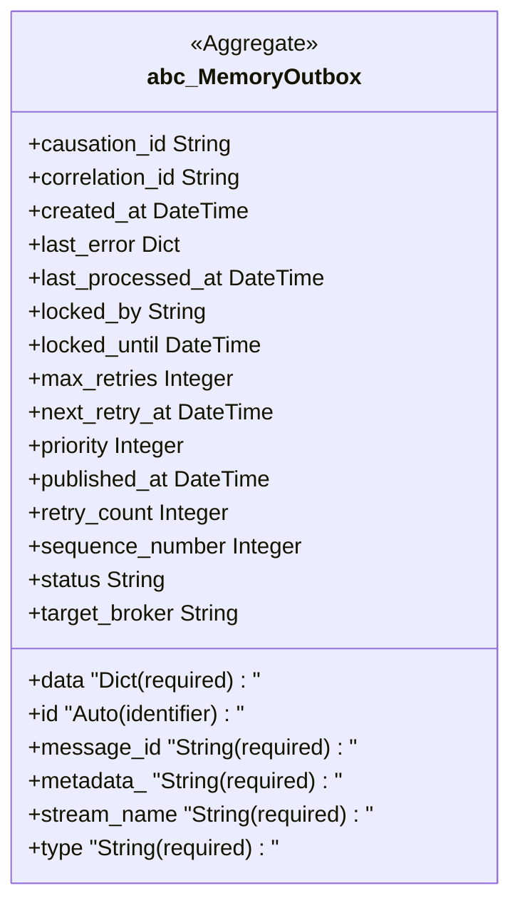
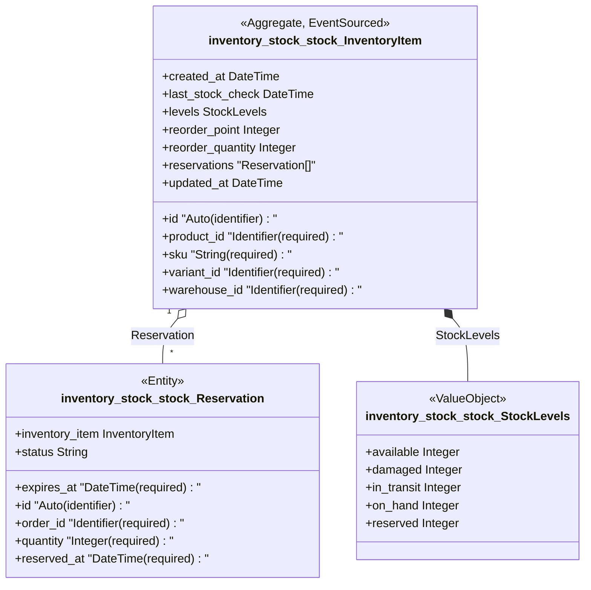
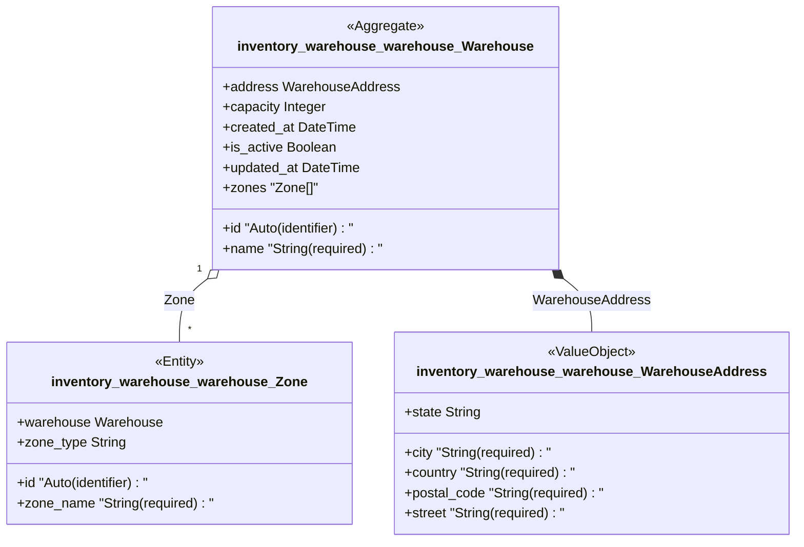

## Cluster: DefaultOutbox

```mermaid
classDiagram
    class abc_DefaultOutbox {
        <<Aggregate>>
        +causation_id String
        +correlation_id String
        +created_at DateTime
        +data "Dict (required)"
        +id "Auto (identifier)"
        +last_error Dict
        +last_processed_at DateTime
        +locked_by String
        +locked_until DateTime
        +max_retries Integer
        +message_id "String (required)"
        +metadata_ "String (required)"
        +next_retry_at DateTime
        +priority Integer
        +published_at DateTime
        +retry_count Integer
        +sequence_number Integer
        +status String
        +stream_name "String (required)"
        +target_broker String
        +type "String (required)"
    }
```

## Cluster: MemoryOutbox

```mermaid
classDiagram
    class abc_MemoryOutbox {
        <<Aggregate>>
        +causation_id String
        +correlation_id String
        +created_at DateTime
        +data "Dict (required)"
        +id "Auto (identifier)"
        +last_error Dict
        +last_processed_at DateTime
        +locked_by String
        +locked_until DateTime
        +max_retries Integer
        +message_id "String (required)"
        +metadata_ "String (required)"
        +next_retry_at DateTime
        +priority Integer
        +published_at DateTime
        +retry_count Integer
        +sequence_number Integer
        +status String
        +stream_name "String (required)"
        +target_broker String
        +type "String (required)"
    }
```

## Cluster: InventoryItem

```mermaid
classDiagram
    class inventory_stock_stock_InventoryItem {
        <<Aggregate, EventSourced>>
        +created_at DateTime
        +id "Auto (identifier)"
        +last_stock_check DateTime
        +levels StockLevels
        +product_id "Identifier (required)"
        +reorder_point Integer
        +reorder_quantity Integer
        +reservations "Reservation[]"
        +sku "String (required)"
        +updated_at DateTime
        +variant_id "Identifier (required)"
        +warehouse_id "Identifier (required)"
    }
    class inventory_stock_stock_Reservation {
        <<Entity>>
        +expires_at "DateTime (required)"
        +id "Auto (identifier)"
        +inventory_item InventoryItem
        +order_id "Identifier (required)"
        +quantity "Integer (required)"
        +reserved_at "DateTime (required)"
        +status String
    }
    inventory_stock_stock_InventoryItem "1" o-- "*" inventory_stock_stock_Reservation : Reservation
    class inventory_stock_stock_StockLevels {
        <<ValueObject>>
        +available Integer
        +damaged Integer
        +in_transit Integer
        +on_hand Integer
        +reserved Integer
    }
    inventory_stock_stock_InventoryItem *-- inventory_stock_stock_StockLevels : StockLevels
```

## Cluster: Warehouse

```mermaid
classDiagram
    class inventory_warehouse_warehouse_Warehouse {
        <<Aggregate>>
        +address WarehouseAddress
        +capacity Integer
        +created_at DateTime
        +id "Auto (identifier)"
        +is_active Boolean
        +name "String (required)"
        +updated_at DateTime
        +zones "Zone[]"
    }
    class inventory_warehouse_warehouse_Zone {
        <<Entity>>
        +id "Auto (identifier)"
        +warehouse Warehouse
        +zone_name "String (required)"
        +zone_type String
    }
    inventory_warehouse_warehouse_Warehouse "1" o-- "*" inventory_warehouse_warehouse_Zone : Zone
    class inventory_warehouse_warehouse_WarehouseAddress {
        <<ValueObject>>
        +city "String (required)"
        +country "String (required)"
        +postal_code "String (required)"
        +state String
        +street "String (required)"
    }
    inventory_warehouse_warehouse_Warehouse *-- inventory_warehouse_warehouse_WarehouseAddress : WarehouseAddress
```
