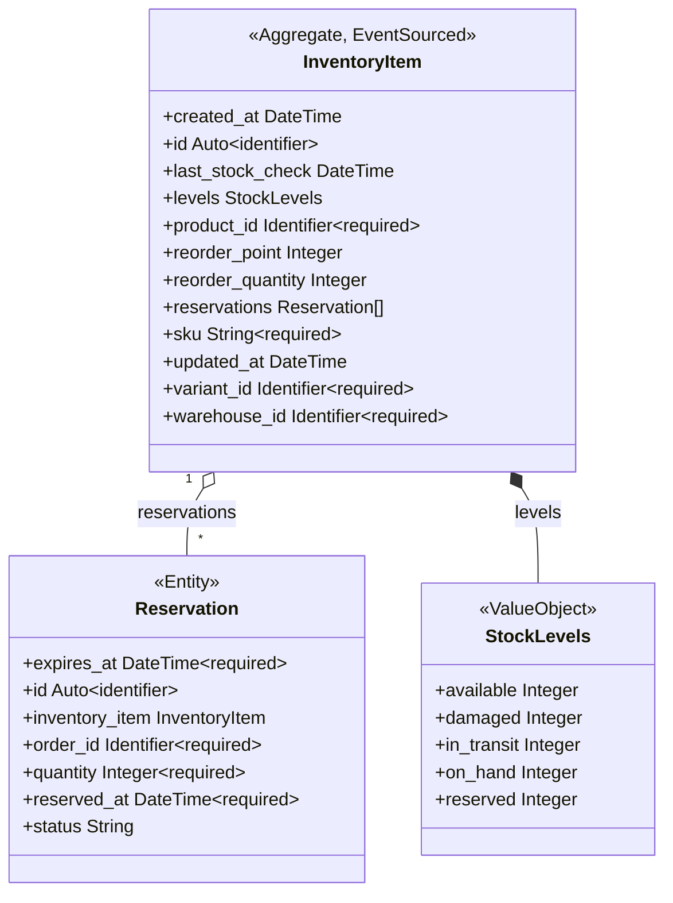
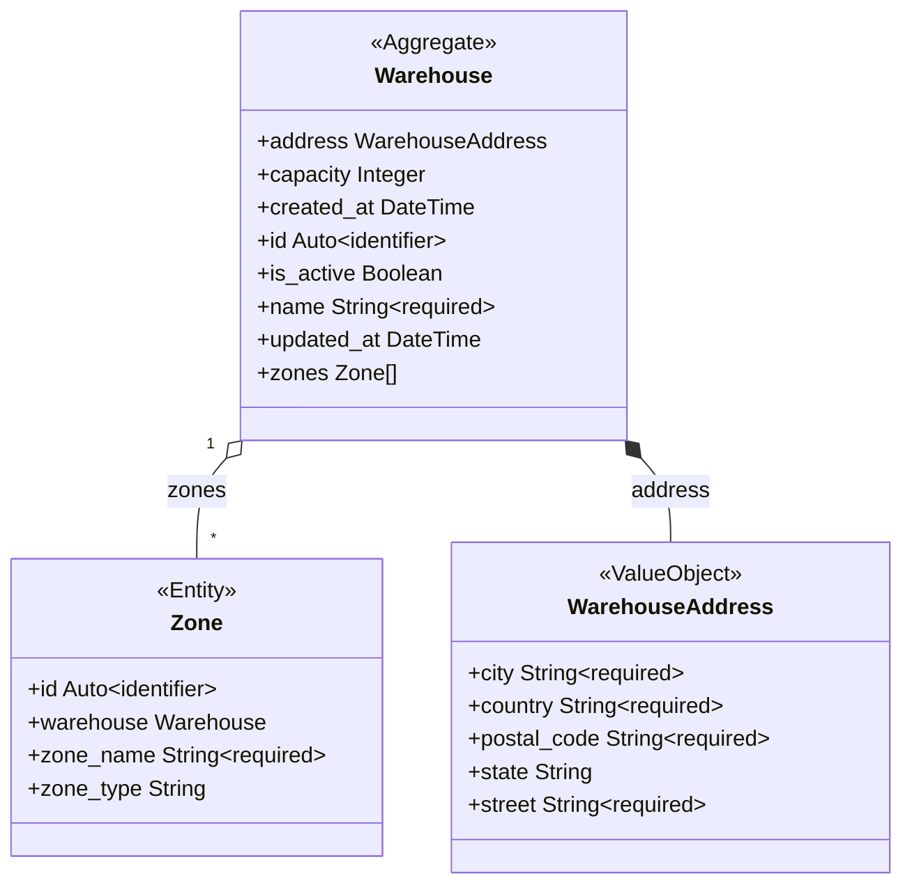

## Cluster: InventoryItem

```mermaid
classDiagram
    class inventory_stock_stock_InventoryItem["InventoryItem"] {
        <<Aggregate, EventSourced>>
        +created_at DateTime
        +id Auto~identifier~
        +last_stock_check DateTime
        +levels StockLevels
        +product_id Identifier~required~
        +reorder_point Integer
        +reorder_quantity Integer
        +reservations Reservation[]
        +sku String~required~
        +updated_at DateTime
        +variant_id Identifier~required~
        +warehouse_id Identifier~required~
    }
    class inventory_stock_stock_Reservation["Reservation"] {
        <<Entity>>
        +expires_at DateTime~required~
        +id Auto~identifier~
        +inventory_item InventoryItem
        +order_id Identifier~required~
        +quantity Integer~required~
        +reserved_at DateTime~required~
        +status String
    }
    inventory_stock_stock_InventoryItem "1" o-- "*" inventory_stock_stock_Reservation : reservations
    class inventory_stock_stock_StockLevels["StockLevels"] {
        <<ValueObject>>
        +available Integer
        +damaged Integer
        +in_transit Integer
        +on_hand Integer
        +reserved Integer
    }
    inventory_stock_stock_InventoryItem *-- inventory_stock_stock_StockLevels : levels
```

## Cluster: Warehouse

```mermaid
classDiagram
    class inventory_warehouse_warehouse_Warehouse["Warehouse"] {
        <<Aggregate>>
        +address WarehouseAddress
        +capacity Integer
        +created_at DateTime
        +id Auto~identifier~
        +is_active Boolean
        +name String~required~
        +updated_at DateTime
        +zones Zone[]
    }
    class inventory_warehouse_warehouse_Zone["Zone"] {
        <<Entity>>
        +id Auto~identifier~
        +warehouse Warehouse
        +zone_name String~required~
        +zone_type String
    }
    inventory_warehouse_warehouse_Warehouse "1" o-- "*" inventory_warehouse_warehouse_Zone : zones
    class inventory_warehouse_warehouse_WarehouseAddress["WarehouseAddress"] {
        <<ValueObject>>
        +city String~required~
        +country String~required~
        +postal_code String~required~
        +state String
        +street String~required~
    }
    inventory_warehouse_warehouse_Warehouse *-- inventory_warehouse_warehouse_WarehouseAddress : address
```
