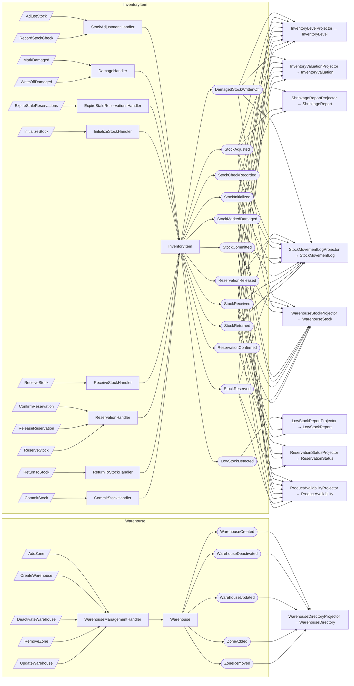

## Event Flows

```mermaid
flowchart LR
    subgraph inventory_stock_stock_InventoryItem[InventoryItem]
        agg_inventory_stock_stock_InventoryItem[InventoryItem]
        cmd_inventory_stock_adjustment_AdjustStock[/AdjustStock/]
        cmd_inventory_stock_adjustment_RecordStockCheck[/RecordStockCheck/]
        cmd_inventory_stock_damage_MarkDamaged[/MarkDamaged/]
        cmd_inventory_stock_damage_WriteOffDamaged[/WriteOffDamaged/]
        cmd_inventory_stock_expiry_ExpireStaleReservations[/ExpireStaleReservations/]
        cmd_inventory_stock_initialization_InitializeStock[/InitializeStock/]
        cmd_inventory_stock_receiving_ReceiveStock[/ReceiveStock/]
        cmd_inventory_stock_reservation_ConfirmReservation[/ConfirmReservation/]
        cmd_inventory_stock_reservation_ReleaseReservation[/ReleaseReservation/]
        cmd_inventory_stock_reservation_ReserveStock[/ReserveStock/]
        cmd_inventory_stock_returns_ReturnToStock[/ReturnToStock/]
        cmd_inventory_stock_shipping_CommitStock[/CommitStock/]
        evt_inventory_stock_events_DamagedStockWrittenOff([DamagedStockWrittenOff])
        evt_inventory_stock_events_LowStockDetected([LowStockDetected])
        evt_inventory_stock_events_ReservationConfirmed([ReservationConfirmed])
        evt_inventory_stock_events_ReservationReleased([ReservationReleased])
        evt_inventory_stock_events_StockAdjusted([StockAdjusted])
        evt_inventory_stock_events_StockCheckRecorded([StockCheckRecorded])
        evt_inventory_stock_events_StockCommitted([StockCommitted])
        evt_inventory_stock_events_StockInitialized([StockInitialized])
        evt_inventory_stock_events_StockMarkedDamaged([StockMarkedDamaged])
        evt_inventory_stock_events_StockReceived([StockReceived])
        evt_inventory_stock_events_StockReserved([StockReserved])
        evt_inventory_stock_events_StockReturned([StockReturned])
        hdlr_inventory_stock_adjustment_StockAdjustmentHandler[StockAdjustmentHandler]
        hdlr_inventory_stock_damage_DamageHandler[DamageHandler]
        hdlr_inventory_stock_expiry_ExpireStaleReservationsHandler[ExpireStaleReservationsHandler]
        hdlr_inventory_stock_initialization_InitializeStockHandler[InitializeStockHandler]
        hdlr_inventory_stock_receiving_ReceiveStockHandler[ReceiveStockHandler]
        hdlr_inventory_stock_reservation_ReservationHandler[ReservationHandler]
        hdlr_inventory_stock_returns_ReturnToStockHandler[ReturnToStockHandler]
        hdlr_inventory_stock_shipping_CommitStockHandler[CommitStockHandler]
    end
    subgraph inventory_warehouse_warehouse_Warehouse[Warehouse]
        agg_inventory_warehouse_warehouse_Warehouse[Warehouse]
        cmd_inventory_warehouse_management_AddZone[/AddZone/]
        cmd_inventory_warehouse_management_CreateWarehouse[/CreateWarehouse/]
        cmd_inventory_warehouse_management_DeactivateWarehouse[/DeactivateWarehouse/]
        cmd_inventory_warehouse_management_RemoveZone[/RemoveZone/]
        cmd_inventory_warehouse_management_UpdateWarehouse[/UpdateWarehouse/]
        evt_inventory_warehouse_events_WarehouseCreated([WarehouseCreated])
        evt_inventory_warehouse_events_WarehouseDeactivated([WarehouseDeactivated])
        evt_inventory_warehouse_events_WarehouseUpdated([WarehouseUpdated])
        evt_inventory_warehouse_events_ZoneAdded([ZoneAdded])
        evt_inventory_warehouse_events_ZoneRemoved([ZoneRemoved])
        hdlr_inventory_warehouse_management_WarehouseManagementHandler[WarehouseManagementHandler]
    end
    cmd_inventory_stock_adjustment_AdjustStock --> hdlr_inventory_stock_adjustment_StockAdjustmentHandler
    cmd_inventory_stock_adjustment_RecordStockCheck --> hdlr_inventory_stock_adjustment_StockAdjustmentHandler
    hdlr_inventory_stock_adjustment_StockAdjustmentHandler --> agg_inventory_stock_stock_InventoryItem
    cmd_inventory_stock_damage_MarkDamaged --> hdlr_inventory_stock_damage_DamageHandler
    cmd_inventory_stock_damage_WriteOffDamaged --> hdlr_inventory_stock_damage_DamageHandler
    hdlr_inventory_stock_damage_DamageHandler --> agg_inventory_stock_stock_InventoryItem
    cmd_inventory_stock_expiry_ExpireStaleReservations --> hdlr_inventory_stock_expiry_ExpireStaleReservationsHandler
    hdlr_inventory_stock_expiry_ExpireStaleReservationsHandler --> agg_inventory_stock_stock_InventoryItem
    cmd_inventory_stock_initialization_InitializeStock --> hdlr_inventory_stock_initialization_InitializeStockHandler
    hdlr_inventory_stock_initialization_InitializeStockHandler --> agg_inventory_stock_stock_InventoryItem
    cmd_inventory_stock_receiving_ReceiveStock --> hdlr_inventory_stock_receiving_ReceiveStockHandler
    hdlr_inventory_stock_receiving_ReceiveStockHandler --> agg_inventory_stock_stock_InventoryItem
    cmd_inventory_stock_reservation_ConfirmReservation --> hdlr_inventory_stock_reservation_ReservationHandler
    cmd_inventory_stock_reservation_ReleaseReservation --> hdlr_inventory_stock_reservation_ReservationHandler
    cmd_inventory_stock_reservation_ReserveStock --> hdlr_inventory_stock_reservation_ReservationHandler
    hdlr_inventory_stock_reservation_ReservationHandler --> agg_inventory_stock_stock_InventoryItem
    cmd_inventory_stock_returns_ReturnToStock --> hdlr_inventory_stock_returns_ReturnToStockHandler
    hdlr_inventory_stock_returns_ReturnToStockHandler --> agg_inventory_stock_stock_InventoryItem
    cmd_inventory_stock_shipping_CommitStock --> hdlr_inventory_stock_shipping_CommitStockHandler
    hdlr_inventory_stock_shipping_CommitStockHandler --> agg_inventory_stock_stock_InventoryItem
    agg_inventory_stock_stock_InventoryItem --> evt_inventory_stock_events_DamagedStockWrittenOff
    agg_inventory_stock_stock_InventoryItem --> evt_inventory_stock_events_LowStockDetected
    agg_inventory_stock_stock_InventoryItem --> evt_inventory_stock_events_ReservationConfirmed
    agg_inventory_stock_stock_InventoryItem --> evt_inventory_stock_events_ReservationReleased
    agg_inventory_stock_stock_InventoryItem --> evt_inventory_stock_events_StockAdjusted
    agg_inventory_stock_stock_InventoryItem --> evt_inventory_stock_events_StockCheckRecorded
    agg_inventory_stock_stock_InventoryItem --> evt_inventory_stock_events_StockCommitted
    agg_inventory_stock_stock_InventoryItem --> evt_inventory_stock_events_StockInitialized
    agg_inventory_stock_stock_InventoryItem --> evt_inventory_stock_events_StockMarkedDamaged
    agg_inventory_stock_stock_InventoryItem --> evt_inventory_stock_events_StockReceived
    agg_inventory_stock_stock_InventoryItem --> evt_inventory_stock_events_StockReserved
    agg_inventory_stock_stock_InventoryItem --> evt_inventory_stock_events_StockReturned
    cmd_inventory_warehouse_management_AddZone --> hdlr_inventory_warehouse_management_WarehouseManagementHandler
    cmd_inventory_warehouse_management_CreateWarehouse --> hdlr_inventory_warehouse_management_WarehouseManagementHandler
    cmd_inventory_warehouse_management_DeactivateWarehouse --> hdlr_inventory_warehouse_management_WarehouseManagementHandler
    cmd_inventory_warehouse_management_RemoveZone --> hdlr_inventory_warehouse_management_WarehouseManagementHandler
    cmd_inventory_warehouse_management_UpdateWarehouse --> hdlr_inventory_warehouse_management_WarehouseManagementHandler
    hdlr_inventory_warehouse_management_WarehouseManagementHandler --> agg_inventory_warehouse_warehouse_Warehouse
    agg_inventory_warehouse_warehouse_Warehouse --> evt_inventory_warehouse_events_WarehouseCreated
    agg_inventory_warehouse_warehouse_Warehouse --> evt_inventory_warehouse_events_WarehouseDeactivated
    agg_inventory_warehouse_warehouse_Warehouse --> evt_inventory_warehouse_events_WarehouseUpdated
    agg_inventory_warehouse_warehouse_Warehouse --> evt_inventory_warehouse_events_ZoneAdded
    agg_inventory_warehouse_warehouse_Warehouse --> evt_inventory_warehouse_events_ZoneRemoved
    proj_inventory_projections_inventory_level_InventoryLevelProjector[InventoryLevelProjector → InventoryLevel]
    evt_inventory_stock_events_DamagedStockWrittenOff --> proj_inventory_projections_inventory_level_InventoryLevelProjector
    evt_inventory_stock_events_ReservationReleased --> proj_inventory_projections_inventory_level_InventoryLevelProjector
    evt_inventory_stock_events_StockAdjusted --> proj_inventory_projections_inventory_level_InventoryLevelProjector
    evt_inventory_stock_events_StockCommitted --> proj_inventory_projections_inventory_level_InventoryLevelProjector
    evt_inventory_stock_events_StockInitialized --> proj_inventory_projections_inventory_level_InventoryLevelProjector
    evt_inventory_stock_events_StockMarkedDamaged --> proj_inventory_projections_inventory_level_InventoryLevelProjector
    evt_inventory_stock_events_StockReceived --> proj_inventory_projections_inventory_level_InventoryLevelProjector
    evt_inventory_stock_events_StockReserved --> proj_inventory_projections_inventory_level_InventoryLevelProjector
    evt_inventory_stock_events_StockReturned --> proj_inventory_projections_inventory_level_InventoryLevelProjector
    proj_inventory_projections_inventory_valuation_InventoryValuationProjector[InventoryValuationProjector → InventoryValuation]
    evt_inventory_stock_events_DamagedStockWrittenOff --> proj_inventory_projections_inventory_valuation_InventoryValuationProjector
    evt_inventory_stock_events_StockAdjusted --> proj_inventory_projections_inventory_valuation_InventoryValuationProjector
    evt_inventory_stock_events_StockCommitted --> proj_inventory_projections_inventory_valuation_InventoryValuationProjector
    evt_inventory_stock_events_StockInitialized --> proj_inventory_projections_inventory_valuation_InventoryValuationProjector
    evt_inventory_stock_events_StockReceived --> proj_inventory_projections_inventory_valuation_InventoryValuationProjector
    evt_inventory_stock_events_StockReturned --> proj_inventory_projections_inventory_valuation_InventoryValuationProjector
    proj_inventory_projections_low_stock_report_LowStockReportProjector[LowStockReportProjector → LowStockReport]
    evt_inventory_stock_events_LowStockDetected --> proj_inventory_projections_low_stock_report_LowStockReportProjector
    evt_inventory_stock_events_StockReceived --> proj_inventory_projections_low_stock_report_LowStockReportProjector
    evt_inventory_stock_events_StockReturned --> proj_inventory_projections_low_stock_report_LowStockReportProjector
    proj_inventory_projections_product_availability_ProductAvailabilityProjector[ProductAvailabilityProjector → ProductAvailability]
    evt_inventory_stock_events_ReservationReleased --> proj_inventory_projections_product_availability_ProductAvailabilityProjector
    evt_inventory_stock_events_StockAdjusted --> proj_inventory_projections_product_availability_ProductAvailabilityProjector
    evt_inventory_stock_events_StockCommitted --> proj_inventory_projections_product_availability_ProductAvailabilityProjector
    evt_inventory_stock_events_StockInitialized --> proj_inventory_projections_product_availability_ProductAvailabilityProjector
    evt_inventory_stock_events_StockMarkedDamaged --> proj_inventory_projections_product_availability_ProductAvailabilityProjector
    evt_inventory_stock_events_StockReceived --> proj_inventory_projections_product_availability_ProductAvailabilityProjector
    evt_inventory_stock_events_StockReserved --> proj_inventory_projections_product_availability_ProductAvailabilityProjector
    evt_inventory_stock_events_StockReturned --> proj_inventory_projections_product_availability_ProductAvailabilityProjector
    proj_inventory_projections_reservation_status_ReservationStatusProjector[ReservationStatusProjector → ReservationStatus]
    evt_inventory_stock_events_ReservationConfirmed --> proj_inventory_projections_reservation_status_ReservationStatusProjector
    evt_inventory_stock_events_ReservationReleased --> proj_inventory_projections_reservation_status_ReservationStatusProjector
    evt_inventory_stock_events_StockCommitted --> proj_inventory_projections_reservation_status_ReservationStatusProjector
    evt_inventory_stock_events_StockReserved --> proj_inventory_projections_reservation_status_ReservationStatusProjector
    proj_inventory_projections_shrinkage_report_ShrinkageReportProjector[ShrinkageReportProjector → ShrinkageReport]
    evt_inventory_stock_events_DamagedStockWrittenOff --> proj_inventory_projections_shrinkage_report_ShrinkageReportProjector
    evt_inventory_stock_events_StockAdjusted --> proj_inventory_projections_shrinkage_report_ShrinkageReportProjector
    evt_inventory_stock_events_StockMarkedDamaged --> proj_inventory_projections_shrinkage_report_ShrinkageReportProjector
    proj_inventory_projections_stock_movement_log_StockMovementLogProjector[StockMovementLogProjector → StockMovementLog]
    evt_inventory_stock_events_DamagedStockWrittenOff --> proj_inventory_projections_stock_movement_log_StockMovementLogProjector
    evt_inventory_stock_events_ReservationConfirmed --> proj_inventory_projections_stock_movement_log_StockMovementLogProjector
    evt_inventory_stock_events_ReservationReleased --> proj_inventory_projections_stock_movement_log_StockMovementLogProjector
    evt_inventory_stock_events_StockAdjusted --> proj_inventory_projections_stock_movement_log_StockMovementLogProjector
    evt_inventory_stock_events_StockCheckRecorded --> proj_inventory_projections_stock_movement_log_StockMovementLogProjector
    evt_inventory_stock_events_StockCommitted --> proj_inventory_projections_stock_movement_log_StockMovementLogProjector
    evt_inventory_stock_events_StockInitialized --> proj_inventory_projections_stock_movement_log_StockMovementLogProjector
    evt_inventory_stock_events_StockMarkedDamaged --> proj_inventory_projections_stock_movement_log_StockMovementLogProjector
    evt_inventory_stock_events_StockReceived --> proj_inventory_projections_stock_movement_log_StockMovementLogProjector
    evt_inventory_stock_events_StockReserved --> proj_inventory_projections_stock_movement_log_StockMovementLogProjector
    evt_inventory_stock_events_StockReturned --> proj_inventory_projections_stock_movement_log_StockMovementLogProjector
    proj_inventory_projections_warehouse_directory_WarehouseDirectoryProjector[WarehouseDirectoryProjector → WarehouseDirectory]
    evt_inventory_warehouse_events_WarehouseCreated --> proj_inventory_projections_warehouse_directory_WarehouseDirectoryProjector
    evt_inventory_warehouse_events_WarehouseDeactivated --> proj_inventory_projections_warehouse_directory_WarehouseDirectoryProjector
    evt_inventory_warehouse_events_WarehouseUpdated --> proj_inventory_projections_warehouse_directory_WarehouseDirectoryProjector
    evt_inventory_warehouse_events_ZoneAdded --> proj_inventory_projections_warehouse_directory_WarehouseDirectoryProjector
    evt_inventory_warehouse_events_ZoneRemoved --> proj_inventory_projections_warehouse_directory_WarehouseDirectoryProjector
    proj_inventory_projections_warehouse_stock_WarehouseStockProjector[WarehouseStockProjector → WarehouseStock]
    evt_inventory_stock_events_DamagedStockWrittenOff --> proj_inventory_projections_warehouse_stock_WarehouseStockProjector
    evt_inventory_stock_events_ReservationReleased --> proj_inventory_projections_warehouse_stock_WarehouseStockProjector
    evt_inventory_stock_events_StockAdjusted --> proj_inventory_projections_warehouse_stock_WarehouseStockProjector
    evt_inventory_stock_events_StockCommitted --> proj_inventory_projections_warehouse_stock_WarehouseStockProjector
    evt_inventory_stock_events_StockInitialized --> proj_inventory_projections_warehouse_stock_WarehouseStockProjector
    evt_inventory_stock_events_StockMarkedDamaged --> proj_inventory_projections_warehouse_stock_WarehouseStockProjector
    evt_inventory_stock_events_StockReceived --> proj_inventory_projections_warehouse_stock_WarehouseStockProjector
    evt_inventory_stock_events_StockReserved --> proj_inventory_projections_warehouse_stock_WarehouseStockProjector
    evt_inventory_stock_events_StockReturned --> proj_inventory_projections_warehouse_stock_WarehouseStockProjector
```
