## Command Handlers: InventoryItem

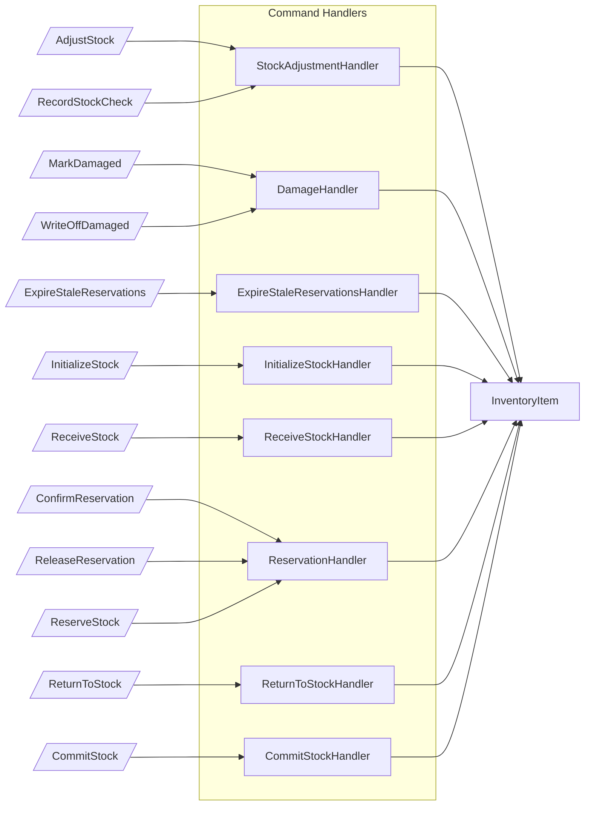

## Command Handlers: Warehouse

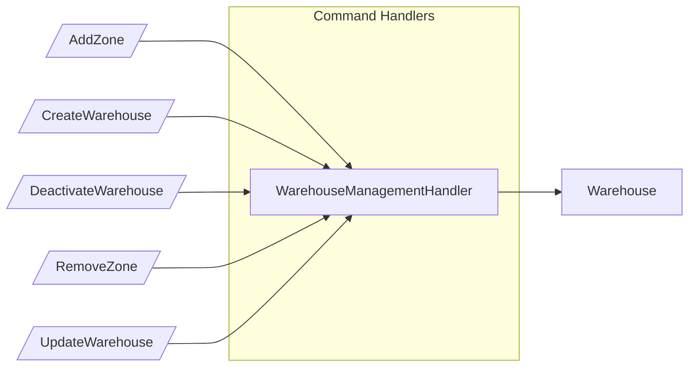

## Subscribers

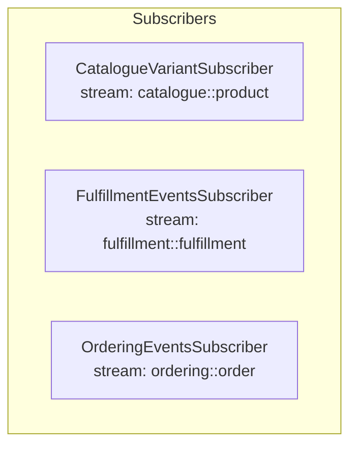

## Projector: InventoryLevel

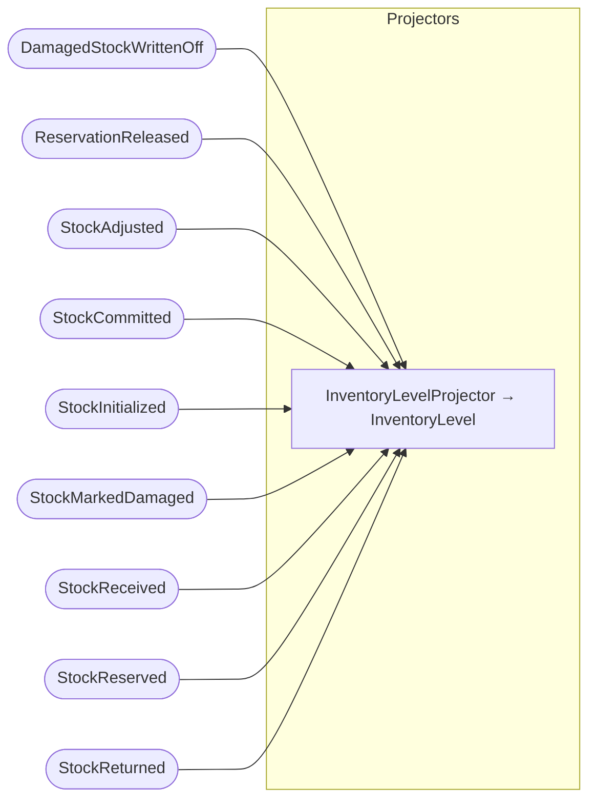

## Projector: InventoryValuation

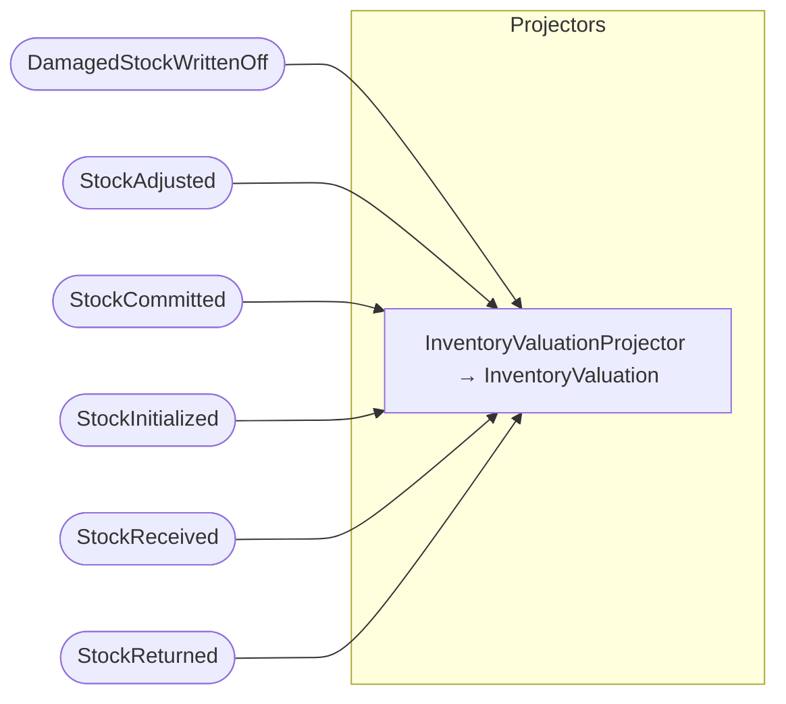

## Projector: LowStockReport

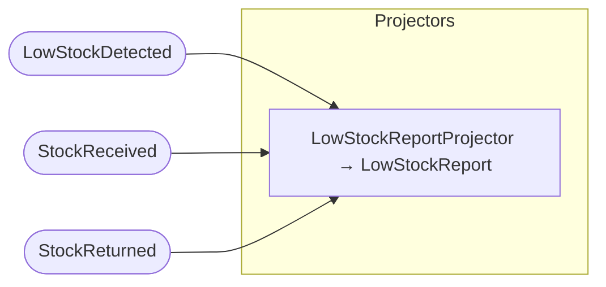

## Projector: ProductAvailability

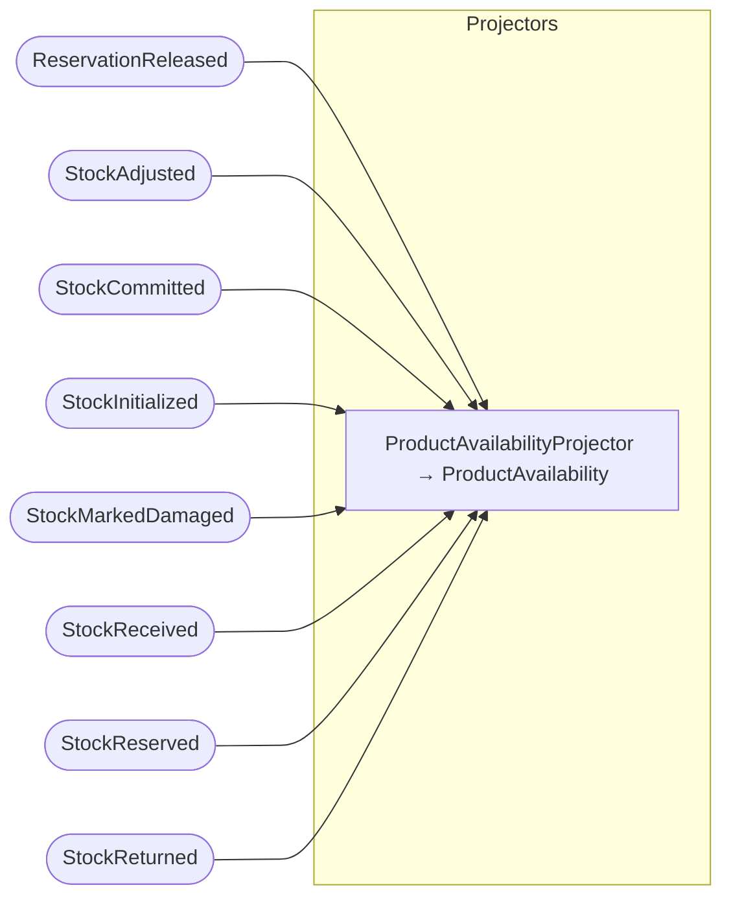

## Projector: ReservationStatus

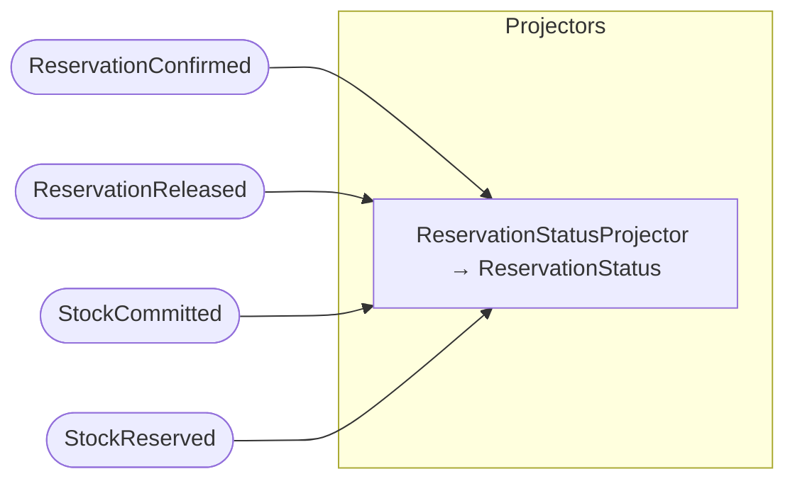

## Projector: ShrinkageReport

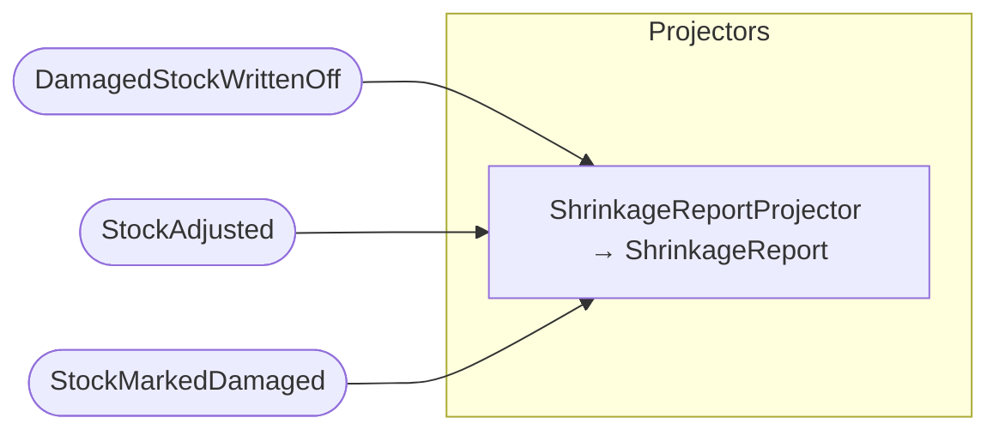

## Projector: StockMovementLog

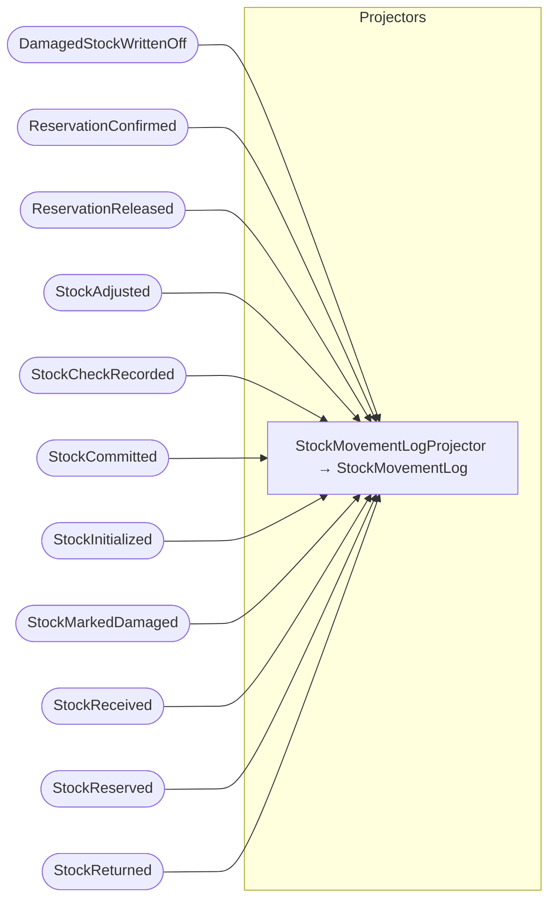

## Projector: WarehouseDirectory

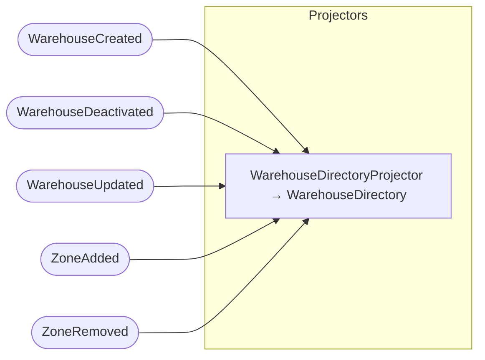

## Projector: WarehouseStock

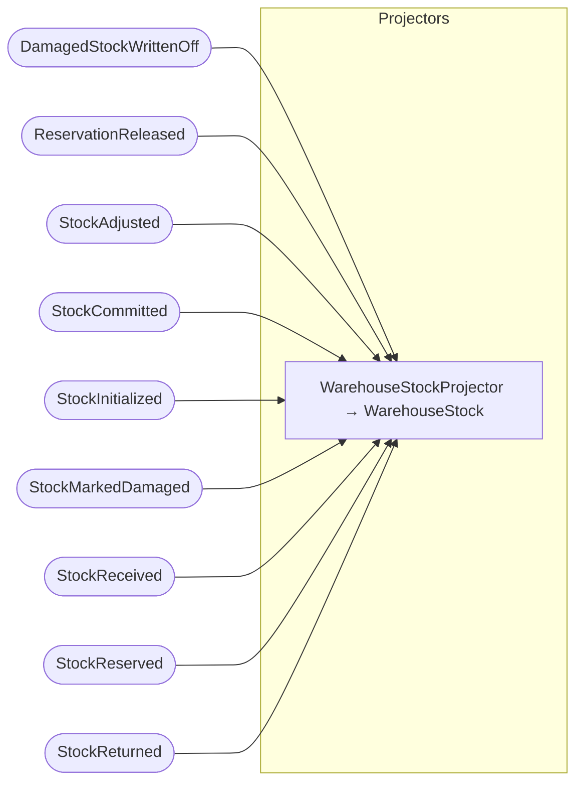
