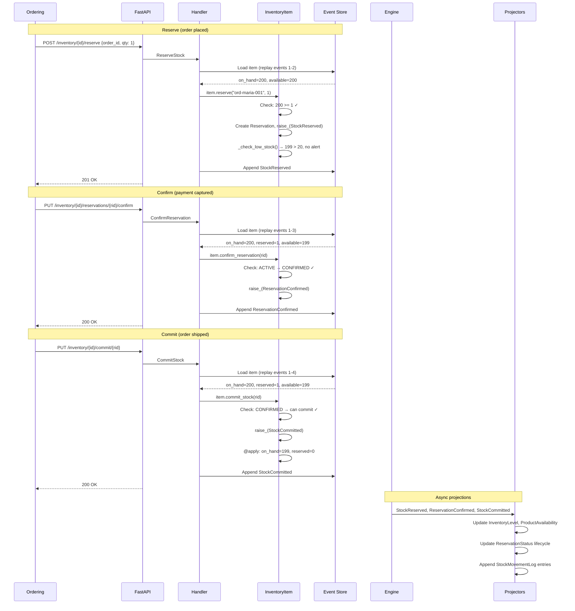

# Reservation Lifecycle: Reserve, Confirm, and Commit

> A customer places an order, stock is reserved to prevent overselling, and
> the reservation progresses through confirmation and commitment as the order
> is paid and shipped.

## The Story

Maria orders a ProGlide wireless mouse from ShopStream. The warehouse has 200 in
stock. When Maria's order is placed, the inventory system reserves 1 unit -- making
it unavailable to other customers. After Maria pays, the reservation is confirmed.
When the warehouse ships the order, the reserved stock is committed: the physical
on-hand count decreases by 1.

This three-step reservation pattern -- **reserve &rarr; confirm &rarr; commit** --
prevents the classic overselling problem. During a flash sale, 500 customers might
try to buy the last 50 units simultaneously. Each `ReserveStock` command checks
available quantity atomically. The 51st request gets a "Insufficient stock" error
rather than an oversold order.

Because the InventoryItem is event-sourced, the entire reservation history is
captured: who reserved what, when it was confirmed, and when it was committed.
If a reservation expires or the order is cancelled, the release is also captured
with a reason, creating a complete audit trail.

## The Flow

### 1. Reserve Stock (Order Placed)

When Maria places her order, the Ordering context sends a reservation request:

```
POST /inventory/{inventory_item_id}/reserve
{
  "order_id": "ord-maria-001",
  "quantity": 1,
  "expires_in_minutes": 15
}
```

&rarr; [source](../../src/inventory/api/routes.py) (`reserve_stock`)

**Command:** `ReserveStock` with `inventory_item_id`, `order_id`, `quantity`, and
optional `expires_at` (defaults to 15 minutes from now).

&rarr; [source](../../src/inventory/stock/reservation.py)

**Aggregate behavior:**

1. The handler loads the InventoryItem by replaying its events from the event store.
   Current state: `on_hand=200, reserved=0, available=200`.
2. Calls `item.reserve(order_id="ord-maria-001", quantity=1)`.
3. **Validates:**
   - Quantity must be positive (> 0).
   - Available must be >= quantity (200 >= 1 &check;).
4. Generates a `reservation_id` (UUID).
5. Creates a `Reservation` entity:
   - `order_id="ord-maria-001"`, `quantity=1`, `status=Active`
   - `reserved_at=now`, `expires_at=now + 15min`
6. Adds the reservation to the aggregate: `self.add_reservations(reservation)`.
7. **Raises `StockReserved`** with `previous_available=200`, `new_available=199`.
8. **Raises `LowStockDetected`** -- No, because 199 > 20 (the reorder point).
   `_check_low_stock()` checks after every reserve and only fires if
   `available <= reorder_point`.
9. The `@apply` handler `_on_stock_reserved` updates StockLevels:
   `on_hand=200, reserved=1, available=199`.

&rarr; [source](../../src/inventory/stock/stock.py) (`InventoryItem.reserve`)

**After commit:**
- Event `StockReserved` is written to the event store and outbox.
- State: `on_hand=200, reserved=1, available=199`.
- Reservation entity: `{id: <uuid>, order_id: "ord-maria-001", quantity: 1, status: "Active"}`.

### 2. Confirm Reservation (Payment Succeeds)

After Maria's payment is captured, the Ordering context confirms the reservation:

```
PUT /inventory/{inventory_item_id}/reservations/{reservation_id}/confirm
```

&rarr; [source](../../src/inventory/api/routes.py) (`confirm_reservation`)

**Command:** `ConfirmReservation` with `inventory_item_id` and `reservation_id`.

**Aggregate behavior:**

1. The handler loads the InventoryItem (replay events 1-3: Initialized, Received, Reserved).
2. Calls `item.confirm_reservation(reservation_id)`.
3. **Validates:**
   - Reservation exists.
   - Reservation is in ACTIVE state (not already Confirmed or Released).
4. Updates reservation status to CONFIRMED.
5. **Raises `ReservationConfirmed`** with `reservation_id`, `order_id`, `quantity`.
6. The `@apply` handler `_on_reservation_confirmed` marks the reservation as CONFIRMED.
   **No stock level change** -- the stock was already reserved. Confirmation is a
   state transition on the reservation entity, not a quantity change.

**After commit:**
- State: `on_hand=200, reserved=1, available=199` (unchanged).
- Reservation: `{status: "Confirmed"}`.

### 3. Commit Stock (Order Ships)

When the warehouse ships Maria's order, the fulfillment system commits the stock:

```
PUT /inventory/{inventory_item_id}/commit/{reservation_id}
```

&rarr; [source](../../src/inventory/api/routes.py) (`commit_stock`)

**Command:** `CommitStock` with `inventory_item_id` and `reservation_id`.

&rarr; [source](../../src/inventory/stock/shipping.py)

**Aggregate behavior:**

1. The handler loads the InventoryItem (replay all events through Confirmed).
2. Calls `item.commit_stock(reservation_id)`.
3. **Validates:**
   - Reservation exists.
   - Reservation is in CONFIRMED state (not Active or Released).
4. Calculates: `new_on_hand = 200 - 1 = 199`, `new_reserved = 1 - 1 = 0`.
5. **Raises `StockCommitted`** with `previous_on_hand=200`, `new_on_hand=199`,
   `previous_reserved=1`, `new_reserved=0`.
6. The `@apply` handler `_on_stock_committed`:
   - Removes the reservation entity from the aggregate.
   - Updates StockLevels: `on_hand=199, reserved=0, available=199`.

**After commit:**
- State: `on_hand=199, reserved=0, available=199`.
- The reservation entity is gone (committed reservations are cleaned up).

### 4. Event Sourcing in Action

After the full reservation lifecycle, the InventoryItem's event stream contains:

```
1. StockInitialized    (inventory created, on_hand=0)
2. StockReceived       (200 units received, on_hand=200)
3. StockReserved       (1 unit for ord-maria-001, available=199)
4. ReservationConfirmed (payment confirmed)
5. StockCommitted      (shipped, on_hand=199)
```

Replaying events 1-5 through `@apply` methods reconstructs the exact current state:
`on_hand=199, reserved=0, available=199, damaged=0`.

### 5. Async Reactions

| Event | Projector | Effect |
|-------|----------|--------|
| `StockReserved` | `InventoryLevelProjector` | available=199, reserved=1 |
| `StockReserved` | `ProductAvailabilityProjector` | total_available decremented |
| `StockReserved` | `ReservationStatusProjector` | Creates reservation view entry |
| `StockReserved` | `StockMovementLogProjector` | Appends "Reserved 1 unit for ord-maria-001" |
| `ReservationConfirmed` | `ReservationStatusProjector` | Status updated to Confirmed |
| `ReservationConfirmed` | `StockMovementLogProjector` | Appends "Confirmed reservation" |
| `StockCommitted` | `InventoryLevelProjector` | on_hand=199, reserved=0 |
| `StockCommitted` | `ProductAvailabilityProjector` | total_on_hand decremented |
| `StockCommitted` | `ReservationStatusProjector` | Status updated to Committed |
| `StockCommitted` | `StockMovementLogProjector` | Appends "Committed 1 unit (shipped)" |

## Sequence Diagram



## Alternative Path: Reservation Released

If Maria cancels her order before payment, or the 15-minute reservation expires:

```
PUT /inventory/{inventory_item_id}/reservations/{reservation_id}/release
{
  "reason": "order_cancelled"
}
```

**Aggregate behavior:**

1. Validates reservation is ACTIVE.
2. Marks reservation as RELEASED.
3. Returns quantity to available: `available = 199 + 1 = 200`.
4. **Raises `ReservationReleased`** with reason and new available.

The event stream would then contain:
```
1. StockInitialized
2. StockReceived
3. StockReserved      (reserved 1)
4. ReservationReleased (released 1, reason: "order_cancelled")
```

State returns to: `on_hand=200, reserved=0, available=200`.

## Flash Sale Scenario: Concurrent Reservations

During a flash sale with 10 units remaining, three simultaneous requests arrive:

| Request | Quantity | Available Before | Result |
|---------|---------|-----------------|--------|
| Order A | 5 | 10 | Success &rarr; available=5 |
| Order B | 3 | 5 | Success &rarr; available=2 |
| Order C | 5 | 2 | **Rejected**: "Insufficient stock: 2 available, 5 requested" |

Each request loads the InventoryItem by replaying events, which includes the
optimistic concurrency version. If two requests try to write simultaneously, the
event store rejects the second write (version conflict), and the request is retried
with the updated state.

## Edge Cases

| Scenario | What Happens | Why |
|----------|-------------|-----|
| Reserve more than available | `ValidationError`: "Insufficient stock" | Prevents overselling |
| Reserve zero quantity | `ValidationError`: "Quantity must be positive" | Zero reservations are meaningless |
| Confirm already-confirmed reservation | `ValidationError`: "Cannot confirm reservation in Confirmed state" | Prevents double-confirmation |
| Confirm a released reservation | `ValidationError`: "Cannot confirm reservation in Released state" | Released reservations are final |
| Commit an unconfirmed reservation | `ValidationError`: "Only confirmed reservations can be committed" | Must follow reserve &rarr; confirm &rarr; commit flow |
| Release a confirmed reservation | `ValidationError`: "Cannot release reservation in Confirmed state" | After confirmation, only commit is allowed |
| Reserve triggers low stock | `LowStockDetected` event raised after `StockReserved` | `_check_low_stock()` runs after every reserve |
| Multiple reservations on same item | Each tracked independently with its own ID and status | Supports concurrent orders for the same product |
