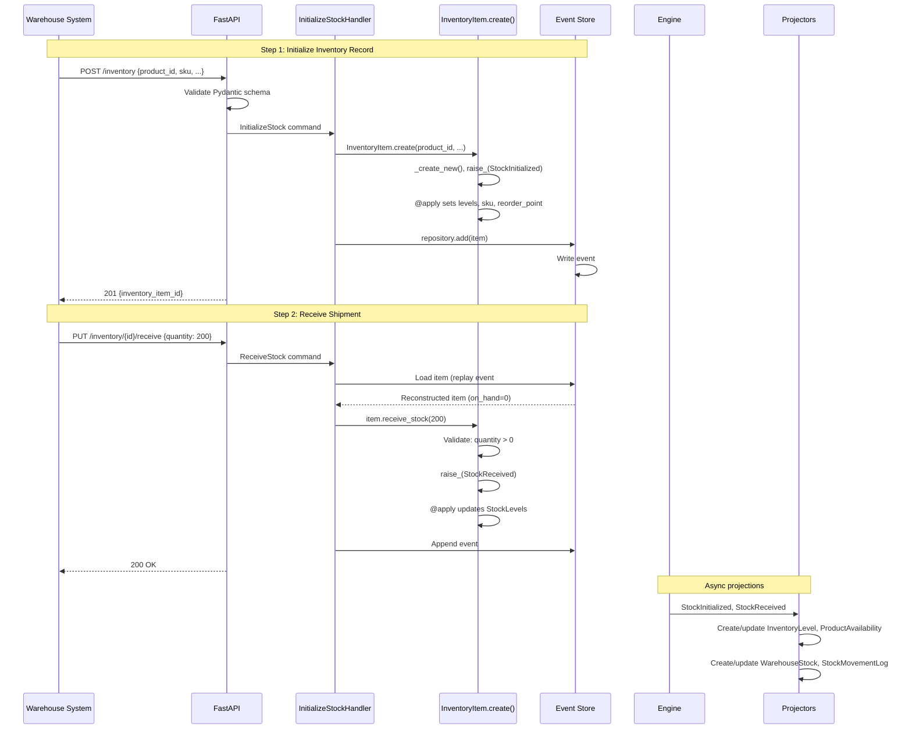

# Stock Receiving: Initializing and Receiving Inventory

> A warehouse registers a new product variant in the system, then receives a
> shipment from a supplier, making the stock available for sale.

## The Story

The Portland warehouse has just taken delivery of 200 ProGlide wireless mice
from the supplier. Before the shipment arrived, the warehouse manager initialized
a stock record for this product variant, setting up the tracking infrastructure.
Now that the goods are physically on the shelves, the receiving team logs the
quantity, bringing the stock from zero to 200 available units.

Behind the scenes, this is the first chapter of every product's inventory life.
The InventoryItem aggregate is event-sourced: every stock movement -- from this
initial receive through future reservations, shipments, and returns -- is
captured as an immutable event. The event stream _is_ the audit trail.

## The Flow

### 1. Initialize the Inventory Record

The warehouse system registers a new InventoryItem for a product variant:

```
POST /inventory
{
  "product_id": "prod-proglide-01",
  "variant_id": "var-blk-01",
  "warehouse_id": "wh-portland-01",
  "sku": "ELEC-MOU-WL01-BLK",
  "initial_quantity": 0,
  "reorder_point": 20,
  "reorder_quantity": 100
}
```

&rarr; [source](../../src/inventory/api/routes.py) (`initialize_stock`)

The API layer receives a Pydantic `InitializeStockRequest` and translates it
into a Protean command. This is the anti-corruption boundary: the external
schema is separate from the internal domain concept.

### 2. Command: InitializeStock

The route creates an `InitializeStock` command:

- **`InitializeStock`** -- the intent to create a new inventory tracking record.
- Key data: `product_id`, `variant_id`, `warehouse_id`, `sku`, `initial_quantity`,
  `reorder_point`, `reorder_quantity`.

&rarr; [source](../../src/inventory/stock/initialization.py)

The command is processed synchronously via `current_domain.process(command, asynchronous=False)`.
Protean routes it to the `InitializeStockHandler`.

### 3. Aggregate Behavior: InventoryItem.create()

`InitializeStockHandler.initialize_stock()` delegates to the aggregate's factory:

1. `InventoryItem._create_new()` generates a blank aggregate with an auto-generated ID.
2. `raise_(StockInitialized(...))` records all initialization data as an event.
3. The `@apply` handler `_on_stock_initialized` sets all fields:
   - `product_id`, `variant_id`, `warehouse_id`, `sku`
   - `levels = StockLevels(on_hand=0, reserved=0, available=0, ...)`
   - `reorder_point=20`, `reorder_quantity=100`
   - `created_at` and `updated_at` timestamps
4. The handler persists: `current_domain.repository_for(InventoryItem).add(item)`.
   Because InventoryItem is event-sourced, this writes the `StockInitialized` event
   to the Message DB event store and an outbox record atomically.
5. Returns the new inventory item ID.

&rarr; [source](../../src/inventory/stock/stock.py) (`InventoryItem.create`)

**What could fail?**
- Missing required fields (`product_id`, `variant_id`, `warehouse_id`, `sku`) &rarr;
  Protean field validation rejects the command.

### 4. Receive the Shipment

The receiving team logs the incoming goods:

```
PUT /inventory/{inventory_item_id}/receive
{
  "quantity": 200,
  "reference": "PO-2026-0218"
}
```

&rarr; [source](../../src/inventory/api/routes.py) (`receive_stock`)

**Command:** `ReceiveStock` with `inventory_item_id`, `quantity`, and optional
`reference` (purchase order number).

&rarr; [source](../../src/inventory/stock/receiving.py)

### 5. Aggregate Behavior: receive_stock()

`ReceiveStockHandler.receive_stock()` processes the command:

1. The handler loads the InventoryItem by replaying its events from the event store.
   At this point, only `StockInitialized` exists, so the aggregate is reconstructed
   with `on_hand=0`.
2. Calls `item.receive_stock(quantity=200, reference="PO-2026-0218")`.
3. **Validates:** quantity must be positive (> 0).
4. Calculates new levels: `new_on_hand = 0 + 200 = 200`, `new_available = 200 - 0 = 200`.
5. **Raises `StockReceived`** with `previous_on_hand=0`, `new_on_hand=200`,
   `new_available=200`, `reference="PO-2026-0218"`.
6. The `@apply` handler `_on_stock_received` updates `StockLevels` immutably.
7. The handler persists. The new event is appended to the event store.

&rarr; [source](../../src/inventory/stock/stock.py) (`InventoryItem.receive_stock`)

### 6. Persistence

**For the InventoryItem (event-sourced):**
- `StockInitialized` was written as event #1 in the stream.
- `StockReceived` is appended as event #2.
- Outbox records are written atomically for both events.
- Future loads replay both events through `@apply` methods to reconstruct
  the current state: `on_hand=200, reserved=0, available=200`.

### 7. Async Reactions

The Inventory Engine's OutboxProcessor publishes both events to Redis Streams.
Projectors react:

| Event | Handled By | Effect |
|-------|-----------|--------|
| `StockInitialized` | `InventoryLevelProjector` | Creates `InventoryLevel` with on_hand=0, available=0 |
| `StockInitialized` | `ProductAvailabilityProjector` | Creates/updates `ProductAvailability` for this product+variant |
| `StockInitialized` | `WarehouseStockProjector` | Creates `WarehouseStock` entry for this warehouse |
| `StockInitialized` | `StockMovementLogProjector` | Appends "Initialized with 0 units" entry |
| `StockReceived` | `InventoryLevelProjector` | Updates on_hand=200, available=200 |
| `StockReceived` | `ProductAvailabilityProjector` | Updates total_available, sets is_in_stock=true |
| `StockReceived` | `WarehouseStockProjector` | Updates on_hand=200, available=200 |
| `StockReceived` | `StockMovementLogProjector` | Appends "Received 200 units (PO-2026-0218)" entry |

## Sequence Diagram



## Edge Cases

| Scenario | What Happens | Why |
|----------|-------------|-----|
| Receive zero quantity | `ValidationError`: "Quantity must be positive" | Zero-quantity receives are meaningless noise |
| Receive negative quantity | `ValidationError`: "Quantity must be positive" | Reductions use adjust_stock, not receive |
| Multiple receives accumulate | on_hand increases each time (100, then 50 = 150) | Each `StockReceived` event adds to the total |
| Initialize with initial_quantity > 0 | Creates item with on_hand and available set to that quantity | Supports seeding inventory from existing systems |
| Receive triggers low stock check | No -- receiving always increases stock | `_check_low_stock()` is not called from `receive_stock()` |
