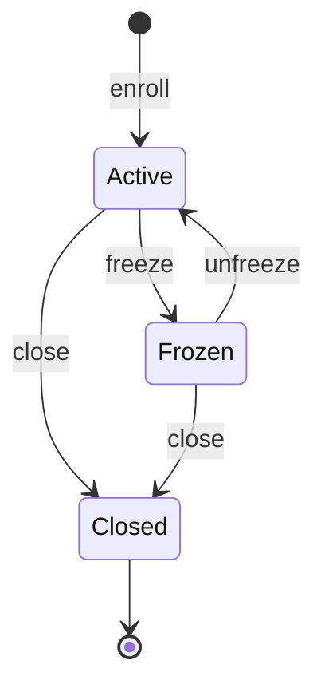
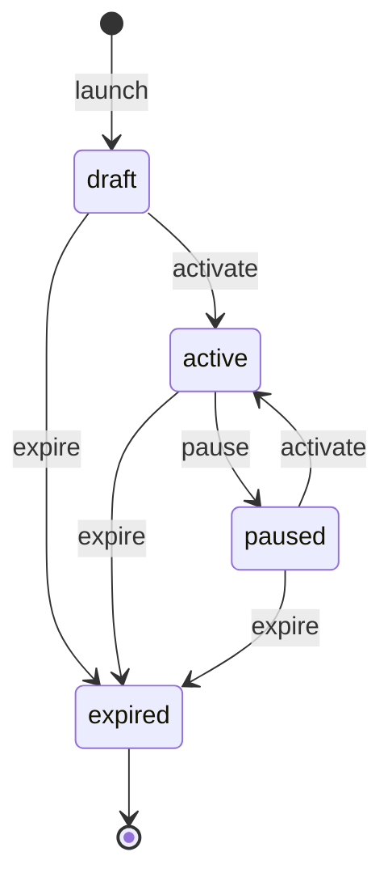

# Loyalty

> Manages reward accounts, points (earning, redeeming, transferring), membership cards,
> tiers, and event-sourced promotional campaigns.

## Business Context

The Loyalty context is ShopStream's rewards program. Customers enrol into a reward
account, earn points as they shop and as their orders are delivered, redeem points for
value, and can transfer points to another member. Each account carries a tier
(bronze &rarr; platinum) and a membership card. Separately, the business runs
promotional campaigns (percentage discounts, fixed discounts, points multipliers) that
have their own lifecycle and a complete history of every change.

Loyalty is a separate bounded context because rewards have fundamentally different rules,
change patterns, and integration points than ordering, payments, or identity. A reward
account is long-lived and mutated frequently (every order earns points), while a promo
campaign is an auditable financial-adjacent record where "what changed, when, and from
what" matters. The two halves even use different persistence strategies in the same
context: reward accounts use standard CQRS, while promo campaigns are **event-sourced**.

Think of the Loyalty context as the rewards desk in a department store. Each shopper has
a points card (the reward account) that the desk tops up as they spend and redeems when
they cash in; shoppers can gift points to a friend (transfer); and the store periodically
posts promotions on a board (campaigns), keeping a ledger of every promotion it ever ran.
The rewards desk doesn't run the cash register (Ordering) or the warehouse (Fulfillment) —
it only hears, after the fact, that an order was delivered (a cross-domain event) and
rewards the shopper for it.

> Loyalty is also ShopStream's **capability showcase** context: it deliberately exercises
> Protean building blocks the other seven contexts don't — domain services, application
> services, custom repositories, cache-backed projections, abstract aggregate inheritance,
> event-sourced fact events, snapshots, and a multi-step upcaster chain. See
> [`PROTEAN_COVERAGE.md`](../../PROTEAN_COVERAGE.md) for the full capability matrix.

## Ubiquitous Language

| Term | Definition | Code Element |
|------|-----------|-------------|
| Reward Account | A customer's loyalty account holding a points balance, tier, membership card, and points ledger | `RewardAccount` ([source](../../src/loyalty/reward/reward_account.py)) |
| Points Balance | The currently spendable points on an account (never negative) | `points_balance` on `RewardAccount` ([source](../../src/loyalty/reward/reward_account.py)) |
| Lifetime Points | The cumulative points ever earned (never decremented by redemptions) | `lifetime_points` on `RewardAccount` |
| Tier | A loyalty level: bronze, silver, gold, or platinum | `tier` on `RewardAccount` (non-Enum `choices`) |
| Member Code | The account's own unique code (uppercase alphanumeric), validated and generated at enrolment | `member_code` on `RewardAccount` |
| Referral Code | The optional code of whoever referred the member | `referral_code` on `RewardAccount` |
| Membership Card | The physical/virtual loyalty card attached one-to-one to an account | `MembershipCard` ([source](../../src/loyalty/reward/reward_account.py)) |
| Points Ledger Entry | An append-only record of one points movement (earn, redeem, transfer in/out, adjust) | `PointsLedgerEntry` ([source](../../src/loyalty/reward/reward_account.py)) |
| Points Transfer | Moving points from one reward account to another, conserving the total | `TransferPoints` ([source](../../src/loyalty/reward/transfer.py)) |
| Promo Campaign | An event-sourced promotional campaign with its own lifecycle | `PromoCampaign` ([source](../../src/loyalty/campaign/campaign.py)) |
| Discount Type | percentage, fixed, or points_multiplier | `discount_type` on `PromoCampaign` |
| Account Status | Lifecycle: Active &harr; Frozen, either &rarr; Closed (terminal) | `AccountStatus` ([source](../../src/loyalty/reward/reward_account.py)) |
| Campaign Status | Lifecycle: draft &rarr; active &harr; paused, any &rarr; expired | `status` on `PromoCampaign` |

Full definitions: [Glossary](../glossary.md#loyalty-context)

## Domain Model

The Loyalty context has two aggregates with deliberately different persistence strategies,
plus a shared abstract base aggregate.

### Auditable (Abstract Base Aggregate)

`Auditable` is an **abstract aggregate** (`@loyalty.aggregate(abstract=True)`) that
contributes `created_at` / `updated_at` timestamps and a `touch()` helper. `RewardAccount`
inherits from it. Abstract aggregates are never persisted on their own — they exist purely
to share fields and behaviour across concrete aggregates.

### RewardAccount (Aggregate, CQRS)

A RewardAccount is the root of a customer's rewards: their balance, tier, card, and ledger
must stay consistent within one transactional boundary. For example, earning points both
increases the balance and appends a ledger entry — these must happen together.

Reward accounts use standard **CQRS** (not event sourcing). Balances change constantly and
the linear, simple state needs no event replay; the ledger entity already provides a
human-readable history.

**Entities:**

| Entity | Role | Identity |
|--------|------|----------|
| MembershipCard | The 1:1 (`HasOne`) loyalty card for the account | System-generated ID within the account |
| PointsLedgerEntry | An append-only 1:N (`HasMany`) points movement; links back to its account via an explicit `Reference` | System-generated ID within the account |

**Value Objects:** none — the account uses plain fields. `member_code` / `referral_code`
carry **composed custom validators** (the built-in `RegexValidator` plus a custom
`NoTripleRepeatValidator` callable).

**Invariants (rules that must always hold):**

- Points balance can never be negative (`@invariant.post`) — this is what rejects
  over-redemption and over-transfer.
- A closed account is immutable (`@invariant.pre`) — once `status == Closed`, any further
  mutation is rejected. The pre-invariant runs against the *pre-mutation* state, so the
  closing transition itself is allowed.
- An account may have at most one membership card.

**State Machine: Account Status**

An account is Active on enrolment. It can be Frozen (and unfrozen back to Active), and
either state can transition to Closed, which is terminal.

### PromoCampaign (Aggregate, Event-Sourced)

A PromoCampaign represents a promotion's complete history. It is **event-sourced**
(`is_event_sourced=True`, `fact_events=True`): state is rebuilt by replaying events through
`@apply` handlers, and after every persist Protean auto-emits a complete-state
`PromoCampaignFactEvent` (Event-Carried State Transfer) on the campaign's `-fact-` stream.

Campaigns are event-sourced because the business wants a full, immutable audit of every
change to a promotion (who changed the discount, when it was paused, etc.) and temporal
queries — exactly the cases event sourcing is for. This mirrors how Ordering, Payments, and
Inventory use event sourcing for their auditable aggregates.

**Snapshots:** with `snapshot_threshold = 5`, reconstruction can fold from a snapshot rather
than replay the full event history once a stream grows long.

**State Machine: Campaign Status**

## Events

| Event | Trigger | Consequence |
|-------|---------|-------------|
| `RewardAccountEnrolled` 📢 | Customer enrols into the program | RewardAccountView + PointsLeaderboard projections created |
| `PointsEarned` 📢 | Account earns points (order, delivery bonus, review bonus, transfer in) | Balance + lifetime updated on RewardAccountView; PointsLeaderboard balance updated; ledger entry appended |
| `PointsRedeemed` 📢 | Account redeems points (or transfer out) | Balance updated on both projections; ledger entry appended; Notifications sends a redemption notice |
| `TierUpgraded` 📢 | Lifetime points cross a tier threshold while earning | RewardAccountView tier updated; Notifications sends a congratulatory notice |
| `MembershipCardIssued` | A membership card is attached to the account | (read models unchanged; informational) |
| `RewardAccountClosed` | Account is closed | RewardAccountView status set to Closed |
| `CampaignLaunched` (v3) | A promo campaign is launched | Campaign created in `draft` (see upcasters for schema history) |
| `CampaignActivated` | A draft/paused campaign is activated | Campaign status &rarr; active |
| `CampaignPaused` | An active campaign is paused | Campaign status &rarr; paused |
| `CampaignExpired` | A campaign is expired | Campaign status &rarr; expired (terminal) |
| `PromoCampaignFactEvent` | Auto-emitted after every PromoCampaign persist | Full-state snapshot event on the `-fact-` stream (ECST) |

📢 = `published=True` — dual-written to the external bus so other contexts can react. Loyalty is
an event **producer** as well as a consumer; published RewardAccount events carry `customer_id`.

## Command Flows

| Command | Who Initiates | What Happens | Events Raised |
|---------|--------------|-------------|---------------|
| `EnrollRewardAccount` | Customer / system | Creates an Active bronze account; generates a valid `member_code` if none supplied | `RewardAccountEnrolled` |
| `EarnPoints` | System | Loads the account, adds points (balance + lifetime; **boosted by any active `points_multiplier` campaign**), appends a ledger entry | `PointsEarned` |
| `RedeemPoints` | Customer | Loads the account, subtracts points (over-redemption rejected by the balance invariant), appends a ledger entry | `PointsRedeemed` |
| `LaunchCampaign` | Marketing | Creates a draft event-sourced `PromoCampaign` | `CampaignLaunched` |
| `ActivateCampaign` / `PauseCampaign` / `ExpireCampaign` | Marketing | Drives the campaign through its lifecycle | `CampaignActivated` / `CampaignPaused` / `CampaignExpired` |

The **points-earning** flow performs a cross-aggregate read: `PointsHandler.earn` consults the
`CampaignCatalog` read model (via `campaign/multiplier.py`) so an active `points_multiplier`
campaign multiplies the points credited (most generous active campaign wins; none ⇒ ×1).

One write path is **not** a CQRS command, to exercise the alternative Protean pattern:

- **Points transfer** runs through a **domain service** (`TransferPoints`) orchestrated by an
  **application service** (`LoyaltyService.transfer_points`, a `@use_case`) — invoked directly,
  not via `domain.process()`. See the [Points Transfer scenario](scenarios/points-transfer.md).

## Read Models (Projections)

| Projection | Storage | Purpose | Built From |
|-----------|---------|---------|-----------|
| `RewardAccountView` | Database | Per-account view: customer, tier, status, balance, lifetime points | `RewardAccountEnrolled` (create), `PointsEarned`, `PointsRedeemed`, `TierUpgraded`, `RewardAccountClosed` |
| `PointsLeaderboard` | **Cache** (`cache="loyalty"`) | Live points balance per account for leaderboard reads | `RewardAccountEnrolled` (create), `PointsEarned`, `PointsRedeemed` |
| `CampaignCatalog` | Database | Flat, queryable catalog of campaigns + status; the read side the multiplier consults and the API lists | `CampaignLaunched` (create), `CampaignActivated`, `CampaignPaused`, `CampaignExpired` |

`PointsLeaderboard` is the only **cache-backed** projection in ShopStream. Cache projections
are written via `current_domain.cache_for(PointsLeaderboard).add(...)` and read via
`current_domain.view_for(PointsLeaderboard).get(...)` — not `repository_for`, which routes to a
database provider.

## Cross-Context Relationships

| Other Context Provides | To This Context | How |
|-----------------------|-----------------|-----|
| `CustomerRegistered` | Loyalty | Identity raises `CustomerRegistered`; Loyalty's `CustomerRegisteredSubscriber` consumes the `identity::customer` stream and auto-enrols a reward account (idempotent) by dispatching `EnrollRewardAccount` — **pattern A** |
| `OrderDelivered` | Loyalty | Ordering raises `OrderDelivered`; Loyalty's `OrderDeliveredSubscriber` consumes the `ordering::order` stream and awards a delivery bonus directly on the customer's RewardAccount — **pattern B** |
| `ReviewApproved` | Loyalty | Reviews raises `ReviewApproved`; Loyalty's `ReviewApprovedSubscriber` consumes the `reviews::review` stream and awards a review bonus directly on the customer's RewardAccount — **pattern B** |
| Loyalty events | Notifications | Loyalty **publishes** `TierUpgraded` / `PointsRedeemed` (and more) to the external bus; Notifications' `LoyaltyEventsSubscriber` turns them into customer notifications (Loyalty as **producer**) |

Loyalty is a downstream consumer of Identity, Ordering, and Reviews — **and** an upstream
**producer** for Notifications. All inbound subscribers use the **anti-corruption layer (ACL)**
pattern — they receive a raw dict payload, filter by event type, and never import another
context's event classes. They also demonstrate both subscriber styles:
`CustomerRegisteredSubscriber` translates the event into a *command* (pattern A, idempotent so
at-least-once delivery is safe), while `OrderDeliveredSubscriber` and `ReviewApprovedSubscriber`
load the aggregate and mutate it directly (pattern B). On the producer side, Loyalty marks
`PointsEarned` / `PointsRedeemed` / `TierUpgraded` / `RewardAccountEnrolled` as `published=True`
so the outbox dual-writes them to the external bus for Notifications to consume. Loyalty stores
`customer_id` as an opaque reference and never queries another context. Auto-enrolment on
registration is what gives every customer a reward account through the normal event flow — no
enrolment endpoint needed.

A Payments→Loyalty refund clawback is a deliberate follow-up rather than an omission: the
`RefundCompleted` event carries `order_id` but no `customer_id`, so the reward account can't be
resolved without an additional lookup path.

## Design Decisions

### Two Persistence Strategies in One Context

**Problem:** Should both loyalty aggregates use the same persistence strategy?

**Decision:** No. `RewardAccount` uses CQRS; `PromoCampaign` is event-sourced.

**Rationale:** They have different needs. Reward accounts mutate constantly with a simple
state and a built-in ledger entity — event sourcing would add replay/snapshot machinery
with no business payoff. Promo campaigns are auditable records where the business genuinely
wants the full change history and temporal queries, so event sourcing earns its keep. This
mirrors Ordering (event-sourced Order + CQRS Cart) and Payments (event-sourced Payment +
CQRS Invoice).

**Trade-off:** Two mental models in one context. The boundary is clear (rewards vs.
campaigns), so the cost is low.

### Points Balance vs. Lifetime Points

**Problem:** How to track both spendable points and a customer's all-time standing?

**Decision:** Two fields — `points_balance` (decreases on redeem/transfer-out) and
`lifetime_points` (only ever increases on earn).

**Rationale:** Tiers and recognition should reflect total contribution, not current balance.
A customer who earned and spent 10,000 points is more valuable than one sitting on 10,000
unspent points. Lifetime points give a stable basis for tiering; balance gives spendable value.

**Trade-off:** Slight redundancy, but the two numbers answer different questions and both are
cheap to maintain.

### Over-Redemption Guarded by a Post-Invariant

**Problem:** Where to enforce "you can't spend points you don't have"?

**Decision:** A `@invariant.post` on `RewardAccount` that rejects any negative balance.

**Rationale:** It's a true aggregate invariant — it must hold after *any* mutation, whether
the points left via a redemption, a transfer, or an adjustment. Centralising it in one
post-invariant means every path (including the `TransferPoints` domain service) is covered
for free, rather than each method re-checking.

**Trade-off:** The error surfaces after the mutation is attempted (the aggregate raises during
the operation), which is the standard Protean invariant model.

### Cross-Aggregate Transfer via a Domain Service

**Problem:** A points transfer touches *two* RewardAccount aggregates. Where does that logic live?

**Decision:** A stateless **domain service** (`TransferPoints`, `part_of=[RewardAccount,
RewardAccount]`) with cross-aggregate pre/post invariants (both accounts active; points
conserved), orchestrated by an **application service** that loads both accounts and persists
them in one Unit of Work.

**Rationale:** Logic spanning multiple aggregates doesn't belong inside either aggregate.
A domain service is the DDD home for it, and the application service (`@use_case`) is the
direct-invocation entry point — the non-CQRS counterpart to a command handler.

**Trade-off:** Persisting two aggregates in one transaction relaxes the strict
"one-aggregate-per-transaction" guideline. For a points transfer — where conservation must be
atomic — that is the right call.

### Delivery Bonus via a Pattern-B Subscriber

**Problem:** How should Loyalty reward a delivered order without coupling to Ordering?

**Decision:** A `@subscriber(broker="global", stream="ordering::order")` that, on
`OrderDelivered`, loads the customer's RewardAccount and calls `earn_points` directly
(pattern B), rather than dispatching a command.

**Rationale:** It demonstrates the direct-to-aggregate subscriber variant and keeps the
reaction simple — there is no extra command to model for a one-line side effect. The ACL
boundary (dict payload, type filtering, no shared event classes) keeps the contexts decoupled.

**Trade-off:** Pattern B puts a little more logic in the subscriber than a thin
command-dispatching subscriber; acceptable for a single, well-contained reaction.

### Multi-Step Redemption via a Process Manager (Saga)

**Problem:** Redeeming points for a voucher spans two aggregates (RewardAccount + Redemption)
and an external voucher provider that can fail — so reserved points must be **refunded** if the
voucher can't be issued.

**Decision:** A second process manager, `RedemptionSaga`, orchestrates the flow:
`RedemptionRequested` → reserve points (`RedeemPoints`) → `PointsReserved` → issue voucher →
`VoucherIssued` ⇒ complete, or `VoucherIssuanceFailed` ⇒ **compensate** by refunding the points
(`EarnPoints`) and marking the redemption compensated. The `Redemption` aggregate only records
each transition (`requested → points_reserved → voucher_issued → completed | compensated`); the
saga owns the decisions.

**Rationale:** It is ShopStream's second saga and deliberately exercises the Protean features the
ordering `OrderCheckoutSaga` does not — a **dict `correlate`** (`{"redemption_id": "redemption_id"}`),
an explicit **compensation** path, and **`end=True`** (the success branch finalises via
`mark_as_complete()` instead, so both styles are shown). The voucher port fails deterministically
for reward codes containing `FAIL`, which drives the compensation branch in tests and demos.

**Trade-off:** Like the ordering saga, it is **engine-driven**; under `event_processing="sync"` it
only advances to `points_reserved` (a later handler re-enters before the start transition persists),
so its full forward + compensation logic is covered by `given()` unit tests rather than a synchronous
end-to-end test.

## Source Code Map

| Concern | Location |
|---------|----------|
| RewardAccount aggregate + entities + abstract base + validators | [`src/loyalty/reward/reward_account.py`](../../src/loyalty/reward/reward_account.py) |
| RewardAccount events | [`src/loyalty/reward/events.py`](../../src/loyalty/reward/events.py) |
| Enroll command + handler | [`src/loyalty/reward/enrollment.py`](../../src/loyalty/reward/enrollment.py) |
| Earn / redeem commands + handler | [`src/loyalty/reward/points.py`](../../src/loyalty/reward/points.py) |
| TransferPoints domain service | [`src/loyalty/reward/transfer.py`](../../src/loyalty/reward/transfer.py) |
| LoyaltyService application service (`@use_case`) | [`src/loyalty/reward/services.py`](../../src/loyalty/reward/services.py) |
| Custom repository (Q/F/lookups) | [`src/loyalty/reward/repository.py`](../../src/loyalty/reward/repository.py) |
| Inbound subscribers (pattern A: identity; pattern B: ordering, reviews) | [`identity_subscriber.py`](../../src/loyalty/reward/identity_subscriber.py), [`ordering_subscriber.py`](../../src/loyalty/reward/ordering_subscriber.py), [`reviews_subscriber.py`](../../src/loyalty/reward/reviews_subscriber.py) |
| PromoCampaign event-sourced aggregate | [`src/loyalty/campaign/campaign.py`](../../src/loyalty/campaign/campaign.py) |
| PromoCampaign events | [`src/loyalty/campaign/events.py`](../../src/loyalty/campaign/events.py) |
| Campaign lifecycle commands + handler | [`src/loyalty/campaign/management.py`](../../src/loyalty/campaign/management.py) |
| Active points-multiplier lookup (cross-aggregate read) | [`src/loyalty/campaign/multiplier.py`](../../src/loyalty/campaign/multiplier.py) |
| CampaignLaunched upcaster chain (v1&rarr;v2&rarr;v3) | [`src/loyalty/campaign/upcasters.py`](../../src/loyalty/campaign/upcasters.py) |
| Redemption aggregate + events + commands | [`src/loyalty/redemption/`](../../src/loyalty/redemption/) |
| **RedemptionSaga** process manager (dict correlate + compensation + `end`) | [`src/loyalty/redemption/saga.py`](../../src/loyalty/redemption/saga.py) |
| Failable voucher port | [`src/loyalty/redemption/voucher.py`](../../src/loyalty/redemption/voucher.py) |
| Projections + projectors (DB account view + cache leaderboard + DB campaign catalog + DB redemption view) | [`src/loyalty/projections/`](../../src/loyalty/projections/) |
| Query handlers (`@read`) for the read endpoints | [`reward_account_view_queries.py`](../../src/loyalty/projections/reward_account_view_queries.py), [`points_leaderboard_queries.py`](../../src/loyalty/projections/points_leaderboard_queries.py), [`campaign_catalog_queries.py`](../../src/loyalty/projections/campaign_catalog_queries.py), [`redemption_view_queries.py`](../../src/loyalty/projections/redemption_view_queries.py) |
| API routes + schemas | [`src/loyalty/api/`](../../src/loyalty/api/) |
| Generated reference: [clusters](clusters.md) · [event flows](event-flows.md) · [handler wiring](handler-wiring.md) · [catalog](catalog.md) | — |

The HTTP API (`/loyalty`, see `src/loyalty/api/`) exposes enrol / earn / redeem / transfer, the
campaign lifecycle (launch / activate / pause / expire), and redemption requests (which start the
`RedemptionSaga`), plus read endpoints for the account view (DB), points standing (cache), the
campaign catalog (DB), and redemption progress (DB). Writes go through commands and the application
service; reads go through query handlers (`current_domain.dispatch`). An active `points_multiplier`
campaign boosts points earned — the earn handler reads the `CampaignCatalog` read model (a
cross-aggregate read; see [`multiplier.py`](../../src/loyalty/campaign/multiplier.py)).
