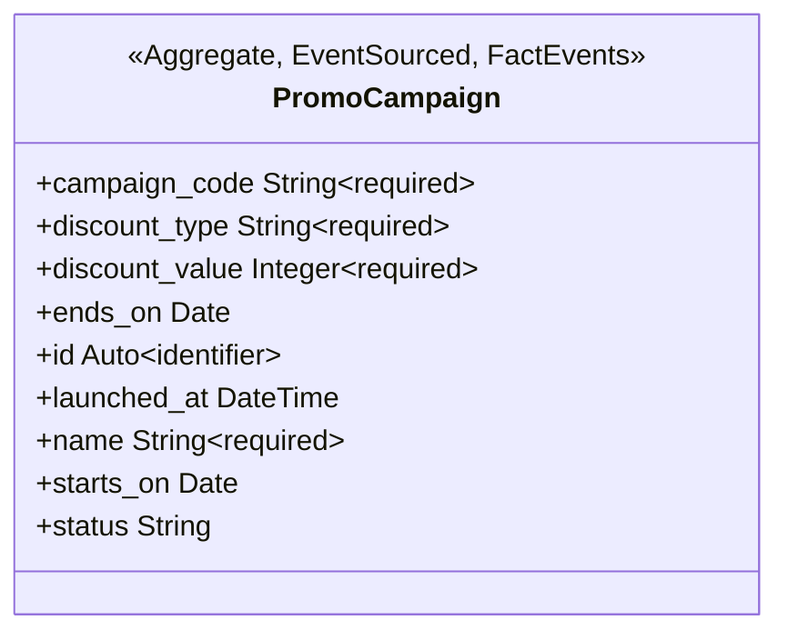
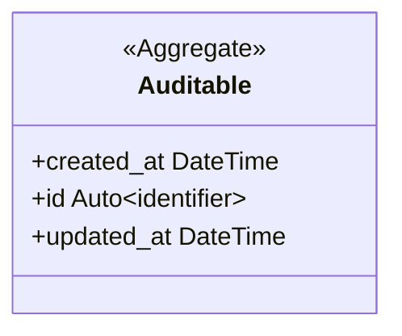
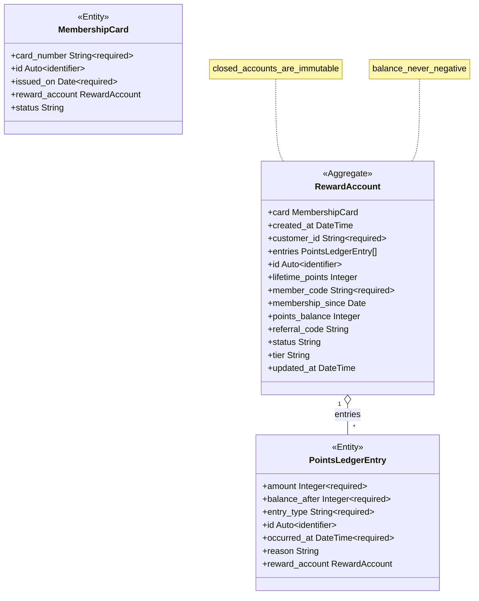

## Cluster: PromoCampaign

```mermaid
classDiagram
    class loyalty_campaign_campaign_PromoCampaign["PromoCampaign"] {
        <<Aggregate, EventSourced, FactEvents>>
        +campaign_code String~required~
        +discount_type String~required~
        +discount_value Integer~required~
        +ends_on Date
        +id Auto~identifier~
        +launched_at DateTime
        +name String~required~
        +starts_on Date
        +status String
    }
```

## Cluster: Auditable

```mermaid
classDiagram
    class loyalty_reward_reward_account_Auditable["Auditable"] {
        <<Aggregate>>
        +created_at DateTime
        +id Auto~identifier~
        +updated_at DateTime
    }
```

## Cluster: RewardAccount

```mermaid
classDiagram
    class loyalty_reward_reward_account_RewardAccount["RewardAccount"] {
        <<Aggregate>>
        +card MembershipCard
        +created_at DateTime
        +customer_id String~required~
        +entries PointsLedgerEntry[]
        +id Auto~identifier~
        +lifetime_points Integer
        +member_code String~required~
        +membership_since Date
        +points_balance Integer
        +referral_code String
        +status String
        +tier String
        +updated_at DateTime
    }
    note for loyalty_reward_reward_account_RewardAccount "closed_accounts_are_immutable"
    note for loyalty_reward_reward_account_RewardAccount "balance_never_negative"
    class loyalty_reward_reward_account_MembershipCard["MembershipCard"] {
        <<Entity>>
        +card_number String~required~
        +id Auto~identifier~
        +issued_on Date~required~
        +reward_account RewardAccount
        +status String
    }
    class loyalty_reward_reward_account_PointsLedgerEntry["PointsLedgerEntry"] {
        <<Entity>>
        +amount Integer~required~
        +balance_after Integer~required~
        +entry_type String~required~
        +id Auto~identifier~
        +occurred_at DateTime~required~
        +reason String
        +reward_account RewardAccount
    }
    loyalty_reward_reward_account_RewardAccount "1" o-- "*" loyalty_reward_reward_account_PointsLedgerEntry : entries
```
