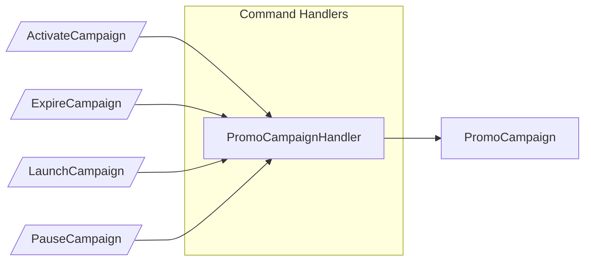
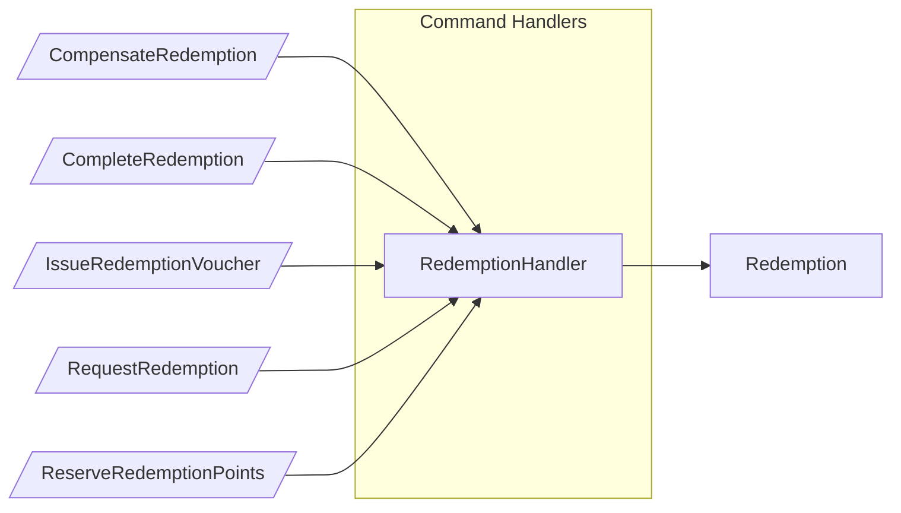
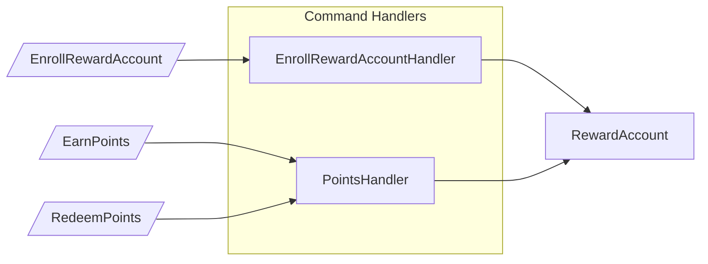
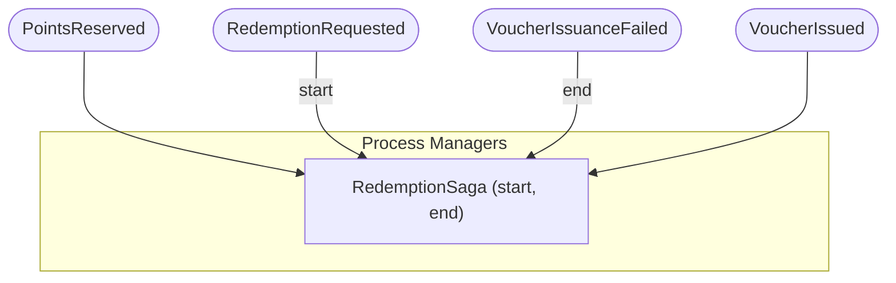
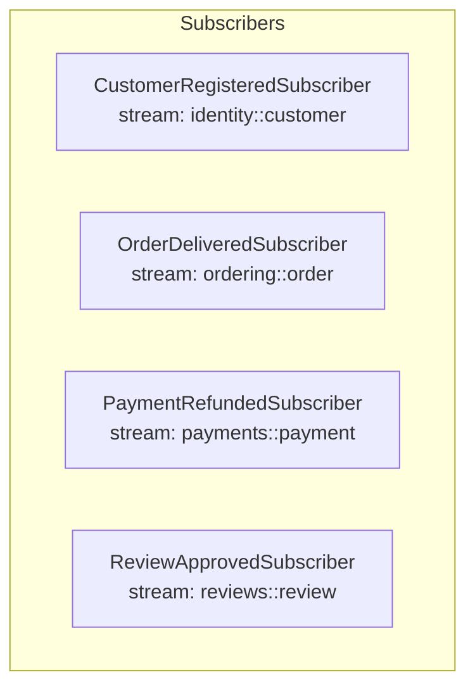
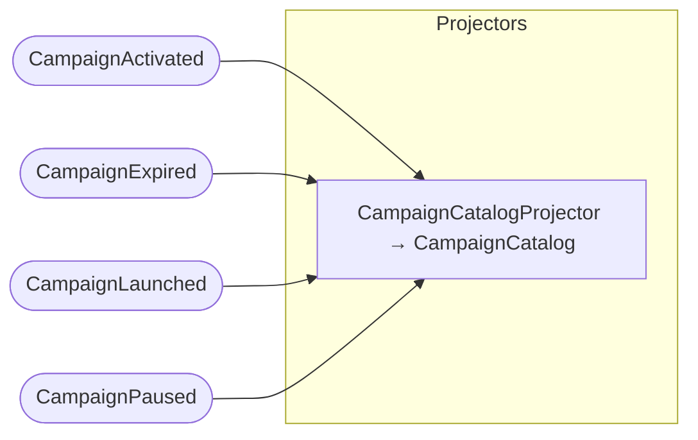
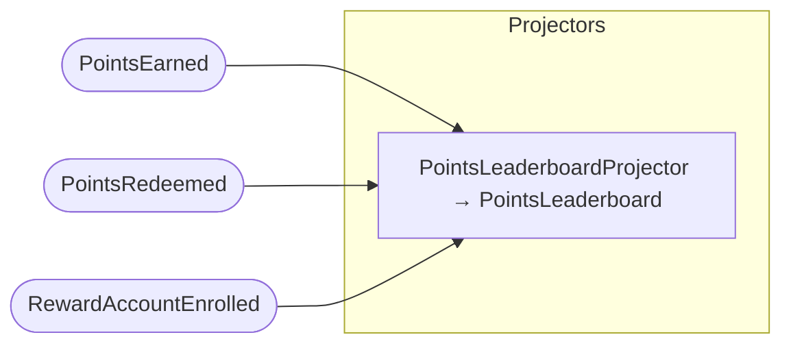
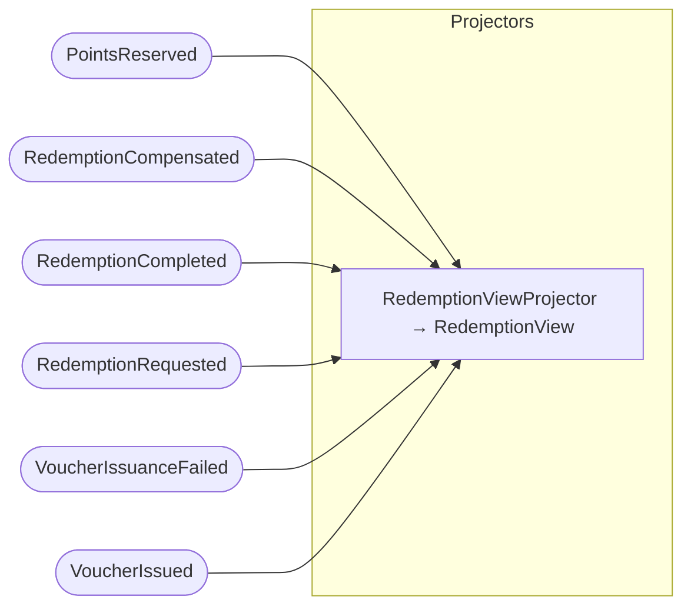
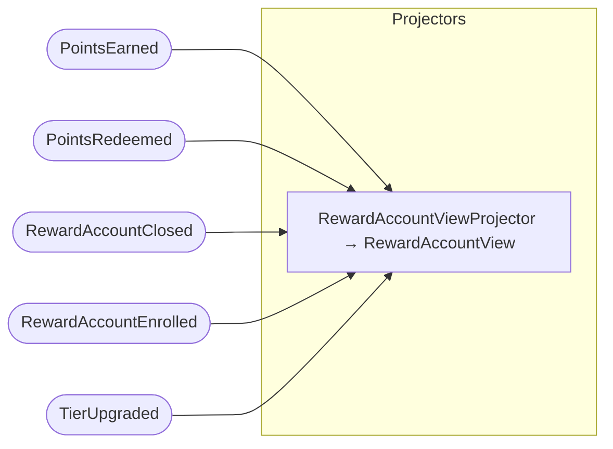

## Command Handlers: PromoCampaign

## Command Handlers: Redemption

## Command Handlers: RewardAccount

## Process Managers

## Subscribers

## Projector: CampaignCatalog

## Projector: PointsLeaderboard

## Projector: RedemptionView

## Projector: RewardAccountView

