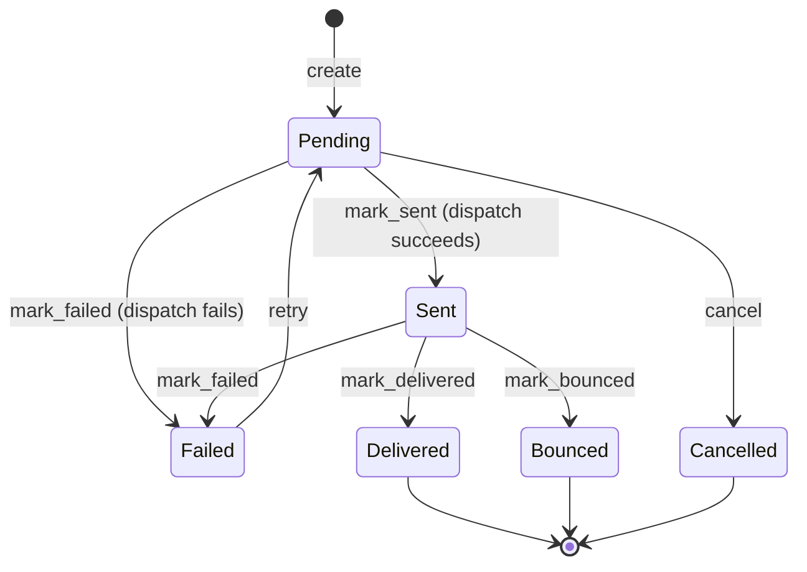

# Notifications

> Consumes cross-domain events and dispatches customer-facing and internal notifications
> via email, SMS, push, and Slack channels.

## Business Context

The Notifications context is the voice of ShopStream talking to its customers and
operations team. Every significant event across the platform -- a new account created,
an order confirmed, a payment processed, a shipment delayed -- triggers a notification
to keep stakeholders informed.

This is a **Generic Domain** with a unique characteristic: it is an **Event Consumer
Only** context. It does not expose any domain events to other bounded contexts. Instead,
it consumes events from all seven other bounded contexts (Identity, Catalogue, Ordering,
Inventory, Payments, Fulfillment, Reviews) and translates them into notifications
dispatched through appropriate channels.

Notifications is a separate bounded context because notification management has
fundamentally different concerns than the domains that trigger them. The notification
lifecycle (Pending &rarr; Sent &rarr; Delivered) is independent of the order lifecycle
or payment lifecycle. Notification preferences (which channels, quiet hours,
type-specific unsubscribes) are a customer concern that doesn't belong in Identity.
Template rendering, channel routing, retry logic, and delivery tracking are all
notification-specific infrastructure.

Think of the Notifications context as a post office inside a company. Different
departments (Ordering, Payments, Fulfillment) drop off messages. The post office
decides which mailbox to use (email, SMS, push, Slack), checks the recipient's
mailing preferences, formats the letter using the right template, sends it, and
tracks whether it was delivered.

## Ubiquitous Language

| Term | Definition | Code Element |
|------|-----------|-------------|
| Notification | A single message dispatched to a recipient via a specific channel | `Notification` ([source](../../src/notifications/notification/notification.py)) |
| Notification Type | The category of notification: Welcome, OrderConfirmation, PaymentReceipt, etc. (13 types) | `NotificationType` ([source](../../src/notifications/notification/notification.py)) |
| Notification Channel | The delivery mechanism: Email, SMS, Push, or Slack | `NotificationChannel` ([source](../../src/notifications/notification/notification.py)) |
| Notification Status | Lifecycle: Pending &rarr; Sent &rarr; Delivered, or Failed/Bounced/Cancelled | `NotificationStatus` ([source](../../src/notifications/notification/notification.py)) |
| Recipient Type | Whether the recipient is a Customer or Internal (operations team) | `RecipientType` ([source](../../src/notifications/notification/notification.py)) |
| Notification Preference | A customer's channel settings, quiet hours, and type-level unsubscribes | `NotificationPreference` ([source](../../src/notifications/preference/preference.py)) |
| Quiet Hours | A do-not-disturb window (start/end times) during which notifications are held | `quiet_hours_start`/`quiet_hours_end` on `NotificationPreference` |
| Template | A rendering class that produces subject and body from event context data | Template classes in [`src/notifications/templates/`](../../src/notifications/templates/) |
| Channel Adapter | A pluggable port/adapter for sending via a specific channel (e.g., SendGrid, Twilio) | [`src/notifications/channel/`](../../src/notifications/channel/) |
| Auto-Dispatch | The synchronous dispatch of immediate (non-scheduled) notifications when created | `NotificationDispatcher` ([source](../../src/notifications/notification/dispatch.py)) |
| Scheduled Notification | A notification with a `scheduled_for` timestamp, dispatched later by a background job | `ProcessScheduledNotifications` ([source](../../src/notifications/notification/scheduler.py)) |

Full definitions: [Glossary](../glossary.md)

## Domain Model

### Notification (Aggregate)

A Notification represents a single message dispatched to a recipient via a specific
channel. It is the aggregate root because the notification lifecycle -- creation,
dispatch, delivery tracking, retry -- is a single transactional concern. Each
notification tracks its own status, failure reason, retry count, and delivery timestamps.

Notifications use standard **CQRS** (not event sourcing). Notifications are fire-and-forget
with a simple linear lifecycle. There is no business need for temporal queries ("what
was this notification's status at 3pm?") or event replay. The audit trail is maintained
via the `NotificationLog` projection.

**Entities:** None (the aggregate is flat).

**Value Objects:** None (enums serve the role of type-safe categorization).

**Invariants:**

- State transitions follow a strict state machine (6 states, 7 valid transitions).
- Only failed notifications can be retried (`status == FAILED`).
- Retry count cannot exceed `max_retries`.
- Cancellation is only allowed from Pending status.

**State Machine: Notification Status**

A Notification begins as Pending when created by a cross-domain event handler. If
it is not scheduled for the future, the `NotificationDispatcher` immediately sends
it via the appropriate channel adapter, transitioning it to Sent or Failed.

Sent notifications may be confirmed as Delivered by a delivery webhook, or may Bounce
(permanent failure) or Fail (transient failure). Failed notifications can be Retried,
returning them to Pending for another dispatch attempt. Pending notifications can be
Cancelled (e.g., customer opted out before dispatch).

### NotificationPreference (Aggregate)

A customer's notification preferences control which channels are enabled, define
quiet hours (do-not-disturb windows), and allow unsubscribing from specific
notification types. Preferences are automatically created with safe defaults (email
enabled, SMS/push disabled) when a customer registers.

**Invariants:**

- Quiet hours start must be in "HH:MM" format with valid hours and minutes.
- A customer cannot unsubscribe from the same type twice.
- A customer cannot resubscribe to a type they're not unsubscribed from.

## Events

| Event | Trigger | Consequence |
|-------|---------|-------------|
| `NotificationCreated` | Cross-domain event handler creates a notification | NotificationLog, CustomerNotifications projections created; auto-dispatch triggered |
| `NotificationSent` | Channel adapter reports successful send | NotificationLog updated, NotificationStats incremented, FailedNotifications removed |
| `NotificationDelivered` | Delivery webhook confirms delivery | NotificationLog, CustomerNotifications updated |
| `NotificationFailed` | Channel adapter reports failure | NotificationLog updated, FailedNotifications created/updated, CustomerNotifications updated |
| `NotificationBounced` | Permanent delivery failure detected | NotificationLog updated |
| `NotificationCancelled` | User or system cancels a pending notification | NotificationLog updated |
| `NotificationRetried` | Failed notification retried for another attempt | NotificationLog updated, FailedNotifications removed |
| `PreferencesCreated` | CustomerRegistered event auto-creates preferences | — |
| `ChannelsUpdated` | Customer updates channel preferences | — |
| `QuietHoursSet` | Customer sets do-not-disturb window | — |
| `QuietHoursCleared` | Customer clears do-not-disturb window | — |
| `TypeUnsubscribed` | Customer unsubscribes from a notification type | — |
| `TypeResubscribed` | Customer resubscribes to a notification type | — |

## Command Flows

| Command | Who Initiates | What Happens | Events Raised |
|---------|--------------|-------------|---------------|
| `CancelNotification` | Customer/System | Cancels a pending or scheduled notification. Only from Pending status. | `NotificationCancelled` |
| `RetryNotification` | Admin/System | Retries a failed notification. Resets to Pending. Must be below max_retries. | `NotificationRetried` |
| `ProcessScheduledNotifications` | Background job | Dispatches all due scheduled notifications (scheduled_for <= now). | `NotificationSent` or `NotificationFailed` per notification |
| `UpdateNotificationPreferences` | Customer | Updates channel settings (email/sms/push enabled/disabled). | `ChannelsUpdated` |
| `SetQuietHours` | Customer | Sets a do-not-disturb time window. | `QuietHoursSet` |
| `ClearQuietHours` | Customer | Removes the do-not-disturb window. | `QuietHoursCleared` |
| `UnsubscribeFromType` | Customer | Unsubscribes from a specific notification type. | `TypeUnsubscribed` |
| `ResubscribeToType` | Customer | Resubscribes to a previously unsubscribed type. | `TypeResubscribed` |

## Read Models (Projections)

| Projection | Purpose | Built From |
|-----------|---------|-----------|
| `NotificationLog` | Full audit trail of all notifications with status history | All 7 notification events |
| `CustomerNotifications` | Per-customer notification feed for account page | `NotificationCreated` (create), `NotificationSent`, `NotificationDelivered`, `NotificationFailed` (status updates) |
| `NotificationStats` | Daily counts by notification type and channel | `NotificationSent` (increment counter) |
| `FailedNotifications` | Queue of failed notifications for retry/investigation | `NotificationFailed` (add/update), `NotificationRetried`/`NotificationSent` (remove) |

## Cross-Context Relationships

The Notifications context is a **pure consumer** -- it consumes events from all other
bounded contexts but does not publish events for consumption by others.

| Other Context Provides | To This Context | How |
|-----------------------|-----------------|-----|
| `CustomerRegistered` | Notifications | Identity raises event; Notifications creates welcome notification + default preferences |
| `OrderCreated` | Notifications | Ordering raises event; Notifications sends order confirmation |
| `OrderCancelled` | Notifications | Ordering raises event; Notifications logs warning (no customer_id on shared event) |
| `OrderDelivered` | Notifications | Ordering raises event; Notifications schedules review prompt (7 days later) |
| `PaymentSucceeded` | Notifications | Payments raises event; Notifications sends payment receipt |
| `RefundCompleted` | Notifications | Payments raises event; Notifications sends refund notification |
| `ShipmentHandedOff` | Notifications | Fulfillment raises event; Notifications logs (requires customer lookup) |
| `DeliveryConfirmed` | Notifications | Fulfillment raises event; Notifications logs (requires customer lookup) |
| `DeliveryException` | Notifications | Fulfillment raises event; Notifications logs (requires customer lookup) |
| `ReviewApproved` | Notifications | Reviews raises event; Notifications sends "review published" email |
| `ReviewRejected` | Notifications | Reviews raises event; Notifications sends "review rejected" email |
| `LowStockDetected` | Notifications | Inventory raises event; Notifications sends internal Slack alert |
| `CartAbandoned` | Notifications | Ordering raises event; Notifications schedules cart recovery email (24 hours) |

## Design Decisions

### Event Consumer Only

**Problem:** Should Notifications publish its own events for other domains?

**Decision:** No. Notifications is a pure event consumer.

**Rationale:** Notification status changes (Sent, Delivered, Failed) are not business
events that other domains need to react to. No other bounded context cares whether
a welcome email was delivered. The notification lifecycle is an infrastructure concern,
not a business concern. This keeps the context map simple -- Notifications is a
leaf node with no downstream consumers.

**Trade-off:** If a future requirement needs notification delivery status (e.g.,
"show customer whether their order confirmation email was delivered"), it would need
a direct query to the Notifications context rather than an event subscription.

### Two Aggregates: Notification + NotificationPreference

**Problem:** Should preferences be part of the Notification aggregate?

**Decision:** Separate aggregates.

**Rationale:** Preferences and notifications have different lifecycles and change
patterns. Preferences are long-lived (created once, updated rarely) while notifications
are short-lived (created, dispatched, done). They also have different consistency
boundaries -- updating a preference should not require loading any notifications,
and creating a notification should not require locking the preference aggregate.

**Trade-off:** Preference lookups during notification creation are eventually
consistent -- a preference change made milliseconds before a notification is created
might not be reflected. This is acceptable because preference changes are rare and
the impact of a single notification on a recently-changed channel is minimal.

### Template Registry Pattern

**Problem:** How to render notification content for 13 different notification types?

**Decision:** A template registry maps `NotificationType` to template classes. Each
template declares its `default_channels` and implements a `render(context)` method
that returns `{subject, body}`.

**Rationale:** Templates are the most likely part of the notification system to change
(marketing copy, formatting, new context variables). Isolating each template in its
own module makes changes safe and reviewable. The registry pattern provides a clean
lookup mechanism and makes it easy to add new notification types.

**Trade-off:** Template rendering is simple string interpolation. A future version
might use a proper templating engine (Jinja2) for HTML emails, but the current
approach keeps the codebase simple and the rendering logic testable.

### Auto-Dispatch via Event Handler

**Problem:** How should notifications be dispatched after creation?

**Decision:** A `NotificationDispatcher` event handler reacts to `NotificationCreated`
events and immediately sends the notification via the appropriate channel adapter.
Scheduled notifications (those with `scheduled_for` set) are skipped by the auto-dispatcher
and handled by the `ProcessScheduledNotifications` command.

**Rationale:** This leverages Protean's event processing infrastructure. In synchronous
mode (tests, dev), dispatch happens inline with the aggregate save. In async mode
(production), dispatch happens via the engine worker. This pattern keeps the notification
creation logic clean -- the creator doesn't need to know about dispatch.

**Trade-off:** In synchronous mode, auto-dispatch means the HTTP response waits for
the email/SMS to be sent. In production (async mode), this is not an issue because
dispatch happens asynchronously in the engine worker.

### Port/Adapter Pattern for Channels

**Problem:** How to support multiple notification channels with different APIs?

**Decision:** Abstract port interfaces (`EmailPort`, `SMSPort`, `PushPort`, `SlackPort`)
with fake adapters for testing and development. Production adapters (SendGrid, Twilio,
FCM, Slack API) implement the same interface.

**Rationale:** The port/adapter pattern decouples the notification domain from specific
third-party services. Tests run with fake adapters (in-memory), development runs with
fake adapters (with logging), and production runs with real adapters. The channel
registry (`get_channel()`) provides singleton access to adapters.

**Trade-off:** Fake adapters don't validate email formats, phone numbers, or device
tokens. Integration tests with real adapters would be needed before production
deployment.

## Source Code Map

| Concern | Location |
|---------|----------|
| Aggregate root + enums + state machine | [`src/notifications/notification/notification.py`](../../src/notifications/notification/notification.py) |
| Domain events (7 notification events) | [`src/notifications/notification/events.py`](../../src/notifications/notification/events.py) |
| Preference aggregate + events | [`src/notifications/preference/preference.py`](../../src/notifications/preference/preference.py), [`events.py`](../../src/notifications/preference/events.py) |
| Cancel notification command + handler | [`src/notifications/notification/cancellation.py`](../../src/notifications/notification/cancellation.py) |
| Retry notification command + handler | [`src/notifications/notification/retry.py`](../../src/notifications/notification/retry.py) |
| Scheduled notifications command + handler | [`src/notifications/notification/scheduler.py`](../../src/notifications/notification/scheduler.py) |
| Preference management commands + handler | [`src/notifications/preference/management.py`](../../src/notifications/preference/management.py) |
| Subscription commands + handler | [`src/notifications/preference/subscription.py`](../../src/notifications/preference/subscription.py) |
| Auto-dispatch event handler | [`src/notifications/notification/dispatch.py`](../../src/notifications/notification/dispatch.py) |
| Notification helpers (create for customer/internal) | [`src/notifications/notification/helpers.py`](../../src/notifications/notification/helpers.py) |
| Cross-domain: Identity events handler | [`src/notifications/notification/identity_events.py`](../../src/notifications/notification/identity_events.py), [`preference/identity_events.py`](../../src/notifications/preference/identity_events.py) |
| Cross-domain: Ordering events handler | [`src/notifications/notification/ordering_events.py`](../../src/notifications/notification/ordering_events.py) |
| Cross-domain: Payment events handler | [`src/notifications/notification/payment_events.py`](../../src/notifications/notification/payment_events.py) |
| Cross-domain: Fulfillment events handler | [`src/notifications/notification/fulfillment_events.py`](../../src/notifications/notification/fulfillment_events.py) |
| Cross-domain: Review events handler | [`src/notifications/notification/review_events.py`](../../src/notifications/notification/review_events.py) |
| Cross-domain: Inventory events handler | [`src/notifications/notification/inventory_events.py`](../../src/notifications/notification/inventory_events.py) |
| Cross-domain: Cart events handler | [`src/notifications/notification/cart_events.py`](../../src/notifications/notification/cart_events.py) |
| Template registry + 13 templates | [`src/notifications/templates/`](../../src/notifications/templates/) |
| Channel adapters (ports + fakes) | [`src/notifications/channel/`](../../src/notifications/channel/) |
| Projections + projectors (4 read models) | [`src/notifications/projections/`](../../src/notifications/projections/) |
| API routes | [`src/notifications/api/routes.py`](../../src/notifications/api/routes.py) |
| API schemas (Pydantic) | [`src/notifications/api/schemas.py`](../../src/notifications/api/schemas.py) |
