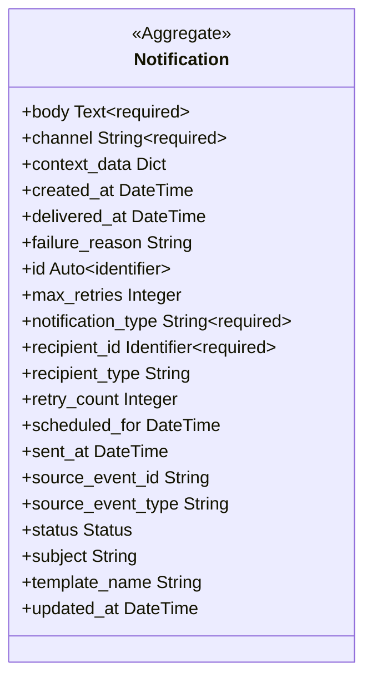
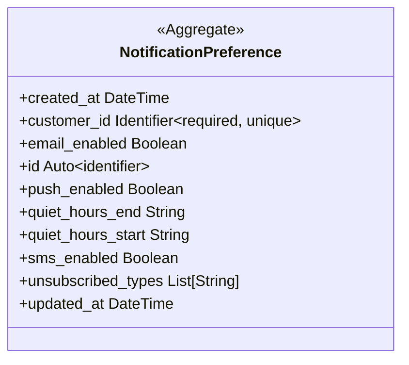

## Cluster: Notification

```mermaid
classDiagram
    class notifications_notification_notification_Notification["Notification"] {
        <<Aggregate>>
        +body Text~required~
        +channel String~required~
        +context_data Dict
        +created_at DateTime
        +delivered_at DateTime
        +failure_reason String
        +id Auto~identifier~
        +max_retries Integer
        +notification_type String~required~
        +recipient_id Identifier~required~
        +recipient_type String
        +retry_count Integer
        +scheduled_for DateTime
        +sent_at DateTime
        +source_event_id String
        +source_event_type String
        +status Status
        +subject String
        +template_name String
        +updated_at DateTime
    }
```

## Cluster: NotificationPreference

```mermaid
classDiagram
    class notifications_preference_preference_NotificationPreference["NotificationPreference"] {
        <<Aggregate>>
        +created_at DateTime
        +customer_id Identifier~required, unique~
        +email_enabled Boolean
        +id Auto~identifier~
        +push_enabled Boolean
        +quiet_hours_end String
        +quiet_hours_start String
        +sms_enabled Boolean
        +unsubscribed_types List[String]
        +updated_at DateTime
    }
```
