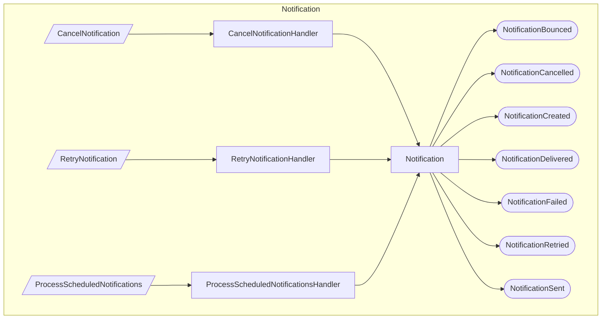
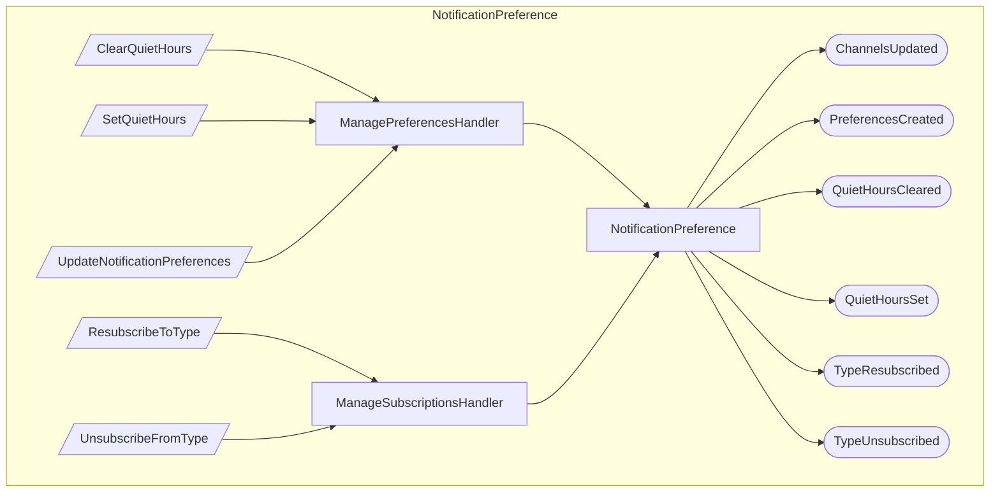

## Event Flow: Notification

```mermaid
flowchart TD
    subgraph notifications_notification_notification_Notification[Notification]
        agg_notifications_notification_notification_Notification[Notification]
        cmd_notifications_notification_cancellation_CancelNotification[/CancelNotification/]
        cmd_notifications_notification_retry_RetryNotification[/RetryNotification/]
        cmd_notifications_notification_scheduler_ProcessScheduledNotifications[/ProcessScheduledNotifications/]
        evt_notifications_notification_events_NotificationBounced([NotificationBounced])
        evt_notifications_notification_events_NotificationCancelled([NotificationCancelled])
        evt_notifications_notification_events_NotificationCreated([NotificationCreated])
        evt_notifications_notification_events_NotificationDelivered([NotificationDelivered])
        evt_notifications_notification_events_NotificationFailed([NotificationFailed])
        evt_notifications_notification_events_NotificationRetried([NotificationRetried])
        evt_notifications_notification_events_NotificationSent([NotificationSent])
        hdlr_notifications_notification_cancellation_CancelNotificationHandler[CancelNotificationHandler]
        hdlr_notifications_notification_retry_RetryNotificationHandler[RetryNotificationHandler]
        hdlr_notifications_notification_scheduler_ProcessScheduledNotificationsHandler[ProcessScheduledNotificationsHandler]
    end
    cmd_notifications_notification_cancellation_CancelNotification --> hdlr_notifications_notification_cancellation_CancelNotificationHandler
    hdlr_notifications_notification_cancellation_CancelNotificationHandler --> agg_notifications_notification_notification_Notification
    cmd_notifications_notification_retry_RetryNotification --> hdlr_notifications_notification_retry_RetryNotificationHandler
    hdlr_notifications_notification_retry_RetryNotificationHandler --> agg_notifications_notification_notification_Notification
    cmd_notifications_notification_scheduler_ProcessScheduledNotifications --> hdlr_notifications_notification_scheduler_ProcessScheduledNotificationsHandler
    hdlr_notifications_notification_scheduler_ProcessScheduledNotificationsHandler --> agg_notifications_notification_notification_Notification
    agg_notifications_notification_notification_Notification --> evt_notifications_notification_events_NotificationBounced
    agg_notifications_notification_notification_Notification --> evt_notifications_notification_events_NotificationCancelled
    agg_notifications_notification_notification_Notification --> evt_notifications_notification_events_NotificationCreated
    agg_notifications_notification_notification_Notification --> evt_notifications_notification_events_NotificationDelivered
    agg_notifications_notification_notification_Notification --> evt_notifications_notification_events_NotificationFailed
    agg_notifications_notification_notification_Notification --> evt_notifications_notification_events_NotificationRetried
    agg_notifications_notification_notification_Notification --> evt_notifications_notification_events_NotificationSent
```

## Event Flow: NotificationPreference

```mermaid
flowchart TD
    subgraph notifications_preference_preference_NotificationPreference[NotificationPreference]
        agg_notifications_preference_preference_NotificationPreference[NotificationPreference]
        cmd_notifications_preference_management_ClearQuietHours[/ClearQuietHours/]
        cmd_notifications_preference_management_SetQuietHours[/SetQuietHours/]
        cmd_notifications_preference_management_UpdateNotificationPreferences[/UpdateNotificationPreferences/]
        cmd_notifications_preference_subscription_ResubscribeToType[/ResubscribeToType/]
        cmd_notifications_preference_subscription_UnsubscribeFromType[/UnsubscribeFromType/]
        evt_notifications_preference_events_ChannelsUpdated([ChannelsUpdated])
        evt_notifications_preference_events_PreferencesCreated([PreferencesCreated])
        evt_notifications_preference_events_QuietHoursCleared([QuietHoursCleared])
        evt_notifications_preference_events_QuietHoursSet([QuietHoursSet])
        evt_notifications_preference_events_TypeResubscribed([TypeResubscribed])
        evt_notifications_preference_events_TypeUnsubscribed([TypeUnsubscribed])
        hdlr_notifications_preference_management_ManagePreferencesHandler[ManagePreferencesHandler]
        hdlr_notifications_preference_subscription_ManageSubscriptionsHandler[ManageSubscriptionsHandler]
    end
    cmd_notifications_preference_management_ClearQuietHours --> hdlr_notifications_preference_management_ManagePreferencesHandler
    cmd_notifications_preference_management_SetQuietHours --> hdlr_notifications_preference_management_ManagePreferencesHandler
    cmd_notifications_preference_management_UpdateNotificationPreferences --> hdlr_notifications_preference_management_ManagePreferencesHandler
    hdlr_notifications_preference_management_ManagePreferencesHandler --> agg_notifications_preference_preference_NotificationPreference
    cmd_notifications_preference_subscription_ResubscribeToType --> hdlr_notifications_preference_subscription_ManageSubscriptionsHandler
    cmd_notifications_preference_subscription_UnsubscribeFromType --> hdlr_notifications_preference_subscription_ManageSubscriptionsHandler
    hdlr_notifications_preference_subscription_ManageSubscriptionsHandler --> agg_notifications_preference_preference_NotificationPreference
    agg_notifications_preference_preference_NotificationPreference --> evt_notifications_preference_events_ChannelsUpdated
    agg_notifications_preference_preference_NotificationPreference --> evt_notifications_preference_events_PreferencesCreated
    agg_notifications_preference_preference_NotificationPreference --> evt_notifications_preference_events_QuietHoursCleared
    agg_notifications_preference_preference_NotificationPreference --> evt_notifications_preference_events_QuietHoursSet
    agg_notifications_preference_preference_NotificationPreference --> evt_notifications_preference_events_TypeResubscribed
    agg_notifications_preference_preference_NotificationPreference --> evt_notifications_preference_events_TypeUnsubscribed
```

## Downstream Consumers

```mermaid
flowchart LR
    evt_notifications_notification_events_NotificationBounced([NotificationBounced])
    evt_notifications_notification_events_NotificationCancelled([NotificationCancelled])
    evt_notifications_notification_events_NotificationCreated([NotificationCreated])
    evt_notifications_notification_events_NotificationDelivered([NotificationDelivered])
    evt_notifications_notification_events_NotificationFailed([NotificationFailed])
    evt_notifications_notification_events_NotificationRetried([NotificationRetried])
    evt_notifications_notification_events_NotificationSent([NotificationSent])
    evt_notifications_preference_events_ChannelsUpdated([ChannelsUpdated])
    evt_notifications_preference_events_PreferencesCreated([PreferencesCreated])
    evt_notifications_preference_events_QuietHoursCleared([QuietHoursCleared])
    evt_notifications_preference_events_QuietHoursSet([QuietHoursSet])
    evt_notifications_preference_events_TypeResubscribed([TypeResubscribed])
    evt_notifications_preference_events_TypeUnsubscribed([TypeUnsubscribed])
    subgraph event_handlers["Event Handlers"]
        eh_notifications_notification_dispatch_NotificationDispatcher[NotificationDispatcher]
    end
    subgraph projectors["Projectors"]
        proj_notifications_projections_customer_notifications_CustomerNotificationsProjector[CustomerNotificationsProjector → CustomerNotifications]
        proj_notifications_projections_customer_preferences_CustomerPreferencesProjector[CustomerPreferencesProjector → CustomerPreferences]
        proj_notifications_projections_failed_notifications_FailedNotificationsProjector[FailedNotificationsProjector → FailedNotifications]
        proj_notifications_projections_notification_log_NotificationLogProjector[NotificationLogProjector → NotificationLog]
        proj_notifications_projections_notification_stats_NotificationStatsProjector[NotificationStatsProjector → NotificationStats]
    end
    evt_notifications_notification_events_NotificationCreated --> eh_notifications_notification_dispatch_NotificationDispatcher
    evt_notifications_notification_events_NotificationCreated --> proj_notifications_projections_customer_notifications_CustomerNotificationsProjector
    evt_notifications_notification_events_NotificationDelivered --> proj_notifications_projections_customer_notifications_CustomerNotificationsProjector
    evt_notifications_notification_events_NotificationFailed --> proj_notifications_projections_customer_notifications_CustomerNotificationsProjector
    evt_notifications_notification_events_NotificationSent --> proj_notifications_projections_customer_notifications_CustomerNotificationsProjector
    evt_notifications_preference_events_ChannelsUpdated --> proj_notifications_projections_customer_preferences_CustomerPreferencesProjector
    evt_notifications_preference_events_PreferencesCreated --> proj_notifications_projections_customer_preferences_CustomerPreferencesProjector
    evt_notifications_preference_events_QuietHoursCleared --> proj_notifications_projections_customer_preferences_CustomerPreferencesProjector
    evt_notifications_preference_events_QuietHoursSet --> proj_notifications_projections_customer_preferences_CustomerPreferencesProjector
    evt_notifications_preference_events_TypeResubscribed --> proj_notifications_projections_customer_preferences_CustomerPreferencesProjector
    evt_notifications_preference_events_TypeUnsubscribed --> proj_notifications_projections_customer_preferences_CustomerPreferencesProjector
    evt_notifications_notification_events_NotificationFailed --> proj_notifications_projections_failed_notifications_FailedNotificationsProjector
    evt_notifications_notification_events_NotificationRetried --> proj_notifications_projections_failed_notifications_FailedNotificationsProjector
    evt_notifications_notification_events_NotificationSent --> proj_notifications_projections_failed_notifications_FailedNotificationsProjector
    evt_notifications_notification_events_NotificationBounced --> proj_notifications_projections_notification_log_NotificationLogProjector
    evt_notifications_notification_events_NotificationCancelled --> proj_notifications_projections_notification_log_NotificationLogProjector
    evt_notifications_notification_events_NotificationCreated --> proj_notifications_projections_notification_log_NotificationLogProjector
    evt_notifications_notification_events_NotificationDelivered --> proj_notifications_projections_notification_log_NotificationLogProjector
    evt_notifications_notification_events_NotificationFailed --> proj_notifications_projections_notification_log_NotificationLogProjector
    evt_notifications_notification_events_NotificationRetried --> proj_notifications_projections_notification_log_NotificationLogProjector
    evt_notifications_notification_events_NotificationSent --> proj_notifications_projections_notification_log_NotificationLogProjector
    evt_notifications_notification_events_NotificationSent --> proj_notifications_projections_notification_stats_NotificationStatsProjector
```
