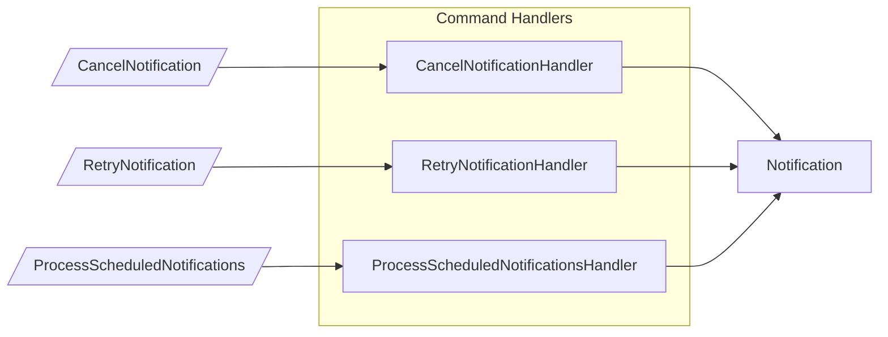
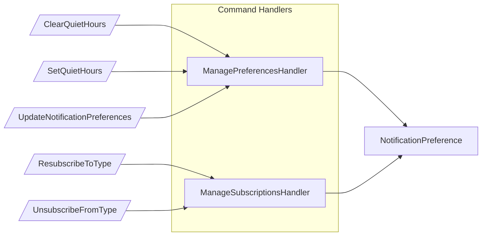
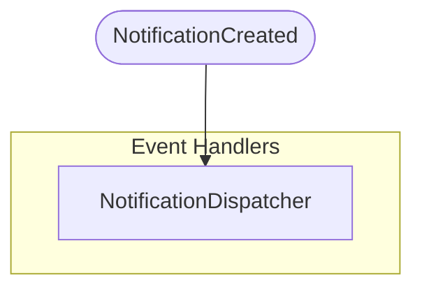
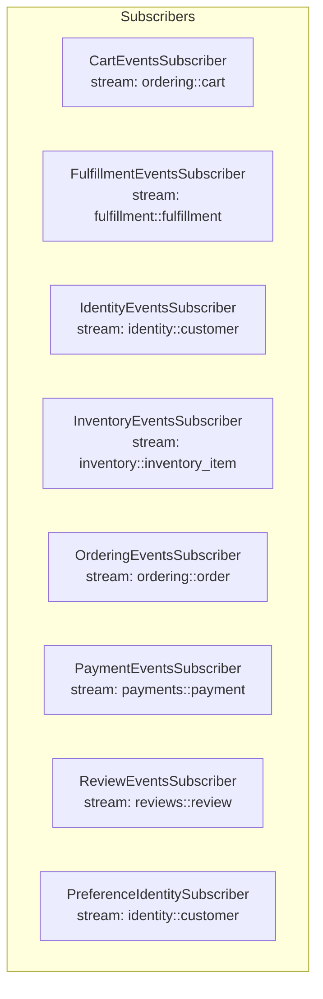
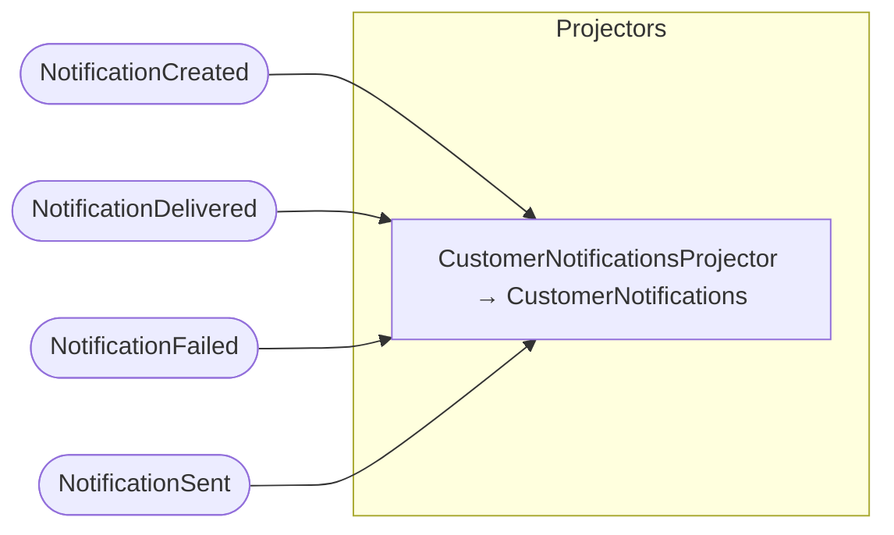
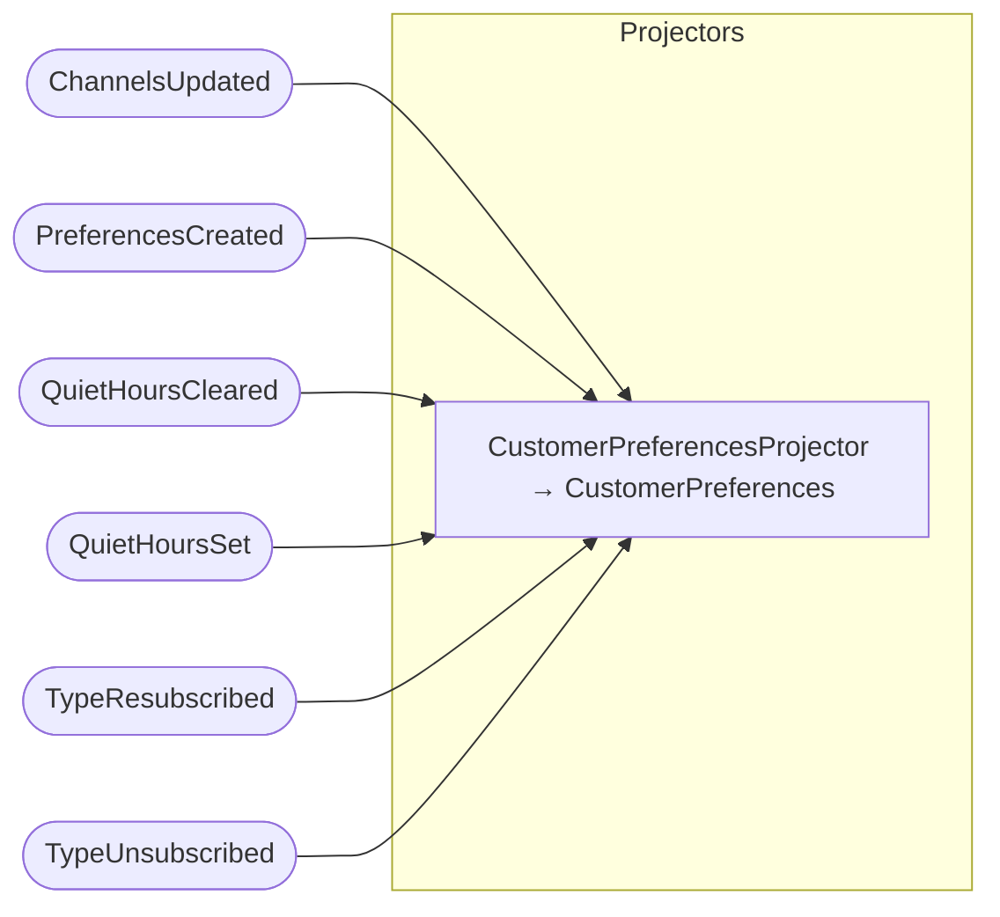
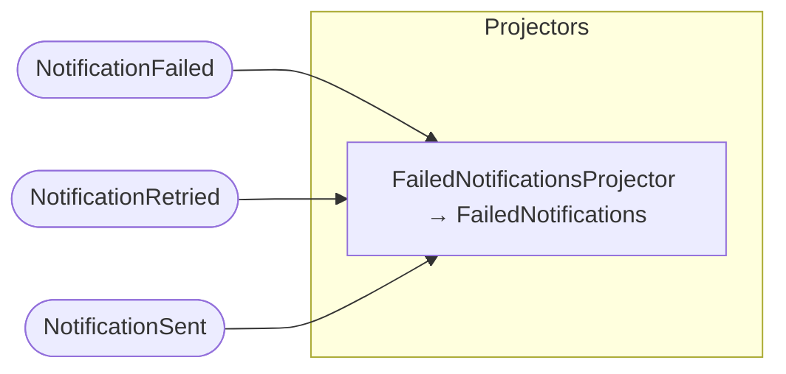
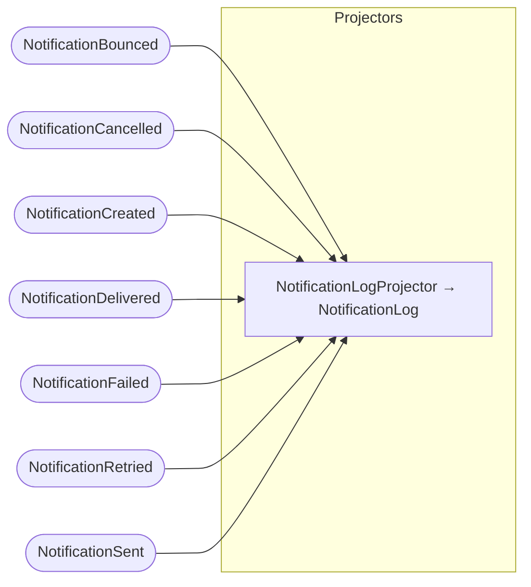
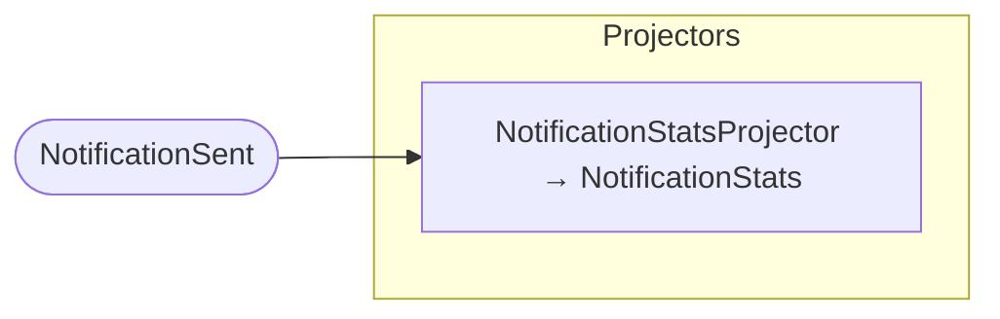

## Command Handlers: Notification

## Command Handlers: NotificationPreference

## Event Handlers

## Subscribers

## Projector: CustomerNotifications

## Projector: CustomerPreferences

## Projector: FailedNotifications

## Projector: NotificationLog

## Projector: NotificationStats

