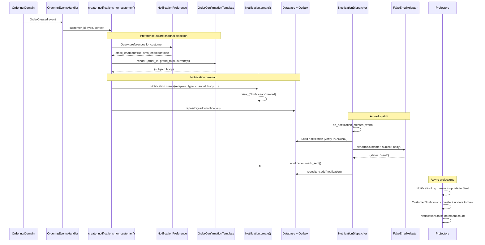

# Notification Dispatch

> A cross-domain event triggers the creation and automatic dispatch of a customer notification
> through the appropriate channel.

## The Story

Alice just placed an order on ShopStream. The Ordering domain raises an `OrderCreated`
event. The Notifications domain consumes this event and creates an order confirmation
email for Alice. Because the notification is immediate (not scheduled for the future),
the auto-dispatch handler picks it up, renders the template, sends it via the email
adapter, and marks it as Sent -- all within the same event processing cycle.

Alice receives her confirmation email within seconds.

## The Flow

### 1. Cross-Domain Event

The Ordering domain commits an order and writes an `OrderCreated` event to the outbox.
In production, the Notifications Engine picks up this event from Redis Streams.
In synchronous mode (dev/test), the event is processed inline.

The event carries: `order_id`, `customer_id`, `grand_total`, `currency`, `items`, `created_at`.

&rarr; [source](../../src/shared/events/ordering.py) (`OrderCreated`)

### 2. Event Handler

`OrderingEventsHandler.on_order_created()` receives the event and delegates to
`create_notifications_for_customer()` -- the shared helper that handles the
preference-aware, template-driven notification creation pattern.

&rarr; [source](../../src/notifications/notification/ordering_events.py)

### 3. Preference Lookup + Channel Selection

The helper performs these steps:

1. **Template lookup:** Maps `NotificationType.ORDER_CONFIRMATION` to
   `OrderConfirmationTemplate`, which declares `default_channels = [Email]`.
2. **Preference lookup:** Queries the `NotificationPreference` aggregate for Alice's
   preferences. If preferences exist, filters the template's default channels against
   Alice's enabled channels. If no preferences exist, falls back to email only (safe default).
3. **Subscription check:** If Alice has unsubscribed from `OrderConfirmation`, returns
   empty (no notifications created).
4. **Template rendering:** Calls `OrderConfirmationTemplate.render({order_id, grand_total, currency})`
   to produce `{subject, body}`.
5. **Notification creation:** Creates one `Notification` aggregate per enabled channel,
   storing the rendered content, template name, source event correlation, and context data.

&rarr; [source](../../src/notifications/notification/helpers.py) (`create_notifications_for_customer`)

### 4. Auto-Dispatch

When `repo.add(notification)` is called, the `NotificationCreated` event is raised.
The `NotificationDispatcher` event handler reacts:

1. Checks `scheduled_for` -- if set, skips (scheduled notifications are dispatched later).
2. Loads the notification from the repository.
3. Verifies the notification is still in `PENDING` status.
4. Gets the channel adapter via `get_channel(notification.channel)`.
5. Calls `_dispatch_via_channel(adapter, notification)`, which routes to the correct
   adapter method based on channel type (email: `send(to, subject, body)`, SMS: `send(to, body)`, etc.).
6. If the adapter returns `{status: "sent"}`, calls `notification.mark_sent()`.
7. If the adapter returns a failure, calls `notification.mark_failed(reason)`.
8. Persists the updated notification.

&rarr; [source](../../src/notifications/notification/dispatch.py)

### 5. Projection Updates

Events raised during the notification lifecycle trigger projectors:

| Event | Handled By | Effect |
|-------|-----------|--------|
| `NotificationCreated` | `NotificationLogProjector` | Creates audit trail entry with status=Pending |
| `NotificationCreated` | `CustomerNotificationsProjector` | Creates customer feed entry (skips internal notifications) |
| `NotificationSent` | `NotificationLogProjector` | Updates status to Sent, records sent_at |
| `NotificationSent` | `NotificationStatsProjector` | Increments daily count for this type+channel |
| `NotificationSent` | `CustomerNotificationsProjector` | Updates status to Sent |

### 6. API Response

Since notification creation is triggered by cross-domain events (not API calls), there
is no direct HTTP response. The customer can later query their notification history via
`GET /notifications/{customer_id}` to see the confirmation email in their feed.

## Sequence Diagram

## Edge Cases

| Scenario | What Happens | Why |
|----------|-------------|-----|
| Customer has no preferences | Falls back to email-only channel | Safe default prevents missing critical notifications |
| Customer unsubscribed from OrderConfirmation | No notification created, returns empty list | Respects customer preferences |
| All channels disabled | No notification created, logs "No enabled channels" | Preference enforcement |
| Email adapter fails (SMTP error) | Notification marked FAILED, added to FailedNotifications queue | Retry logic available via `RetryNotification` command |
| Email adapter raises exception | Notification marked FAILED with exception message | Exception safety in dispatch handler |
| Notification already dispatched (not PENDING) | Dispatcher skips, logs "not in PENDING status" | Idempotency protection |
| Notification not found in repo | Dispatcher logs error and returns | Safety for eventual consistency |
| Scheduled notification (e.g., review prompt) | Dispatcher skips, notification stays PENDING | `ProcessScheduledNotifications` handles these later |
