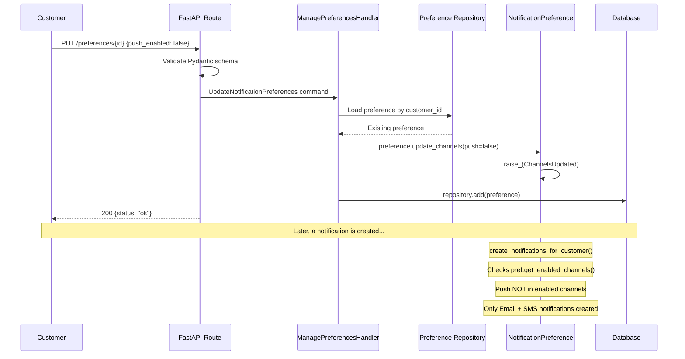

# Preference Management

> A customer updates their notification preferences to control which channels they receive
> notifications on, sets quiet hours, and unsubscribes from specific notification types.

## The Story

Bob has been receiving too many push notifications from ShopStream. He opens his account
settings and disables push notifications while keeping email and SMS enabled. He also
sets quiet hours from 10 PM to 8 AM so he's not disturbed at night. Later, he decides
he no longer wants cart recovery emails and unsubscribes from that specific type.

Behind the scenes, each action is a command processed by the NotificationPreference
aggregate. Future notifications will respect Bob's updated preferences -- cart recovery
emails will be skipped entirely, and no notifications will be dispatched during his
quiet hours.

## The Flow

### 1. API Request (Update Channels)

The client sends a channel preference update:

```
PUT /notifications/preferences/cust-bob-42
{
  "email_enabled": true,
  "sms_enabled": true,
  "push_enabled": false
}
```

&rarr; [source](../../src/notifications/api/routes.py) (`update_preferences`)

### 2. Command

The API route creates an `UpdateNotificationPreferences` command:

- **`UpdateNotificationPreferences`** -- the intent to change channel settings.
- Key data: `customer_id`, `email_enabled`, `sms_enabled`, `push_enabled`.

&rarr; [source](../../src/notifications/preference/management.py)

### 3. Handler Logic

`ManagePreferencesHandler.update_preferences()` loads the existing preference aggregate
for the customer, calls `preference.update_channels(email, sms, push)`, and persists
the updated aggregate.

The aggregate raises a `ChannelsUpdated` event recording the new settings.

&rarr; [source](../../src/notifications/preference/management.py)

### 4. Quiet Hours

Bob sets quiet hours via:

```
PUT /notifications/preferences/cust-bob-42/quiet-hours
{
  "start": "22:00",
  "end": "08:00"
}
```

The `SetQuietHours` command handler calls `preference.set_quiet_hours("22:00", "08:00")`,
which validates the time format (HH:MM, valid hours/minutes) and stores the window.

To remove quiet hours later, Bob can call:

```
DELETE /notifications/preferences/cust-bob-42/quiet-hours
```

&rarr; [source](../../src/notifications/preference/management.py)

### 5. Type-Level Unsubscribe

Bob unsubscribes from cart recovery emails:

```
POST /notifications/preferences/cust-bob-42/unsubscribe
{
  "notification_type": "CartRecovery"
}
```

The `UnsubscribeFromType` command handler calls `preference.unsubscribe_from("CartRecovery")`.
The aggregate adds the type to its unsubscribed list (stored as a JSON array) and
raises a `TypeUnsubscribed` event.

When a `CartAbandoned` event later triggers a notification for Bob, the helper checks
`preference.is_subscribed_to("CartRecovery")`, finds he's unsubscribed, and skips
notification creation entirely.

&rarr; [source](../../src/notifications/preference/subscription.py)

### 6. Auto-Creation on Registration

Preferences are automatically created when a customer registers. The
`PreferenceIdentityEventsHandler` consumes `CustomerRegistered` events from the Identity
domain and creates a `NotificationPreference` with safe defaults:

- Email enabled, SMS disabled, Push disabled
- No quiet hours
- No type-level unsubscribes

This is idempotent -- if preferences already exist for the customer, the handler skips
creation.

&rarr; [source](../../src/notifications/preference/identity_events.py)

## Sequence Diagram



## Edge Cases

| Scenario | What Happens | Why |
|----------|-------------|-----|
| No preferences exist when queried via API | Returns defaults (email=true, sms=false, push=false) | Graceful fallback for customers who haven't registered |
| Customer unsubscribes from a type twice | `ValidationError`: "Already unsubscribed from this type" | Aggregate invariant prevents duplicate entries |
| Customer resubscribes to a type they didn't unsubscribe from | `ValidationError`: "Not unsubscribed from this type" | Aggregate invariant enforces logical consistency |
| Invalid quiet hours format (e.g., "25:00") | `ValidationError`: "Invalid hour" | Time validation in aggregate method |
| Quiet hours cleared when none were set | Silently succeeds (idempotent) | No error for clearing nonexistent quiet hours |
| Preference update while notification is being created | Notification uses the preference snapshot at creation time | Eventual consistency -- acceptable for notification preferences |
| CustomerRegistered event processed twice | Second invocation finds existing preferences and skips | Idempotency check in handler |
