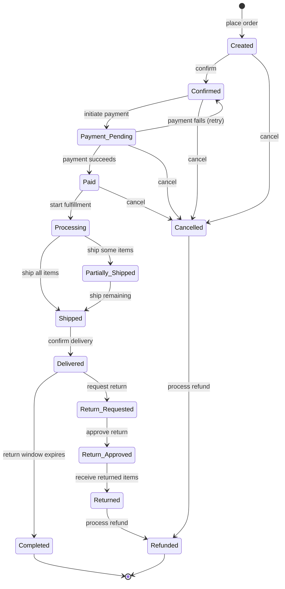
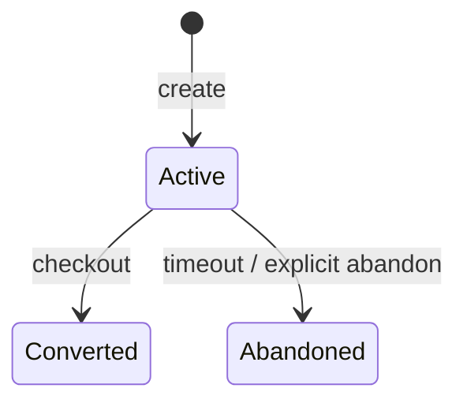

# Ordering

> Manages the lifecycle of shopping carts and orders, from browse-to-buy through
> fulfillment, returns, and refunds.

## Business Context

When a shopper adds items to their cart, they are expressing intent. When they check
out, that intent becomes a commitment. The Ordering context manages this progression
-- from the tentative world of cart management through the transactional world of order
processing.

This is a separate bounded context because orders have fundamentally different
consistency requirements than products or customers. An order must maintain pricing
integrity once placed, even if the product price changes afterward. A cart is
ephemeral; an order is a legal record. And the rules governing order state transitions
(can you cancel after payment? can you return after 30 days?) are domain-specific
business policies that have nothing to do with how products are catalogued or how
customers manage their profiles.

Think of the Ordering context as the cashier and logistics department combined. The
cashier handles the transaction (cart to order, payment), and logistics handles
everything after (processing, shipping, delivery, returns). The cashier doesn't manage
the product shelves (Catalogue) or customer memberships (Identity) -- they just need
to know the price and the customer's ID.

The Ordering context contains two aggregates that serve very different purposes:

- **Shopping Cart** -- a disposable, pre-commitment container. Uses standard CQRS.
  Event sourcing would add overhead without proportional business value.
- **Order** -- a durable, auditable financial record. Uses **event sourcing** because
  being able to reconstruct exactly how an order reached its current state (and prove
  it in a dispute) is a business requirement, not a technical curiosity.

## Ubiquitous Language

| Term | Definition | Code Element |
|------|-----------|-------------|
| Order | A confirmed intent to purchase, tracking the full lifecycle through fulfillment | `Order` ([source](../../src/ordering/order/order.py)) |
| Shopping Cart | An ephemeral container for items a customer intends to buy | `ShoppingCart` ([source](../../src/ordering/cart/cart.py)) |
| Order Item | A line item: a specific product variant at a quantity and price | `OrderItem` ([source](../../src/ordering/order/order.py)) |
| Cart Item | An item in a cart: a product variant at a quantity (no price yet) | `CartItem` ([source](../../src/ordering/cart/cart.py)) |
| Shipping Address | Delivery destination, snapshotted at order creation | `ShippingAddress` ([source](../../src/ordering/order/order.py)) |
| Order Pricing | Financial summary: subtotal, shipping, tax, discount, grand total | `OrderPricing` ([source](../../src/ordering/order/order.py)) |
| Order Status | The 14-state lifecycle from Created to Completed/Refunded | `OrderStatus` ([source](../../src/ordering/order/order.py)) |
| Item Status | Per-item lifecycle: Pending &rarr; Reserved &rarr; Shipped &rarr; Delivered &rarr; Returned | `ItemStatus` ([source](../../src/ordering/order/order.py)) |
| Cart Status | Cart lifecycle: Active, Converted, Abandoned | `CartStatus` ([source](../../src/ordering/cart/cart.py)) |
| Cancellation Actor | Who cancelled: Customer, System, or Admin | `CancellationActor` ([source](../../src/ordering/order/order.py)) |
| Checkout / Conversion | The moment a cart becomes an order | `convert_to_order()` ([source](../../src/ordering/cart/cart.py)) |

Full definitions: [Glossary](../glossary.md#ordering-context)

## Domain Model

### Order (Aggregate, Event Sourced)

An Order represents a customer's purchase commitment and tracks the complete lifecycle
from creation through fulfillment, returns, and refunds. It is the financial backbone
of the platform.

The Order is an aggregate root because its items, pricing, addresses, and status must
all be consistent. For example, when an item is added, the pricing must be recalculated
in the same transaction. When the order transitions to Shipped, all item statuses must
update to Shipped atomically.

**Why event sourcing?** Orders are legally and financially significant. An event-sourced
Order provides:
- A complete, immutable audit trail of every change.
- The ability to answer "what was this order's status at 3pm yesterday?"
- Reliable state reconstruction -- the Order is rebuilt by replaying events through
  `@apply` methods, not by reading mutable database rows.
- Natural alignment with the 14-state machine, where each transition is a meaningful
  business event.

**Entities:**

| Entity | Role | Identity |
|--------|------|----------|
| OrderItem | A line item with product, variant, SKU, title, quantity, price, and individual status | System-generated ID within the Order |

**Value Objects:**

| Value Object | Captures | Key Constraints |
|-------------|----------|----------------|
| ShippingAddress | Delivery destination: street, city, state, postal_code, country | Street, city, postal_code, and country required |
| OrderPricing | Financial summary with subtotal, shipping, tax, discount, grand_total, currency | All amounts default to 0.0; currency defaults to USD |

**Invariants (rules that must always hold):**

- Order state transitions must follow the state machine (see below). Invalid transitions raise a `ValidationError`.
- Items can only be added, removed, or updated in CREATED state.
- Coupons can only be applied in CREATED state.
- Cancellation is only allowed from CREATED, CONFIRMED, PAYMENT_PENDING, or PAID states (not after Processing begins).
- Refunds are only allowed for CANCELLED or RETURNED orders.
- Item quantity must be at least 1.

**State Machine: Order Status**

The Order lifecycle is a 14-state machine with two terminal states (Completed and
Refunded). Every transition is guarded by `_VALID_TRANSITIONS` -- attempting an
invalid transition raises a `ValidationError`.

The lifecycle tells a business story:

1. **Created** -- The order is placed with items and pricing. The customer can still
   modify items, change quantities, or apply coupons. This is the "shopping bag review"
   phase.

2. **Confirmed** -- The customer commits to the order. Inventory is logically reserved.
   No more item modifications.

3. **Payment Pending** -- A payment attempt has been initiated (payment ID and method
   recorded). The system is waiting for the payment gateway's response.

4. **Paid** -- Payment was successfully captured. The money is committed.
   If payment fails, the order returns to Confirmed for retry.

5. **Processing** -- The warehouse has started picking and packing the order.

6. **Partially Shipped** -- Some items have been shipped, but others remain in the
   warehouse. Each shipped item's status updates to Shipped individually.

7. **Shipped** -- All items have been handed to the carrier. Tracking information is
   recorded.

8. **Delivered** -- The customer has received the package. The return window opens.

9. **Completed** -- The return window has expired. The order is finalized. **(Terminal)**

10. **Return Requested** -- The customer requested a return within the return window.

11. **Return Approved** -- The return request was approved by an admin or automated rule.

12. **Returned** -- The returned items have been received at the warehouse.

13. **Cancelled** -- The order was cancelled before shipping. Records the reason and
    who cancelled (Customer, System, or Admin).

14. **Refunded** -- Money has been returned to the customer. **(Terminal)**

### Shopping Cart (Aggregate, CQRS)

A Shopping Cart is a temporary container for items a customer is considering buying.
It exists to support the browsing-to-buying transition. Carts can belong to
authenticated customers (identified by `customer_id`) or anonymous guests (identified
by `session_id`).

**Why NOT event sourced?** Carts are ephemeral and disposable. They are created, modified,
and either converted to orders or abandoned. There is no business need to audit a cart's
history or reconstruct its state at a point in time. Standard CQRS is simpler and
sufficient.

**Entities:**

| Entity | Role | Identity |
|--------|------|----------|
| CartItem | An item in the cart: product_id, variant_id, quantity, added_at | System-generated ID within the Cart |

**Invariants:**

- A cart must have items to be converted to an order (cannot check out an empty cart).
- Items can only be added, removed, or updated in ACTIVE carts.
- Coupons can only be applied to ACTIVE carts.
- Only ACTIVE carts can be converted or abandoned.
- A coupon cannot be applied twice.

**Key behaviors:**

- **Add item** -- If the same product+variant already exists in the cart, the quantity
  is increased rather than adding a duplicate line item.
- **Merge guest cart** -- When a guest logs in, their guest cart items are merged into
  their authenticated cart. Overlapping items have quantities summed.
- **Convert to order** -- Marks the cart as Converted and captures an items snapshot.
  The actual Order creation is handled by a separate `CreateOrder` command, keeping the
  two aggregates independent.
- **Abandon** -- Marks the cart as Abandoned (e.g., triggered by a scheduled job after
  a timeout period).

**Lifecycle:**

## Events

### Order Events (18)

| Event | Trigger | Consequence |
|-------|---------|-------------|
| `OrderCreated` | Customer places an order (via checkout or direct) | OrderDetail, OrderSummary, OrderTimeline, CustomerOrders, OrdersByStatus projections created |
| `ItemAdded` | Item added to order in CREATED state | OrderDetail pricing updated |
| `ItemRemoved` | Item removed from order in CREATED state | OrderDetail pricing updated |
| `ItemQuantityUpdated` | Item quantity changed in CREATED state | OrderDetail pricing updated |
| `CouponApplied` | Coupon code applied to order | OrderDetail updated |
| `OrderConfirmed` | Customer confirms the order | OrderDetail, OrderSummary, OrderTimeline, OrdersByStatus updated |
| `PaymentPending` | Payment attempt initiated | OrderDetail, OrderTimeline updated |
| `PaymentSucceeded` | Payment successfully captured | OrderDetail, OrderTimeline, OrdersByStatus updated |
| `PaymentFailed` | Payment attempt failed (order returns to Confirmed) | OrderDetail, OrderTimeline updated |
| `OrderProcessing` | Warehouse starts fulfillment | OrderDetail, OrderTimeline, OrdersByStatus updated |
| `OrderShipped` | All items shipped with carrier/tracking info | OrderDetail, OrderSummary, OrderTimeline, OrdersByStatus updated |
| `OrderPartiallyShipped` | Some items shipped | OrderDetail, OrderTimeline updated |
| `OrderDelivered` | Package delivered to customer | OrderDetail, OrderTimeline, OrdersByStatus updated |
| `OrderCompleted` | Return window expired, order finalized | OrderDetail, OrderTimeline, OrdersByStatus updated |
| `ReturnRequested` | Customer requests a return (with reason) | OrderDetail, OrderTimeline, OrdersByStatus updated |
| `ReturnApproved` | Return request approved | OrderDetail, OrderTimeline updated |
| `OrderReturned` | Returned items received | OrderDetail, OrderTimeline, OrdersByStatus updated |
| `OrderCancelled` | Order cancelled (records reason and who) | OrderDetail, OrderSummary, OrderTimeline, OrdersByStatus updated |
| `OrderRefunded` | Money returned to customer | OrderDetail, OrderTimeline, OrdersByStatus updated |

### Cart Events (7)

| Event | Trigger | Consequence |
|-------|---------|-------------|
| `CartItemAdded` | Customer adds an item to cart | CartView projection updated |
| `CartQuantityUpdated` | Customer changes item quantity in cart | CartView projection updated |
| `CartItemRemoved` | Customer removes an item from cart | CartView projection updated |
| `CartCouponApplied` | Customer applies a coupon code | CartView projection updated |
| `CartsMerged` | Guest cart merged into authenticated cart on login | CartView projection updated |
| `CartConverted` | Cart checked out and converted to an order | CartView projection updated |
| `CartAbandoned` | Cart marked as abandoned (timeout) | CartView projection updated |

## Command Flows

### Order Commands

| Command | Who Initiates | What Happens | Events Raised |
|---------|--------------|-------------|---------------|
| `CreateOrder` | System (from checkout) / API | Creates an order with items, addresses, pricing from checkout data | `OrderCreated` |
| `AddItem` | Customer | Adds a line item (only in Created state) | `ItemAdded` |
| `RemoveItem` | Customer | Removes a line item (only in Created state) | `ItemRemoved` |
| `UpdateItemQuantity` | Customer | Changes item quantity (only in Created state) | `ItemQuantityUpdated` |
| `ApplyCoupon` | Customer | Applies a coupon code (only in Created state) | `CouponApplied` |
| `ConfirmOrder` | Customer | Commits the order, inventory reserved | `OrderConfirmed` |
| `RecordPaymentPending` | Payment gateway | Records payment initiation | `PaymentPending` |
| `RecordPaymentSuccess` | Payment gateway | Records successful payment capture | `PaymentSucceeded` |
| `RecordPaymentFailure` | Payment gateway | Records payment failure, returns to Confirmed | `PaymentFailed` |
| `MarkProcessing` | Warehouse system | Starts fulfillment processing | `OrderProcessing` |
| `RecordShipment` | Logistics system | Records full shipment with carrier/tracking | `OrderShipped` |
| `RecordPartialShipment` | Logistics system | Records partial shipment with item IDs | `OrderPartiallyShipped` |
| `RecordDelivery` | Logistics system | Records package delivery | `OrderDelivered` |
| `CompleteOrder` | System (scheduled) | Finalizes order after return window | `OrderCompleted` |
| `RequestReturn` | Customer | Requests a return with reason | `ReturnRequested` |
| `ApproveReturn` | Admin/System | Approves a return request | `ReturnApproved` |
| `RecordReturn` | Warehouse system | Records receipt of returned items | `OrderReturned` |
| `CancelOrder` | Customer/System/Admin | Cancels order with reason and actor | `OrderCancelled` |
| `RefundOrder` | Finance system | Processes refund for cancelled/returned order | `OrderRefunded` |

### Cart Commands

| Command | Who Initiates | What Happens | Events Raised |
|---------|--------------|-------------|---------------|
| `CreateCart` | System | Creates an active cart for customer or guest | _(no event -- cart creation is not a domain event)_ |
| `AddToCart` | Customer | Adds item or increases quantity of existing item | `CartItemAdded` |
| `UpdateCartQuantity` | Customer | Sets new quantity for a cart item | `CartQuantityUpdated` |
| `RemoveFromCart` | Customer | Removes an item from the cart | `CartItemRemoved` |
| `ApplyCouponToCart` | Customer | Applies a coupon code to the cart | `CartCouponApplied` |
| `MergeGuestCart` | System (on login) | Merges guest cart items into authenticated cart | `CartsMerged` |
| `ConvertToOrder` | Customer (checkout) | Marks cart as converted, captures items snapshot | `CartConverted` |
| `AbandonCart` | System (scheduled) | Marks inactive cart as abandoned | `CartAbandoned` |

## Read Models (Projections)

| Projection | Purpose | Built From |
|-----------|---------|-----------|
| `OrderSummary` | Lightweight order listing: id, customer, status, item count, grand total | `OrderCreated`, `OrderShipped`, `OrderCancelled` and other status events |
| `OrderDetail` | Full order view: items, addresses, pricing, payment, shipment details | All Order events |
| `OrderTimeline` | Chronological audit trail of state transitions with timestamps | All Order events |
| `OrdersByStatus` | Orders grouped by status for operational dashboards | All Order status-change events |
| `CustomerOrders` | Orders grouped by customer_id for customer order history | `OrderCreated` and status events |
| `CartView` | Active cart display: items with quantities, applied coupons | All Cart events |

## Cross-Context Relationships

| This Context References | From Other Context | How |
|------------------------|-------------------|-----|
| customer_id | Identity | Stored on both Order and ShoppingCart as opaque reference |
| product_id, variant_id | Catalogue | Stored on OrderItem and CartItem; Order also snapshots sku, title, unit_price |

The Ordering context is downstream of both Identity and Catalogue. It references
customers and products by ID only, never loading or querying those aggregates directly.

Order Items capture a **snapshot** of product data (SKU, title, unit_price) at order
creation time. This is critical: if a product's price changes after an order is placed,
the order retains the original price. Cart Items do NOT snapshot prices -- they only
store product_id and variant_id, and prices are resolved at checkout time.

## Design Decisions

### Event Sourcing for Orders, CQRS for Carts

**Problem:** Both aggregates manage state changes. Should both use event sourcing?

**Decision:** Order is event-sourced; ShoppingCart uses standard CQRS.

**Rationale:** Orders are financially and legally significant. A complete audit trail
of every state change is a business requirement for dispute resolution, regulatory
compliance, and operational debugging. Event sourcing provides this naturally.

Carts are ephemeral and disposable. They have no financial significance until checkout.
Event sourcing would add storage overhead and reconstruction complexity without
proportional business value.

**Trade-off:** Two different persistence patterns in the same bounded context add
cognitive overhead for developers. But the business justification is clear, and it
showcases both patterns for educational purposes.

### 14-State Machine vs. Simpler Lifecycles

**Problem:** The order lifecycle has many states. Could it be simpler?

**Decision:** 14 states with explicit transitions, enforced by `_VALID_TRANSITIONS`.

**Rationale:** Each state represents a distinct business milestone that different
actors care about:
- Customers care about Confirmed, Shipped, Delivered.
- Finance cares about Payment Pending, Paid, Refunded.
- Warehouse cares about Processing, Shipped, Partially Shipped.
- Support cares about Return Requested, Return Approved, Cancelled.

Collapsing states (e.g., merging Processing and Shipped) would lose operationally
important distinctions. The explicit transition map prevents invalid state changes
at the aggregate level, making it impossible to reach an inconsistent state even
if a bug exists in a command handler.

**Trade-off:** More states means more events, more `@apply` methods, and more projection
handling. But each piece is simple -- the complexity is in the number of states, not in
any individual transition.

### Separate Cart and Order Aggregates

**Problem:** Should cart-to-order be a single aggregate that evolves, or two separate
aggregates with a conversion step?

**Decision:** Two separate aggregates. Cart converts to Order via separate commands.

**Rationale:** Carts and orders have fundamentally different characteristics:
- Carts are mutable, ephemeral, and have no financial significance.
- Orders are append-only (event-sourced), durable, and financially binding.
- Carts can exist without customer_id (guest carts); orders always have a customer.
- Carts don't track pricing; orders lock in prices at creation.

Using separate aggregates keeps each one simple and allows different persistence
strategies (CQRS vs. event sourcing).

**Trade-off:** The checkout flow spans two aggregates: first CreateOrder (with data from
the cart), then ConvertToOrder (marking the cart as consumed). If order creation succeeds
but cart conversion fails, we have an order (fine) and an unconverted cart (harmless).
The reverse cannot happen because order creation runs first.

### Cancellation Window

**Problem:** When should cancellation be allowed?

**Decision:** Cancellation is allowed only from Created, Confirmed, Payment Pending, or
Paid states -- not after Processing begins.

**Rationale:** Once the warehouse starts processing (picking, packing), reversing the
operation has real physical cost. The cancellation window closes when fulfillment begins.
After that, the customer must wait for delivery and then request a return.

**Trade-off:** A customer who wants to cancel after payment but before processing starts
might have a narrow window. This is a common e-commerce pattern.

## Source Code Map

| Concern | Location |
|---------|----------|
| Order aggregate (event-sourced, 14-state machine) | [`src/ordering/order/order.py`](../../src/ordering/order/order.py) |
| Order events (18) | [`src/ordering/order/events.py`](../../src/ordering/order/events.py) |
| Order creation command + handler | [`src/ordering/order/creation.py`](../../src/ordering/order/creation.py) |
| Order modification commands + handler | [`src/ordering/order/modification.py`](../../src/ordering/order/modification.py) |
| Order confirmation command + handler | [`src/ordering/order/confirmation.py`](../../src/ordering/order/confirmation.py) |
| Payment commands + handler | [`src/ordering/order/payment.py`](../../src/ordering/order/payment.py) |
| Fulfillment commands + handler | [`src/ordering/order/fulfillment.py`](../../src/ordering/order/fulfillment.py) |
| Return commands + handler | [`src/ordering/order/returns.py`](../../src/ordering/order/returns.py) |
| Cancellation + refund commands + handler | [`src/ordering/order/cancellation.py`](../../src/ordering/order/cancellation.py) |
| Completion command + handler | [`src/ordering/order/completion.py`](../../src/ordering/order/completion.py) |
| ShoppingCart aggregate | [`src/ordering/cart/cart.py`](../../src/ordering/cart/cart.py) |
| Cart events (7) | [`src/ordering/cart/events.py`](../../src/ordering/cart/events.py) |
| Cart management commands + handler | [`src/ordering/cart/management.py`](../../src/ordering/cart/management.py) |
| Cart item commands + handler | [`src/ordering/cart/items.py`](../../src/ordering/cart/items.py) |
| Cart coupon command + handler | [`src/ordering/cart/coupons.py`](../../src/ordering/cart/coupons.py) |
| Cart conversion command + handler | [`src/ordering/cart/conversion.py`](../../src/ordering/cart/conversion.py) |
| Projections + projectors | [`src/ordering/projections/`](../../src/ordering/projections/) |
| API routes (25 endpoints) | [`src/ordering/api/routes.py`](../../src/ordering/api/routes.py) |
| API schemas (Pydantic) | [`src/ordering/api/schemas.py`](../../src/ordering/api/schemas.py) |
