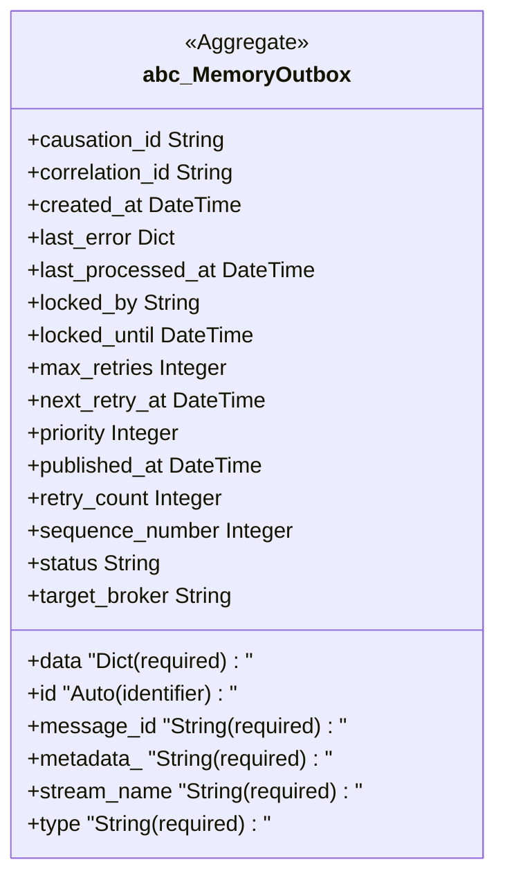
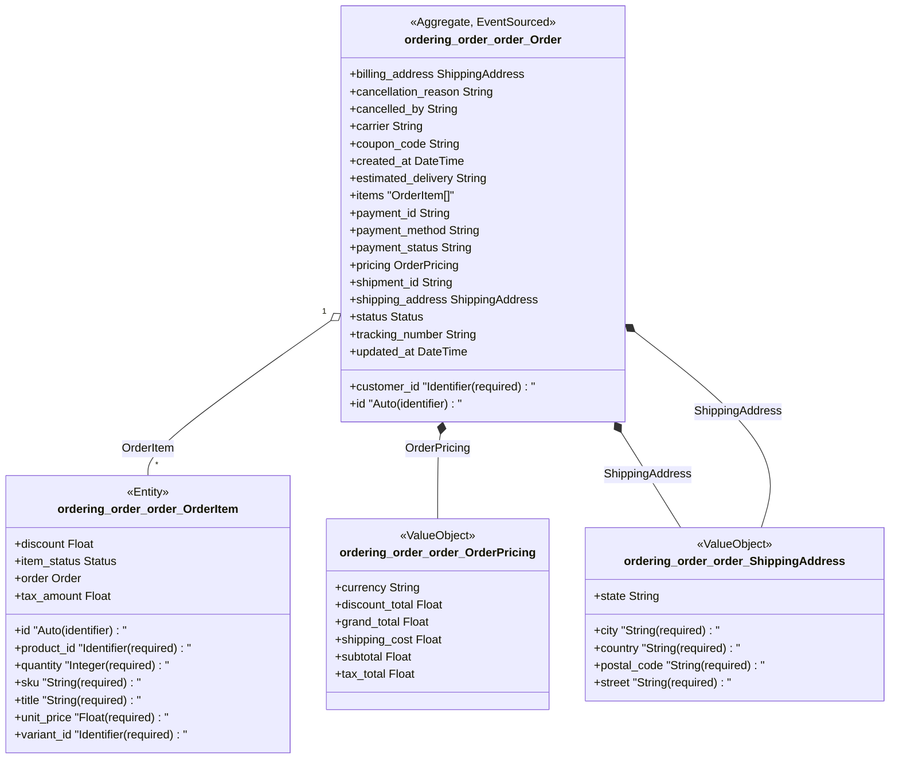

## Cluster: DefaultOutbox


## Cluster: MemoryOutbox



## Cluster: ShoppingCart

```mermaid
classDiagram
    class ordering_cart_cart_ShoppingCart {
        <<Aggregate>>
        +applied_coupons "List[String]"
        +created_at DateTime
        +customer_id Identifier
        +id "Auto (identifier)"
        +items "CartItem[]"
        +session_id String
        +status Status
        +updated_at DateTime
    }
    note for ordering_cart_cart_ShoppingCart cart_must_have_items_to_convert
    class ordering_cart_cart_CartItem {
        <<Entity>>
        +added_at DateTime
        +id "Auto (identifier)"
        +product_id "Identifier (required)"
        +quantity "Integer (required)"
        +shopping_cart ShoppingCart
        +variant_id "Identifier (required)"
    }
    ordering_cart_cart_ShoppingCart "1" o-- "*" ordering_cart_cart_CartItem : CartItem
```

## Cluster: Order


