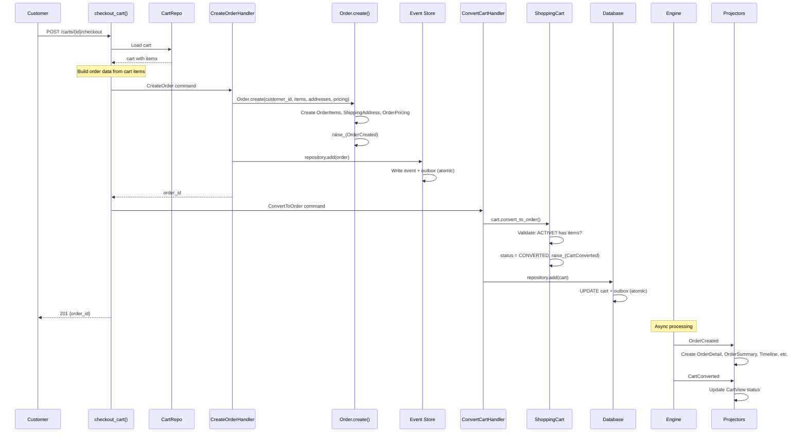

# Cart Checkout: Converting a Cart to an Order

> A customer reviews their shopping cart and proceeds to checkout, transforming
> browsing intent into a purchase commitment.

## The Story

Maria has been browsing ShopStream and has added a wireless mouse and a keyboard
to her cart. She's ready to buy. She clicks "Checkout," provides her shipping and
billing addresses, and confirms the purchase.

Behind the scenes, this is a pivotal business moment: the cart -- an ephemeral,
freely modifiable container -- becomes an order: a durable, event-sourced, legally
meaningful financial record. The product prices, which were not stored on the cart,
are resolved and locked in. The cart is marked as converted and becomes immutable.

This is modeled as a **cross-aggregate operation** spanning the ShoppingCart and
Order aggregates. The API route orchestrates two separate commands:
1. `CreateOrder` -- builds the Order aggregate with items, addresses, and pricing.
2. `ConvertToOrder` -- marks the ShoppingCart as consumed.

They happen in the same HTTP request but operate on different aggregates. This
separation is intentional: if order creation fails, the cart remains active and
the customer can retry. If order creation succeeds but cart conversion fails, we
have an order (correct) and an unconverted cart (harmless).

## The Flow

### 1. API Request

The customer submits checkout with addresses and the cart ID:

```
POST /carts/{cart_id}/checkout
{
  "shipping": {
    "street": "123 Main St",
    "city": "Portland",
    "state": "OR",
    "postal_code": "97201",
    "country": "US"
  },
  "billing": {
    "street": "123 Main St",
    "city": "Portland",
    "state": "OR",
    "postal_code": "97201",
    "country": "US"
  }
}
```

&rarr; [source](../../src/ordering/api/routes.py) (`checkout_cart`)

### 2. Load Cart and Build Order Data

The route handler orchestrates across two aggregates:

1. **Load the cart**: `current_domain.repository_for(ShoppingCart).get(cart_id)`
2. **Extract items**: Iterate over `cart.items` to build the order's item list,
   including product_id, variant_id, quantity, and price data.
3. **Calculate pricing**: Compute subtotal from item prices, add shipping cost, and
   determine grand total.

Note: Cart items only store `product_id`, `variant_id`, and `quantity` -- no prices.
In a production system, prices would be resolved by querying the Catalogue context
at checkout time. This is the **snapshot boundary**: once captured on the Order, prices
are locked regardless of future Catalogue changes.

### 3. Create the Order (First Command)

The route creates and processes a `CreateOrder` command:

- **`CreateOrder`** -- contains customer_id, items (JSON), shipping_address (JSON),
  billing_address (JSON), and pricing fields (subtotal, shipping_cost, tax, discount,
  grand_total, currency).

&rarr; [source](../../src/ordering/order/creation.py)

**Command handler behavior:**
1. `CreateOrderHandler.create_order()` deserializes the JSON payloads.
2. Calls `Order.create()` -- the factory method that:
   - Constructs `OrderItem` entities from the items data.
   - Constructs `ShippingAddress` and `OrderPricing` value objects.
   - Sets status to CREATED.
   - **Raises `OrderCreated`** -- since Order is event-sourced, this event is the
     source of truth. The `@apply` method `_on_order_created` will reconstruct
     this exact state during future event replay.
3. Persists via `current_domain.repository_for(Order).add(order)`.
   - Because Order is event-sourced, this writes the `OrderCreated` event to the
     Message DB event store.
   - An outbox record is written atomically.
4. Returns the new order ID.

&rarr; [source](../../src/ordering/order/order.py) (`Order.create`)

### 4. Convert the Cart (Second Command)

After order creation succeeds, the route processes a `ConvertToOrder` command:

- **`ConvertToOrder`** -- contains only the cart_id.

&rarr; [source](../../src/ordering/cart/conversion.py)

**Command handler behavior:**
1. `ConvertCartHandler.convert_to_order()` loads the cart.
2. Calls `cart.convert_to_order()` which:
   - Validates the cart is ACTIVE and has items.
   - Captures an items snapshot (product_id, variant_id, quantity per item).
   - Sets status to CONVERTED.
   - **Raises `CartConverted`** with the items snapshot.
3. Persists via standard CQRS repository (not event-sourced).

&rarr; [source](../../src/ordering/cart/cart.py) (`ShoppingCart.convert_to_order`)

### 5. Persistence

**For the Order (event-sourced):**
- The `OrderCreated` event is written to the Message DB event store.
- An outbox record is written atomically.
- Future loads of this order will replay the event through `@apply` methods.

**For the ShoppingCart (standard CQRS):**
- The cart's status is updated to CONVERTED in the database.
- A `CartConverted` outbox record is written.

### 6. Async Reactions

Both events are published to Redis Streams by the Engine's OutboxProcessor:

| Event | Handled By | Effect |
|-------|-----------|--------|
| `OrderCreated` | `OrderDetailProjector` | Full order snapshot created with items, addresses, pricing |
| `OrderCreated` | `OrderSummaryProjector` | Lightweight listing entry created |
| `OrderCreated` | `OrderTimelineProjector` | First timeline entry: "Order Created" |
| `OrderCreated` | `CustomerOrdersProjector` | Customer's order count incremented |
| `OrderCreated` | `OrdersByStatusProjector` | "Created" count incremented |
| `CartConverted` | `CartViewProjector` | Cart view updated to show CONVERTED status |

## Sequence Diagram



## Edge Cases

| Scenario | What Happens | Why |
|----------|-------------|-----|
| Empty cart at checkout | `ValidationError`: "Cannot convert an empty cart" | Both `convert_to_order()` and the `cart_must_have_items_to_convert` invariant prevent this |
| Cart already converted | `ValidationError`: "Only active carts can be converted" | Status guard prevents double-checkout |
| Order creation fails, cart remains | Cart stays ACTIVE, customer can retry | Commands are sequential: if step 1 fails, step 2 never executes |
| Order succeeds, cart conversion fails | Order exists (correct), cart unconverted (harmless) | Rare edge case; the order is the important artifact |
| Guest cart (no customer_id) | Order created with customer_id="guest" | Guest checkout is supported; customer_id is nullable on carts |
