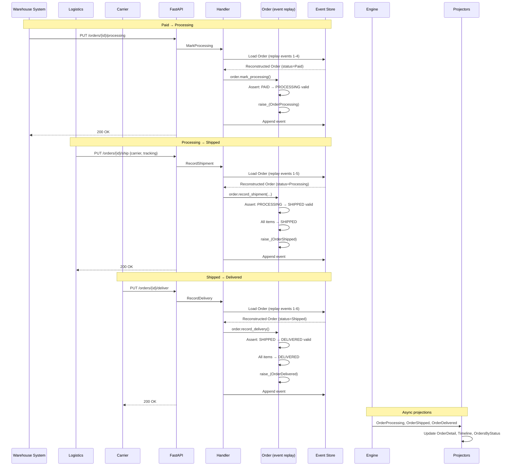
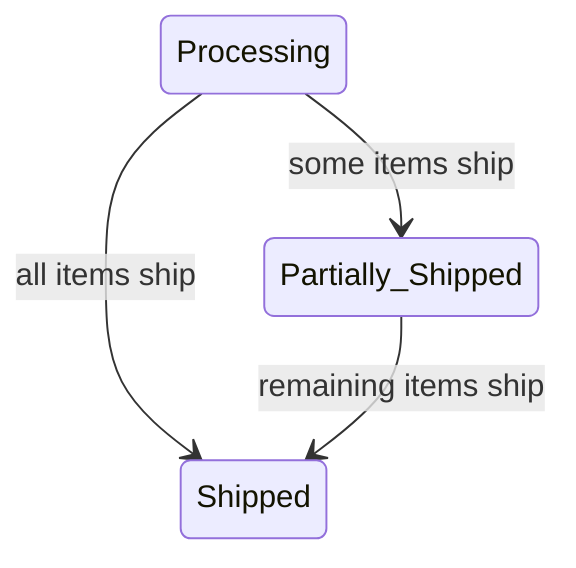

# Order Fulfillment: From Paid to Delivered

> After payment is captured, the order moves through warehouse processing,
> shipping, and delivery -- a journey through the state machine.

## The Story

Maria's order has been confirmed and paid for. Now the operations side takes over.
The warehouse system marks the order as Processing (picking and packing has started).
Once packed, the logistics system records the shipment with a carrier and tracking
number. Finally, when the carrier confirms delivery, the order reaches its destination.

This scenario walks through four state transitions:
**Paid &rarr; Processing &rarr; Shipped &rarr; Delivered**

Each transition is a separate command, typically initiated by a different system
(warehouse management, logistics, carrier webhook). Each transition is guarded by
the state machine -- you cannot ship an order that hasn't been processed, and you
cannot mark an order as delivered that hasn't been shipped.

Because the Order is event-sourced, every transition is captured as an immutable
event. An operations team member can look at the OrderTimeline projection to see
exactly when each transition happened and in what order.

## The Flow

### 1. Mark as Processing

The warehouse management system signals that picking has started:

```
PUT /orders/{order_id}/processing
```

&rarr; [source](../../src/ordering/api/routes.py) (`mark_processing`)

**Command:** `MarkProcessing` with `order_id`

&rarr; [source](../../src/ordering/order/fulfillment.py)

**Aggregate behavior:**
1. The handler loads the Order by replaying its events from the event store.
2. Calls `order.mark_processing()`.
3. `_assert_can_transition(OrderStatus.PROCESSING)` checks the state machine:
   - Current status must be PAID.
   - PAID &rarr; PROCESSING is a valid transition.
4. Status changes to PROCESSING.
5. **Raises `OrderProcessing`** with `started_at` timestamp.
6. The `@apply` method `_on_order_processing` records the status change and timestamp
   for future event replay.

### 2. Record Shipment

The logistics system records that all items have been shipped:

```
PUT /orders/{order_id}/ship
{
  "shipment_id": "SHIP-20260218-001",
  "carrier": "FedEx",
  "tracking_number": "1234567890",
  "estimated_delivery": "2026-02-23"
}
```

&rarr; [source](../../src/ordering/api/routes.py) (`record_shipment`)

**Command:** `RecordShipment` with shipment_id, carrier, tracking_number, and optional
estimated_delivery and shipped_item_ids.

&rarr; [source](../../src/ordering/order/fulfillment.py)

**Aggregate behavior:**
1. The handler loads the Order (event replay).
2. Calls `order.record_shipment(...)`.
3. Status check: current status must be PAID, PROCESSING, or PARTIALLY_SHIPPED.
4. Status changes to SHIPPED.
5. Shipment details stored: shipment_id, carrier, tracking_number, estimated_delivery.
6. **All item statuses updated to SHIPPED** -- every `OrderItem` transitions to
   `ItemStatus.SHIPPED`.
7. **Raises `OrderShipped`** with all shipment details and the list of shipped item IDs.

**Why item-level status tracking?** Because of partial shipments. If only some items
ship initially (`record_partial_shipment`), each item tracks its own status independently.
The full shipment path is: PENDING &rarr; SHIPPED &rarr; DELIVERED &rarr; (optionally RETURNED).

### 3. Record Delivery

The carrier confirms delivery (via webhook or manual entry):

```
PUT /orders/{order_id}/deliver
```

&rarr; [source](../../src/ordering/api/routes.py) (`record_delivery`)

**Command:** `RecordDelivery` with `order_id`

**Aggregate behavior:**
1. The handler loads the Order (event replay).
2. Calls `order.record_delivery()`.
3. `_assert_can_transition(OrderStatus.DELIVERED)` checks: SHIPPED &rarr; DELIVERED is valid.
4. Status changes to DELIVERED.
5. **All item statuses updated to DELIVERED.**
6. **Raises `OrderDelivered`** with `delivered_at` timestamp.

At this point, the return window opens. The customer can now request a return
(leading to the Return Requested &rarr; Return Approved &rarr; Returned &rarr; Refunded path)
or wait for the window to expire (leading to Completed).

### 4. Event Sourcing in Action

Each transition above follows the same pattern:
1. **Load**: The Order is reconstructed by replaying all previous events through `@apply` methods.
2. **Command**: A new state change is applied, which raises a new event.
3. **Persist**: The new event is appended to the event store (never mutating previous events).
4. **Outbox**: An outbox record is written atomically.

After the full fulfillment flow, the Order's event stream contains:
```
1. OrderCreated      (from checkout)
2. OrderConfirmed    (customer confirmed)
3. PaymentPending    (payment initiated)
4. PaymentSucceeded  (payment captured)
5. OrderProcessing   (warehouse started)     <-- this scenario
6. OrderShipped      (carrier picked up)     <-- this scenario
7. OrderDelivered    (customer received)     <-- this scenario
```

Replaying events 1-7 through `@apply` methods reconstructs the exact current state.

### 5. Async Reactions

Each event triggers projection updates:

| Event | Projector | Effect |
|-------|----------|--------|
| `OrderProcessing` | `OrderDetailProjector` | Status updated to Processing |
| `OrderProcessing` | `OrderTimelineProjector` | Timeline entry: "Processing started at ..." |
| `OrderProcessing` | `OrdersByStatusProjector` | Moved from "Paid" to "Processing" bucket |
| `OrderShipped` | `OrderDetailProjector` | Status, carrier, tracking recorded |
| `OrderShipped` | `OrderSummaryProjector` | Status updated for listing view |
| `OrderShipped` | `OrderTimelineProjector` | Timeline entry: "Shipped via FedEx, tracking: ..." |
| `OrderShipped` | `OrdersByStatusProjector` | Moved from "Processing" to "Shipped" bucket |
| `OrderDelivered` | `OrderDetailProjector` | Status updated to Delivered |
| `OrderDelivered` | `OrderTimelineProjector` | Timeline entry: "Delivered at ..." |
| `OrderDelivered` | `OrdersByStatusProjector` | Moved from "Shipped" to "Delivered" bucket |

## Sequence Diagram



## Partial Shipment Variation

When an order has multiple items and only some are ready:

```
PUT /orders/{order_id}/ship/partial
{
  "shipment_id": "SHIP-001",
  "carrier": "FedEx",
  "tracking_number": "1234567890",
  "shipped_item_ids": ["item-1-id", "item-3-id"]
}
```

This transitions the order to **Partially Shipped**. Only the specified items change
to `ItemStatus.SHIPPED` -- others remain `PENDING`. Once the remaining items ship
(via a subsequent `RecordShipment`), the order transitions from Partially Shipped to
Shipped.



## Edge Cases

| Scenario | What Happens | Why |
|----------|-------------|-----|
| Ship an order that's still in CREATED state | `ValidationError`: "Order must be Paid, Processing, or Partially Shipped to ship" | State machine prevents skipping steps |
| Deliver an order that hasn't been shipped | `ValidationError`: "Cannot transition from Processing to Delivered" | Must go through Shipped first |
| Mark processing on an already-processing order | `ValidationError`: "Cannot transition from Processing to Processing" | Idempotency requires explicit handling |
| Partial shipment from non-Processing state | `ValidationError`: "Order must be Processing for partial shipment" | Only Processing orders can be partially shipped |
| Event store corruption | Order cannot be reconstructed; events are the single source of truth | This is why event store integrity is critical |
