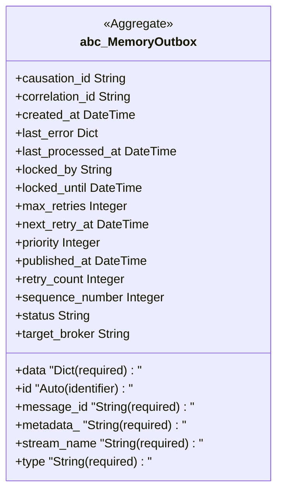
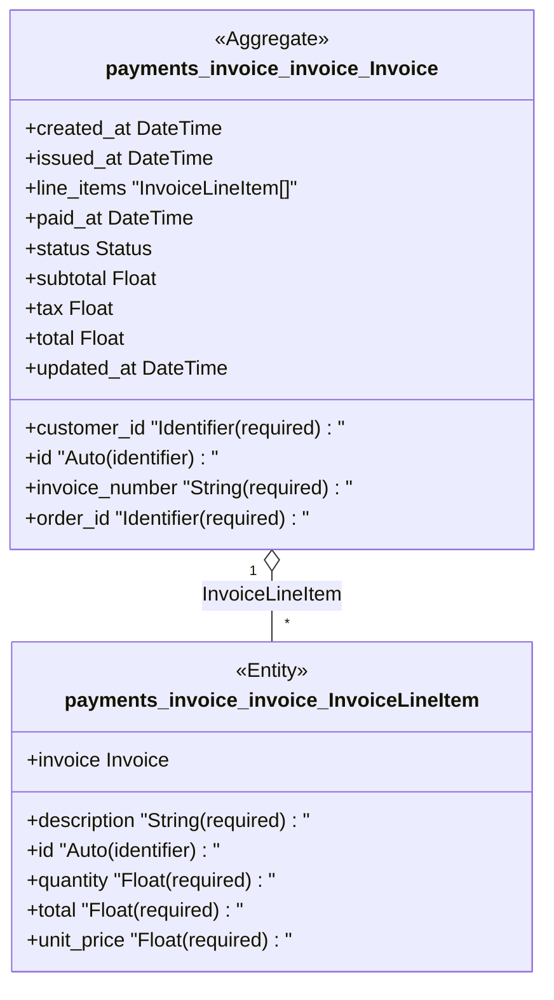
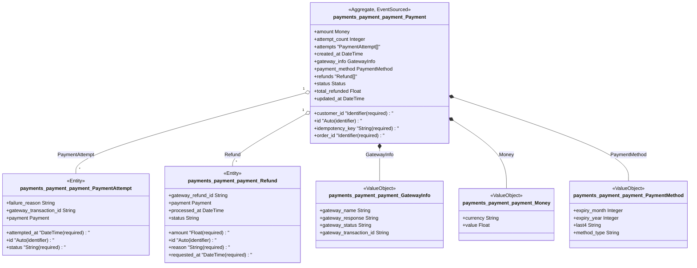

## Cluster: DefaultOutbox

```mermaid
classDiagram
    class abc_DefaultOutbox {
        <<Aggregate>>
        +causation_id String
        +correlation_id String
        +created_at DateTime
        +data "Dict (required)"
        +id "Auto (identifier)"
        +last_error Dict
        +last_processed_at DateTime
        +locked_by String
        +locked_until DateTime
        +max_retries Integer
        +message_id "String (required)"
        +metadata_ "String (required)"
        +next_retry_at DateTime
        +priority Integer
        +published_at DateTime
        +retry_count Integer
        +sequence_number Integer
        +status String
        +stream_name "String (required)"
        +target_broker String
        +type "String (required)"
    }
```

## Cluster: MemoryOutbox

```mermaid
classDiagram
    class abc_MemoryOutbox {
        <<Aggregate>>
        +causation_id String
        +correlation_id String
        +created_at DateTime
        +data "Dict (required)"
        +id "Auto (identifier)"
        +last_error Dict
        +last_processed_at DateTime
        +locked_by String
        +locked_until DateTime
        +max_retries Integer
        +message_id "String (required)"
        +metadata_ "String (required)"
        +next_retry_at DateTime
        +priority Integer
        +published_at DateTime
        +retry_count Integer
        +sequence_number Integer
        +status String
        +stream_name "String (required)"
        +target_broker String
        +type "String (required)"
    }
```

## Cluster: Invoice

```mermaid
classDiagram
    class payments_invoice_invoice_Invoice {
        <<Aggregate>>
        +created_at DateTime
        +customer_id "Identifier (required)"
        +id "Auto (identifier)"
        +invoice_number "String (required)"
        +issued_at DateTime
        +line_items "InvoiceLineItem[]"
        +order_id "Identifier (required)"
        +paid_at DateTime
        +status Status
        +subtotal Float
        +tax Float
        +total Float
        +updated_at DateTime
    }
    class payments_invoice_invoice_InvoiceLineItem {
        <<Entity>>
        +description "String (required)"
        +id "Auto (identifier)"
        +invoice Invoice
        +quantity "Float (required)"
        +total "Float (required)"
        +unit_price "Float (required)"
    }
    payments_invoice_invoice_Invoice "1" o-- "*" payments_invoice_invoice_InvoiceLineItem : InvoiceLineItem
```

## Cluster: Payment

```mermaid
classDiagram
    class payments_payment_payment_Payment {
        <<Aggregate, EventSourced>>
        +amount Money
        +attempt_count Integer
        +attempts "PaymentAttempt[]"
        +created_at DateTime
        +customer_id "Identifier (required)"
        +gateway_info GatewayInfo
        +id "Auto (identifier)"
        +idempotency_key "String (required)"
        +order_id "Identifier (required)"
        +payment_method PaymentMethod
        +refunds "Refund[]"
        +status Status
        +total_refunded Float
        +updated_at DateTime
    }
    class payments_payment_payment_PaymentAttempt {
        <<Entity>>
        +attempted_at "DateTime (required)"
        +failure_reason String
        +gateway_transaction_id String
        +id "Auto (identifier)"
        +payment Payment
        +status "String (required)"
    }
    payments_payment_payment_Payment "1" o-- "*" payments_payment_payment_PaymentAttempt : PaymentAttempt
    class payments_payment_payment_Refund {
        <<Entity>>
        +amount "Float (required)"
        +gateway_refund_id String
        +id "Auto (identifier)"
        +payment Payment
        +processed_at DateTime
        +reason "String (required)"
        +requested_at "DateTime (required)"
        +status String
    }
    payments_payment_payment_Payment "1" o-- "*" payments_payment_payment_Refund : Refund
    class payments_payment_payment_GatewayInfo {
        <<ValueObject>>
        +gateway_name String
        +gateway_response String
        +gateway_status String
        +gateway_transaction_id String
    }
    payments_payment_payment_Payment *-- payments_payment_payment_GatewayInfo : GatewayInfo
    class payments_payment_payment_Money {
        <<ValueObject>>
        +currency String
        +value Float
    }
    payments_payment_payment_Payment *-- payments_payment_payment_Money : Money
    class payments_payment_payment_PaymentMethod {
        <<ValueObject>>
        +expiry_month Integer
        +expiry_year Integer
        +last4 String
        +method_type String
    }
    payments_payment_payment_Payment *-- payments_payment_payment_PaymentMethod : PaymentMethod
```
