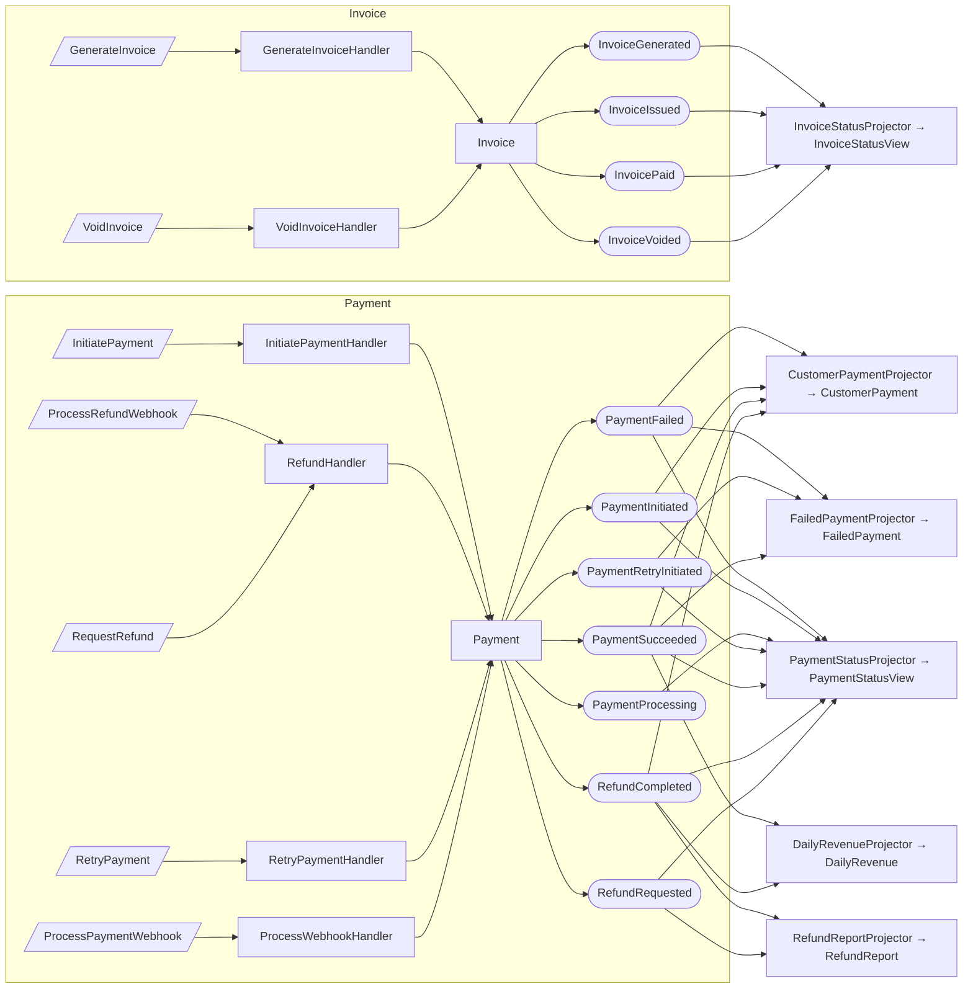

## Event Flows

```mermaid
flowchart LR
    subgraph payments_invoice_invoice_Invoice[Invoice]
        agg_payments_invoice_invoice_Invoice[Invoice]
        cmd_payments_invoice_generation_GenerateInvoice[/GenerateInvoice/]
        cmd_payments_invoice_voiding_VoidInvoice[/VoidInvoice/]
        evt_payments_invoice_events_InvoiceGenerated([InvoiceGenerated])
        evt_payments_invoice_events_InvoiceIssued([InvoiceIssued])
        evt_payments_invoice_events_InvoicePaid([InvoicePaid])
        evt_payments_invoice_events_InvoiceVoided([InvoiceVoided])
        hdlr_payments_invoice_generation_GenerateInvoiceHandler[GenerateInvoiceHandler]
        hdlr_payments_invoice_voiding_VoidInvoiceHandler[VoidInvoiceHandler]
    end
    subgraph payments_payment_payment_Payment[Payment]
        agg_payments_payment_payment_Payment[Payment]
        cmd_payments_payment_initiation_InitiatePayment[/InitiatePayment/]
        cmd_payments_payment_refund_ProcessRefundWebhook[/ProcessRefundWebhook/]
        cmd_payments_payment_refund_RequestRefund[/RequestRefund/]
        cmd_payments_payment_retry_RetryPayment[/RetryPayment/]
        cmd_payments_payment_webhook_ProcessPaymentWebhook[/ProcessPaymentWebhook/]
        evt_payments_payment_events_PaymentFailed([PaymentFailed])
        evt_payments_payment_events_PaymentInitiated([PaymentInitiated])
        evt_payments_payment_events_PaymentProcessing([PaymentProcessing])
        evt_payments_payment_events_PaymentRetryInitiated([PaymentRetryInitiated])
        evt_payments_payment_events_PaymentSucceeded([PaymentSucceeded])
        evt_payments_payment_events_RefundCompleted([RefundCompleted])
        evt_payments_payment_events_RefundRequested([RefundRequested])
        hdlr_payments_payment_initiation_InitiatePaymentHandler[InitiatePaymentHandler]
        hdlr_payments_payment_refund_RefundHandler[RefundHandler]
        hdlr_payments_payment_retry_RetryPaymentHandler[RetryPaymentHandler]
        hdlr_payments_payment_webhook_ProcessWebhookHandler[ProcessWebhookHandler]
    end
    cmd_payments_invoice_generation_GenerateInvoice --> hdlr_payments_invoice_generation_GenerateInvoiceHandler
    hdlr_payments_invoice_generation_GenerateInvoiceHandler --> agg_payments_invoice_invoice_Invoice
    cmd_payments_invoice_voiding_VoidInvoice --> hdlr_payments_invoice_voiding_VoidInvoiceHandler
    hdlr_payments_invoice_voiding_VoidInvoiceHandler --> agg_payments_invoice_invoice_Invoice
    agg_payments_invoice_invoice_Invoice --> evt_payments_invoice_events_InvoiceGenerated
    agg_payments_invoice_invoice_Invoice --> evt_payments_invoice_events_InvoiceIssued
    agg_payments_invoice_invoice_Invoice --> evt_payments_invoice_events_InvoicePaid
    agg_payments_invoice_invoice_Invoice --> evt_payments_invoice_events_InvoiceVoided
    cmd_payments_payment_initiation_InitiatePayment --> hdlr_payments_payment_initiation_InitiatePaymentHandler
    hdlr_payments_payment_initiation_InitiatePaymentHandler --> agg_payments_payment_payment_Payment
    cmd_payments_payment_refund_ProcessRefundWebhook --> hdlr_payments_payment_refund_RefundHandler
    cmd_payments_payment_refund_RequestRefund --> hdlr_payments_payment_refund_RefundHandler
    hdlr_payments_payment_refund_RefundHandler --> agg_payments_payment_payment_Payment
    cmd_payments_payment_retry_RetryPayment --> hdlr_payments_payment_retry_RetryPaymentHandler
    hdlr_payments_payment_retry_RetryPaymentHandler --> agg_payments_payment_payment_Payment
    cmd_payments_payment_webhook_ProcessPaymentWebhook --> hdlr_payments_payment_webhook_ProcessWebhookHandler
    hdlr_payments_payment_webhook_ProcessWebhookHandler --> agg_payments_payment_payment_Payment
    agg_payments_payment_payment_Payment --> evt_payments_payment_events_PaymentFailed
    agg_payments_payment_payment_Payment --> evt_payments_payment_events_PaymentInitiated
    agg_payments_payment_payment_Payment --> evt_payments_payment_events_PaymentProcessing
    agg_payments_payment_payment_Payment --> evt_payments_payment_events_PaymentRetryInitiated
    agg_payments_payment_payment_Payment --> evt_payments_payment_events_PaymentSucceeded
    agg_payments_payment_payment_Payment --> evt_payments_payment_events_RefundCompleted
    agg_payments_payment_payment_Payment --> evt_payments_payment_events_RefundRequested
    proj_payments_projections_customer_payments_CustomerPaymentProjector[CustomerPaymentProjector → CustomerPayment]
    evt_payments_payment_events_PaymentFailed --> proj_payments_projections_customer_payments_CustomerPaymentProjector
    evt_payments_payment_events_PaymentInitiated --> proj_payments_projections_customer_payments_CustomerPaymentProjector
    evt_payments_payment_events_PaymentSucceeded --> proj_payments_projections_customer_payments_CustomerPaymentProjector
    evt_payments_payment_events_RefundCompleted --> proj_payments_projections_customer_payments_CustomerPaymentProjector
    proj_payments_projections_daily_revenue_DailyRevenueProjector[DailyRevenueProjector → DailyRevenue]
    evt_payments_payment_events_PaymentSucceeded --> proj_payments_projections_daily_revenue_DailyRevenueProjector
    evt_payments_payment_events_RefundCompleted --> proj_payments_projections_daily_revenue_DailyRevenueProjector
    proj_payments_projections_failed_payments_FailedPaymentProjector[FailedPaymentProjector → FailedPayment]
    evt_payments_payment_events_PaymentFailed --> proj_payments_projections_failed_payments_FailedPaymentProjector
    evt_payments_payment_events_PaymentRetryInitiated --> proj_payments_projections_failed_payments_FailedPaymentProjector
    evt_payments_payment_events_PaymentSucceeded --> proj_payments_projections_failed_payments_FailedPaymentProjector
    proj_payments_projections_invoice_status_InvoiceStatusProjector[InvoiceStatusProjector → InvoiceStatusView]
    evt_payments_invoice_events_InvoiceGenerated --> proj_payments_projections_invoice_status_InvoiceStatusProjector
    evt_payments_invoice_events_InvoiceIssued --> proj_payments_projections_invoice_status_InvoiceStatusProjector
    evt_payments_invoice_events_InvoicePaid --> proj_payments_projections_invoice_status_InvoiceStatusProjector
    evt_payments_invoice_events_InvoiceVoided --> proj_payments_projections_invoice_status_InvoiceStatusProjector
    proj_payments_projections_payment_status_PaymentStatusProjector[PaymentStatusProjector → PaymentStatusView]
    evt_payments_payment_events_PaymentFailed --> proj_payments_projections_payment_status_PaymentStatusProjector
    evt_payments_payment_events_PaymentInitiated --> proj_payments_projections_payment_status_PaymentStatusProjector
    evt_payments_payment_events_PaymentProcessing --> proj_payments_projections_payment_status_PaymentStatusProjector
    evt_payments_payment_events_PaymentRetryInitiated --> proj_payments_projections_payment_status_PaymentStatusProjector
    evt_payments_payment_events_PaymentSucceeded --> proj_payments_projections_payment_status_PaymentStatusProjector
    evt_payments_payment_events_RefundCompleted --> proj_payments_projections_payment_status_PaymentStatusProjector
    evt_payments_payment_events_RefundRequested --> proj_payments_projections_payment_status_PaymentStatusProjector
    proj_payments_projections_refund_report_RefundReportProjector[RefundReportProjector → RefundReport]
    evt_payments_payment_events_RefundCompleted --> proj_payments_projections_refund_report_RefundReportProjector
    evt_payments_payment_events_RefundRequested --> proj_payments_projections_refund_report_RefundReportProjector
```
