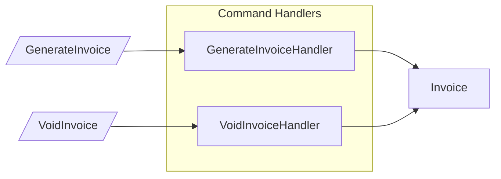
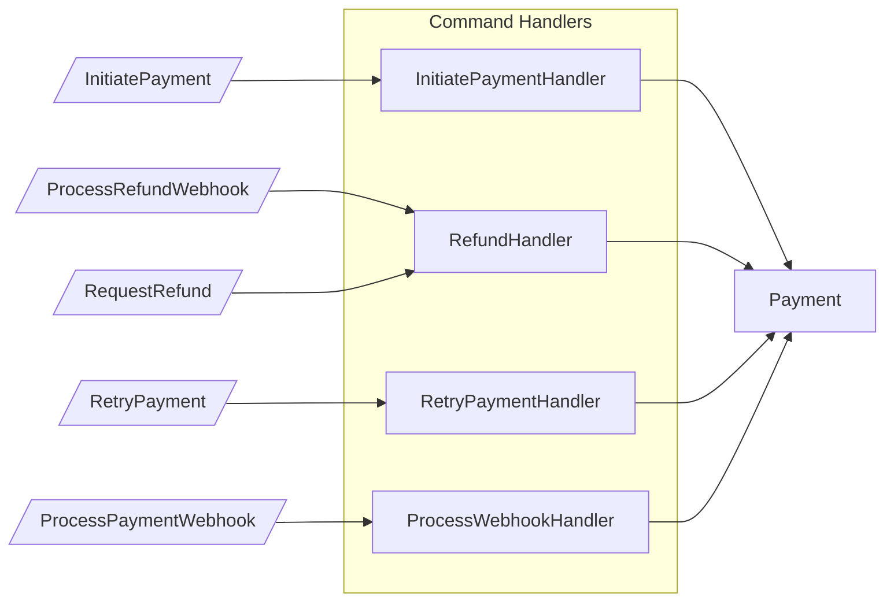
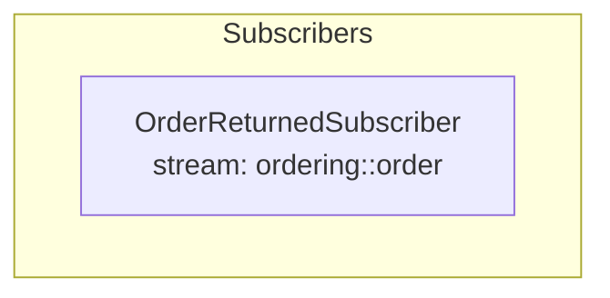
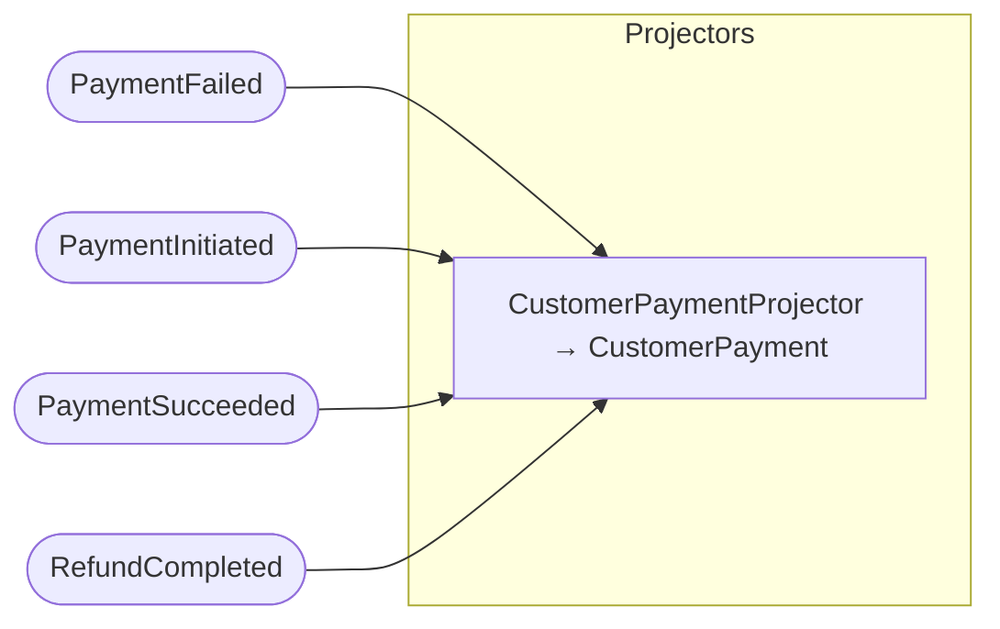
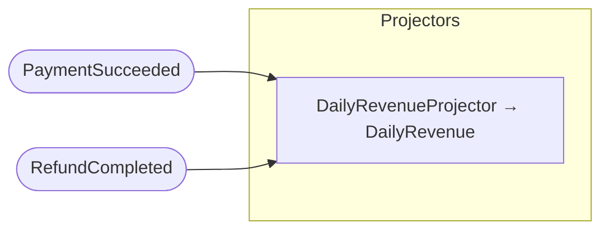
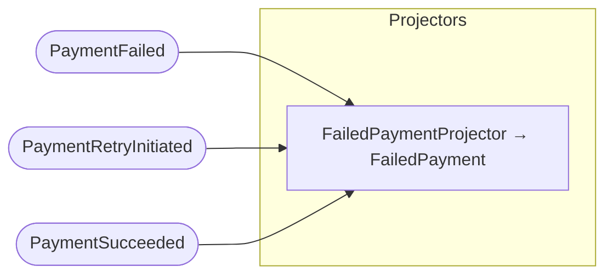
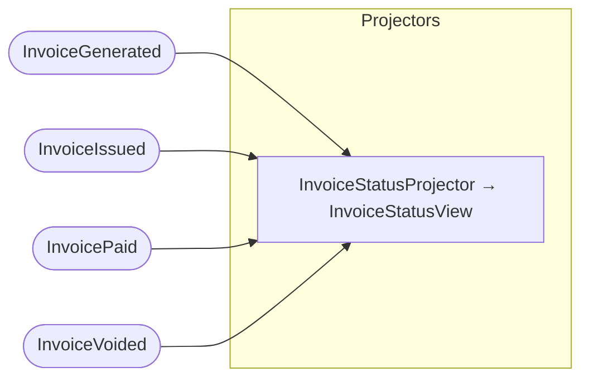
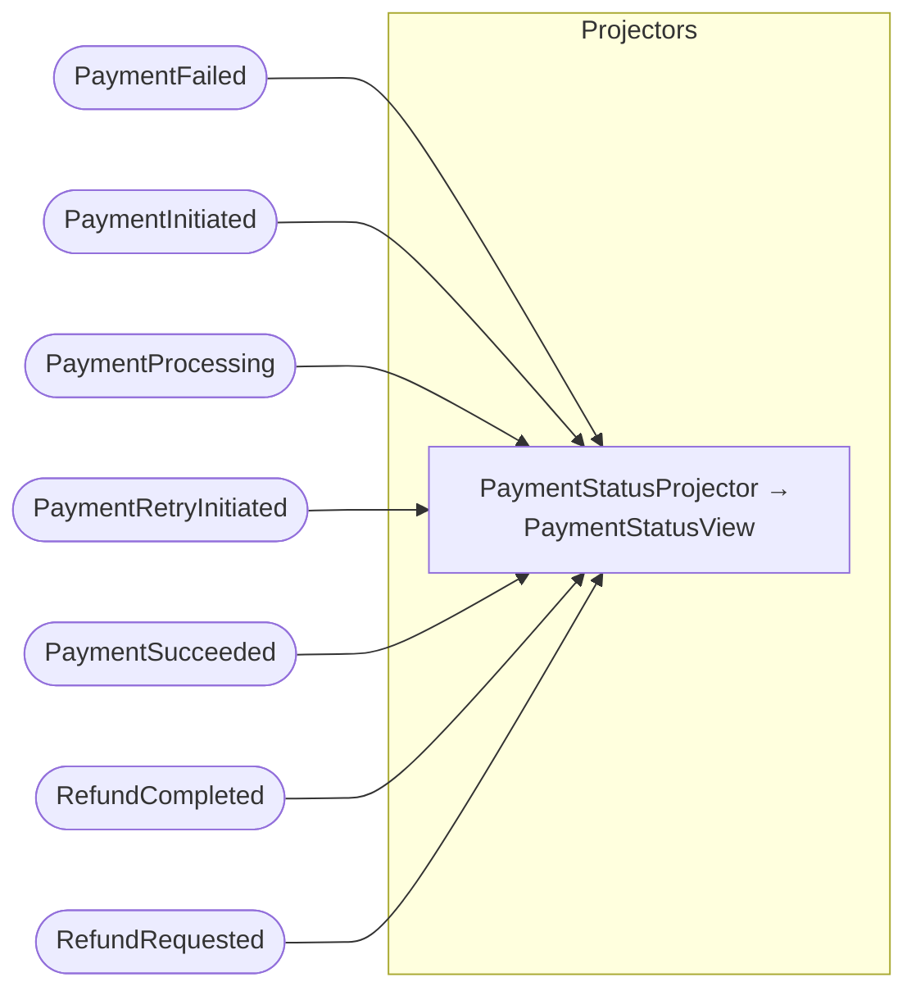
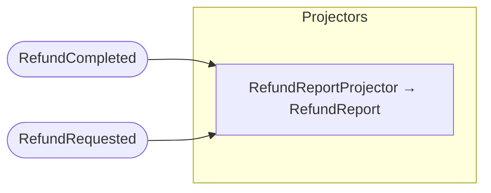

## Command Handlers: Invoice

## Command Handlers: Payment

## Subscribers

## Projector: CustomerPayment

## Projector: DailyRevenue

## Projector: FailedPayment

## Projector: InvoiceStatusView

## Projector: PaymentStatusView

## Projector: RefundReport

