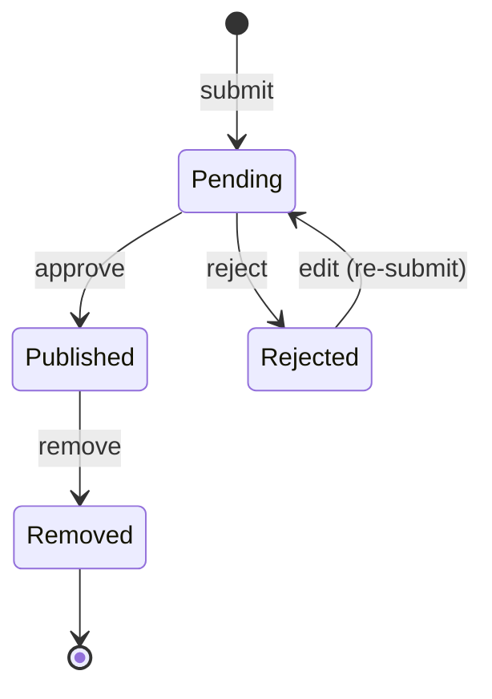

# Reviews

> Manages product reviews, ratings, moderation, helpful voting, reporting, and seller replies.

## Business Context

The Reviews context is the voice of the customer on ShopStream. After purchasing and
receiving a product, customers can share their experience by writing reviews with star
ratings, pros/cons, and optional images. Sellers can respond to reviews with a single
reply. Other customers can vote reviews as helpful or unhelpful, and anyone can report
inappropriate content for moderation.

This is a separate bounded context because review management has fundamentally different
consistency requirements and change patterns than ordering, inventory, or payments.
Reviews are write-once-mostly: a customer writes a review, it may be edited once or
twice, and then it lives as a permanent record. The read-to-write ratio is extremely
high -- thousands of shoppers read reviews for every one review written.

Reviews also have their own lifecycle (moderation), their own cross-aggregate
constraint (one review per customer per product), and their own integration points
(verified purchase checks via Ordering events). These concerns don't belong in any
other bounded context.

Think of the Reviews context as a community bulletin board in a department store.
Customers can post their opinions (reviews), the store moderator can approve or
reject posts (moderation), other customers can mark posts as helpful (voting), and
the seller can pin a response (reply). The bulletin board doesn't know about the
cash register (Ordering) or the warehouse (Fulfillment) -- it only knows whether a
customer actually bought the product (verified purchase, via a cross-domain event).

## Ubiquitous Language

| Term | Definition | Code Element |
|------|-----------|-------------|
| Review | A customer's written assessment of a product, with a star rating (1-5), title, body, and optional pros/cons/images | `Review` ([source](../../src/reviews/review/review.py)) |
| Rating | A 1-5 star score representing the customer's satisfaction | `Rating` ([source](../../src/reviews/review/review.py)) |
| Moderation | The process of approving or rejecting a submitted review before it becomes publicly visible | `ModerateReview` ([source](../../src/reviews/review/moderation.py)) |
| Helpful Vote | A customer's indication that a review was helpful or unhelpful | `HelpfulVote` ([source](../../src/reviews/review/review.py)) |
| Seller Reply | A single response from the product seller attached to a published review | `SellerReply` ([source](../../src/reviews/review/review.py)) |
| Review Image | A photograph attached to a review (max 5 per review) | `ReviewImage` ([source](../../src/reviews/review/review.py)) |
| Review Status | Lifecycle: Pending &rarr; Published or Rejected; Published &rarr; Removed | `ReviewStatus` ([source](../../src/reviews/review/review.py)) |
| Vote Type | Whether a vote is Helpful or Unhelpful | `VoteType` ([source](../../src/reviews/review/review.py)) |
| Report Reason | Why content was flagged: Spam, Offensive, Irrelevant, Fake, Other | `ReportReason` ([source](../../src/reviews/review/review.py)) |
| Moderation Action | Whether to Approve or Reject a review | `ModerationAction` ([source](../../src/reviews/review/review.py)) |
| Verified Purchase | A flag indicating the reviewer actually bought the product (checked against delivered orders) | `verified_purchase` on `Review` ([source](../../src/reviews/review/review.py)) |

Full definitions: [Glossary](../glossary.md#reviews-context)

## Domain Model

### Review (Aggregate)

A Review represents a customer's assessment of a product. It is the aggregate root
because reviews, their votes, images, and seller reply must be consistent within a
single transactional boundary. For example, the "no self-vote" and "one vote per
customer" rules are enforced within the aggregate, and the "at most one seller reply"
invariant requires the reply entity to be part of the aggregate.

Reviews use standard **CQRS** (not event sourcing). Unlike orders or payments, reviews
don't need temporal queries or an immutable audit trail of every change. The state
transitions are simple (Pending &rarr; Published/Rejected), and reviews are
write-once-mostly.

**Entities:**

| Entity | Role | Identity |
|--------|------|----------|
| ReviewImage | A photograph attached to the review | System-generated ID within the Review |
| HelpfulVote | A customer's helpful/unhelpful vote on the review | System-generated ID within the Review |
| SellerReply | The seller's single response to a published review | System-generated ID within the Review |

**Value Objects:**

| Value Object | Captures | Key Constraints |
|-------------|----------|----------------|
| Rating | Star score (1-5) | Integer range enforced by post-invariant |

**Invariants (rules that must always hold):**

- A review cannot have more than 5 images.
- At most one seller reply per review.
- Review body must be at least 20 characters (when status is Pending).
- Review title must not be empty or whitespace-only.
- A customer cannot vote on their own review (no self-vote).
- A customer can only vote once per review (no duplicate votes).
- A customer cannot report their own review (no self-report).

**State Machine: Review Status**

A Review begins as Pending when submitted by a customer. It sits in a moderation
queue until a moderator approves or rejects it. Approved reviews become Published
and are visible on the product page. Rejected reviews can be edited and
re-submitted by the customer (returning to Pending). Published reviews can be
Removed by an admin for policy violations.

The key design decision is that moderation happens _before_ publication, not after.
This prevents inappropriate content from ever being visible to customers. The
trade-off is increased moderator workload and a delay before reviews appear.

## Events

| Event | Trigger | Consequence |
|-------|---------|-------------|
| `ReviewSubmitted` | Customer submits a new review | ModerationQueue, CustomerReviews, ReviewDetail projections created |
| `ReviewEdited` | Customer edits their pending/rejected review | CustomerReviews, ReviewDetail projections updated; re-submitted reviews return to Pending |
| `ReviewApproved` | Moderator approves a pending review | ProductReviews created, ProductRating updated, ModerationQueue entry removed, CustomerReviews/ReviewDetail updated |
| `ReviewRejected` | Moderator rejects a pending review | ModerationQueue entry removed, CustomerReviews/ReviewDetail updated |
| `HelpfulVoteRecorded` | Customer votes a review as helpful or unhelpful | ProductReviews and ReviewDetail projections updated with vote counts |
| `ReviewReported` | Customer reports a review for moderation | ModerationQueue entry updated (or re-added with enrichment from aggregate) |
| `ReviewRemoved` | Admin removes a published review | ProductReviews deleted, ProductRating updated (decremented), ModerationQueue/CustomerReviews/ReviewDetail updated |
| `SellerReplyAdded` | Seller responds to a published review | ProductReviews and ReviewDetail projections updated |

## Command Flows

| Command | Who Initiates | What Happens | Events Raised |
|---------|--------------|-------------|---------------|
| `SubmitReview` | Customer | Creates a new review in Pending status. Checks one-per-customer-per-product (excluding removed). Looks up verified purchase from VerifiedPurchases projection. | `ReviewSubmitted` |
| `EditReview` | Customer | Partially updates a pending/rejected review. Customer ownership checked. Rejected reviews return to Pending. | `ReviewEdited` |
| `ModerateReview` | Moderator | Approves or rejects a pending review. Reason required for rejection. | `ReviewApproved` or `ReviewRejected` |
| `VoteOnReview` | Customer | Records a helpful or unhelpful vote. No self-vote, no duplicate. | `HelpfulVoteRecorded` |
| `ReportReview` | Customer | Reports a review for moderation. No self-report. Tracks reasons in JSON. | `ReviewReported` |
| `RemoveReview` | Admin | Removes a published review. Only from Published status. | `ReviewRemoved` |
| `AddSellerReply` | Seller | Adds a reply to a published review. Only on Published, max 1 reply. | `SellerReplyAdded` |

## Read Models (Projections)

| Projection | Purpose | Built From |
|-----------|---------|-----------|
| `ProductReviews` | Published reviews on the product detail page: rating, title, body, votes, seller reply | `ReviewApproved` (create), `HelpfulVoteRecorded`, `ReviewRemoved` (delete), `SellerReplyAdded` |
| `ProductRating` | Aggregated rating per product: average, star distribution, total/verified review counts | `ReviewApproved` (add to distribution), `ReviewRemoved` (subtract from distribution) |
| `CustomerReviews` | Customer's review history across all statuses for their account page | `ReviewSubmitted` (create), all status-change events |
| `ModerationQueue` | Pending and reported reviews awaiting moderator action | `ReviewSubmitted` (add), `ReviewApproved`/`ReviewRejected` (remove), `ReviewReported` (update/re-add), `ReviewRemoved` (remove) |
| `VerifiedPurchases` | Customer+product→order mapping for verified purchase checks | Populated by `OrderingEventsHandler` (cross-domain, not a projector) |
| `ReviewDetail` | Full detail view of a single review with all metadata | All 8 events |

## Cross-Context Relationships

| This Context Provides | To Other Context | How |
|----------------------|-----------------|-----|
| `ReviewApproved`, `ReviewRemoved` | (future) Catalogue, Notifications | Shared event contracts in `src/shared/events/reviews.py` |

| Other Context Provides | To This Context | How |
|-----------------------|-----------------|-----|
| `OrderDelivered` | Reviews | Ordering raises `OrderDelivered`; Reviews consumes it to populate `VerifiedPurchases` projection |

The Reviews context is primarily a consumer of Ordering events. When an order is
delivered, the `OrderingEventsHandler` creates `VerifiedPurchases` records for each
product in the order. When a customer later submits a review, the `SubmitReview`
handler looks up these records to flag the review as a verified purchase.

Reviews does not subscribe to Identity or Catalogue events. It stores `customer_id`
and `product_id` as opaque references.

## Design Decisions

### CQRS, Not Event Sourced

**Problem:** Should the Review aggregate use event sourcing?

**Decision:** No. Reviews use standard CQRS.

**Rationale:** Reviews are write-once-mostly with a simple 4-state lifecycle. There
is no business need for temporal queries ("what was this review's rating two weeks
ago?") or an immutable financial audit trail. Event sourcing would add complexity
(event replay, snapshots) without corresponding business value. This matches the
pattern used by ShoppingCart and Fulfillment -- aggregates with simple, linear
state transitions.

**Trade-off:** No built-in temporal history. If the business later needs review
change tracking, it would require adding an audit projection.

### One Review Per Customer Per Product

**Problem:** How to enforce the one-review-per-product-per-customer business rule?

**Decision:** Enforce in the command handler (not the aggregate).

**Rationale:** This invariant spans multiple aggregate instances (all reviews for
a product by a customer). It cannot be enforced within a single aggregate. The
`SubmitReview` handler queries the repository to check for existing non-removed
reviews before creating a new one. This is the same pattern used for other
cross-instance checks in ShopStream.

**Trade-off:** There is a theoretical race condition where two simultaneous
submissions for the same customer+product could both pass the check. In practice,
this is extremely unlikely (a customer submitting two reviews simultaneously) and
could be addressed with a database unique constraint if needed.

### Moderation Before Publication

**Problem:** Should reviews be immediately visible or require moderation first?

**Decision:** Reviews require moderator approval before becoming visible (Pending &rarr; Published).

**Rationale:** Pre-moderation prevents inappropriate content from ever appearing
on the storefront. For an e-commerce platform, trust and content quality are
critical -- a single offensive review visible for even minutes can damage the
brand and seller relationships.

**Trade-off:** Increased moderator workload. Reviews are not immediately visible
after submission, which can frustrate customers who expect instant feedback. This
could be mitigated in the future with automated moderation (ML-based content
filtering) that auto-approves low-risk reviews.

### Verified Purchase via Local Projection

**Problem:** How should Reviews know if a reviewer actually purchased the product?

**Decision:** Reviews maintains a local `VerifiedPurchases` projection populated by
consuming `OrderDelivered` events from the Ordering domain.

**Rationale:** Reviews should not query the Ordering domain at write time (this
would create temporal coupling and a runtime dependency). Instead, the
`OrderingEventsHandler` consumes `OrderDelivered` events and maintains a local
projection. The `SubmitReview` handler looks up this projection -- a fast, local
read with no cross-domain calls.

**Trade-off:** There is a window between order delivery and the event being
consumed where a review might not be flagged as verified. This is acceptable
because verified purchase is an enhancement (a badge), not a gate -- customers
can still submit reviews regardless.

## Source Code Map

| Concern | Location |
|---------|----------|
| Aggregate root + entities + value objects + enums | [`src/reviews/review/review.py`](../../src/reviews/review/review.py) |
| Domain events | [`src/reviews/review/events.py`](../../src/reviews/review/events.py) |
| Submit review command + handler | [`src/reviews/review/submission.py`](../../src/reviews/review/submission.py) |
| Edit review command + handler | [`src/reviews/review/editing.py`](../../src/reviews/review/editing.py) |
| Moderate review command + handler | [`src/reviews/review/moderation.py`](../../src/reviews/review/moderation.py) |
| Vote on review command + handler | [`src/reviews/review/voting.py`](../../src/reviews/review/voting.py) |
| Report review command + handler | [`src/reviews/review/reporting.py`](../../src/reviews/review/reporting.py) |
| Remove review command + handler | [`src/reviews/review/removal.py`](../../src/reviews/review/removal.py) |
| Seller reply command + handler | [`src/reviews/review/reply.py`](../../src/reviews/review/reply.py) |
| Cross-domain: OrderDelivered handler | [`src/reviews/review/ordering_events.py`](../../src/reviews/review/ordering_events.py) |
| Projections + projectors | [`src/reviews/projections/`](../../src/reviews/projections/) |
| API routes | [`src/reviews/api/routes.py`](../../src/reviews/api/routes.py) |
| API schemas (Pydantic) | [`src/reviews/api/schemas.py`](../../src/reviews/api/schemas.py) |
