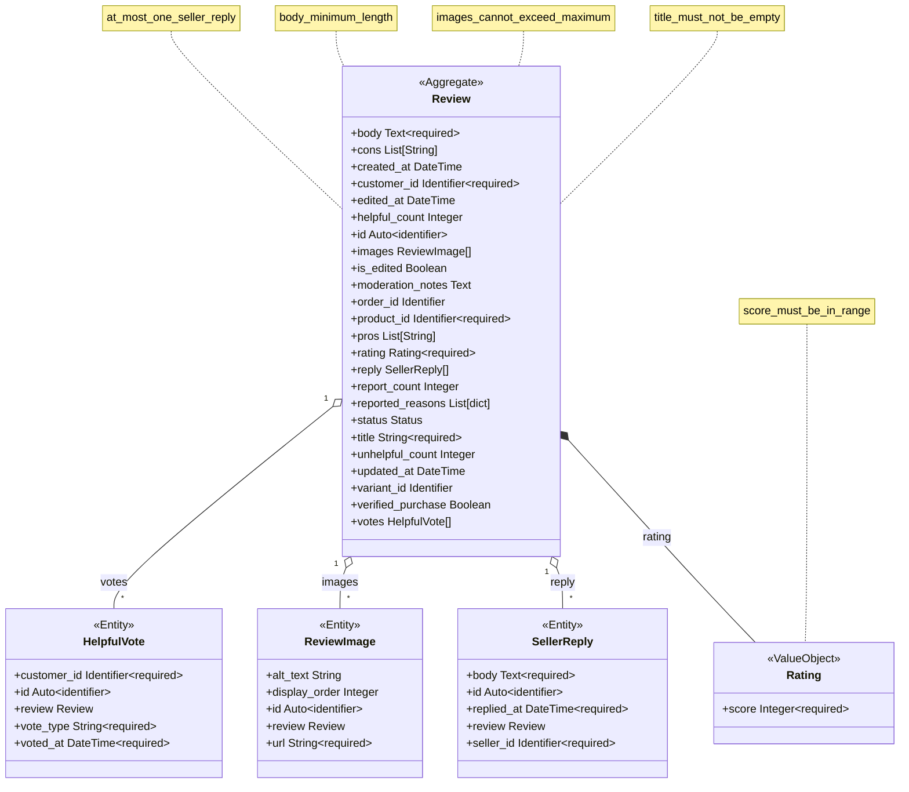

## Cluster: Review

```mermaid
classDiagram
    class reviews_review_review_Review["Review"] {
        <<Aggregate>>
        +body Text~required~
        +cons List[String]
        +created_at DateTime
        +customer_id Identifier~required~
        +edited_at DateTime
        +helpful_count Integer
        +id Auto~identifier~
        +images ReviewImage[]
        +is_edited Boolean
        +moderation_notes Text
        +order_id Identifier
        +product_id Identifier~required~
        +pros List[String]
        +rating Rating~required~
        +reply SellerReply[]
        +report_count Integer
        +reported_reasons List[dict]
        +status Status
        +title String~required~
        +unhelpful_count Integer
        +updated_at DateTime
        +variant_id Identifier
        +verified_purchase Boolean
        +votes HelpfulVote[]
    }
    note for reviews_review_review_Review "at_most_one_seller_reply"
    note for reviews_review_review_Review "body_minimum_length"
    note for reviews_review_review_Review "images_cannot_exceed_maximum"
    note for reviews_review_review_Review "title_must_not_be_empty"
    class reviews_review_review_HelpfulVote["HelpfulVote"] {
        <<Entity>>
        +customer_id Identifier~required~
        +id Auto~identifier~
        +review Review
        +vote_type String~required~
        +voted_at DateTime~required~
    }
    reviews_review_review_Review "1" o-- "*" reviews_review_review_HelpfulVote : votes
    class reviews_review_review_ReviewImage["ReviewImage"] {
        <<Entity>>
        +alt_text String
        +display_order Integer
        +id Auto~identifier~
        +review Review
        +url String~required~
    }
    reviews_review_review_Review "1" o-- "*" reviews_review_review_ReviewImage : images
    class reviews_review_review_SellerReply["SellerReply"] {
        <<Entity>>
        +body Text~required~
        +id Auto~identifier~
        +replied_at DateTime~required~
        +review Review
        +seller_id Identifier~required~
    }
    reviews_review_review_Review "1" o-- "*" reviews_review_review_SellerReply : reply
    class reviews_review_review_Rating["Rating"] {
        <<ValueObject>>
        +score Integer~required~
    }
    note for reviews_review_review_Rating "score_must_be_in_range"
    reviews_review_review_Review *-- reviews_review_review_Rating : rating
```
