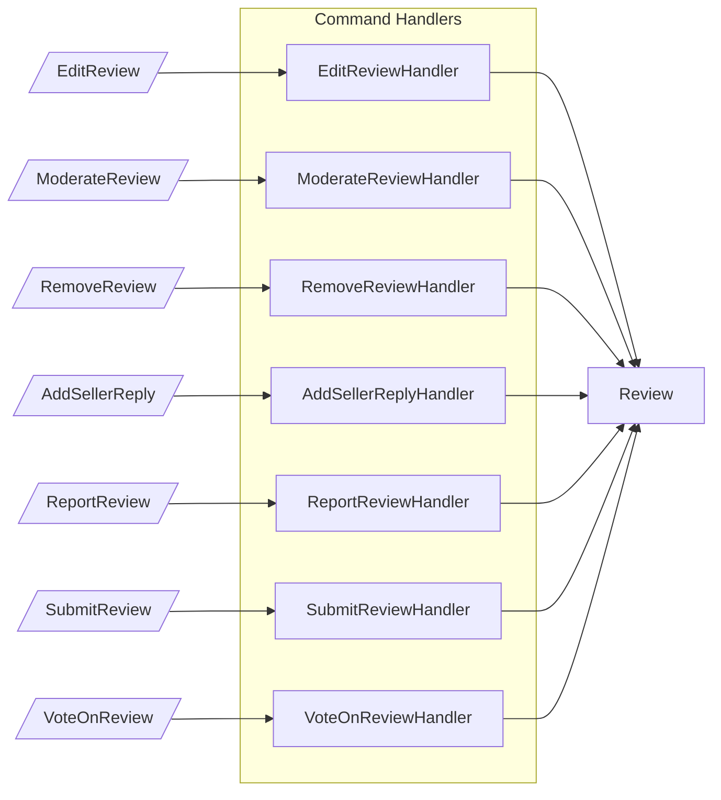
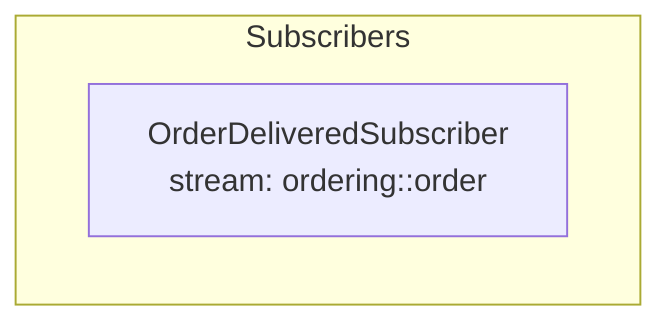
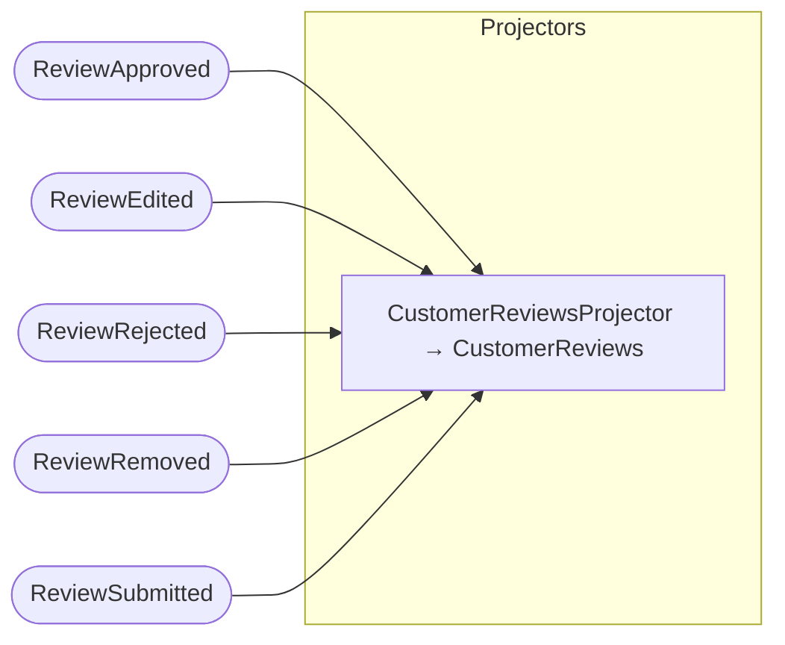
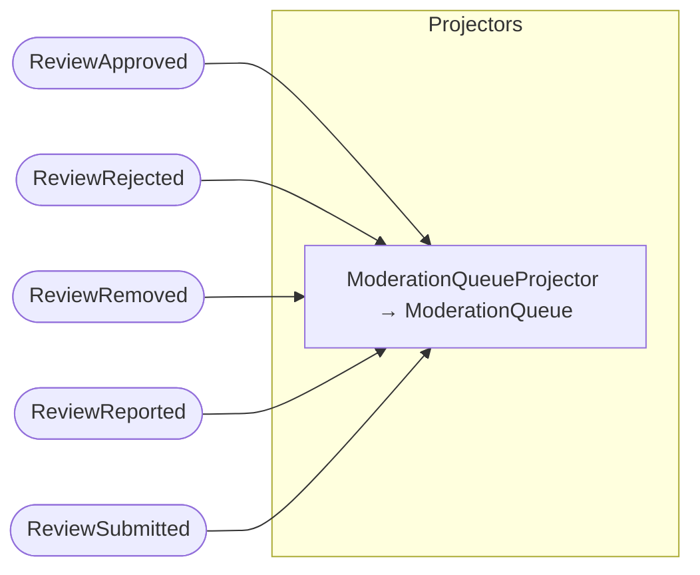
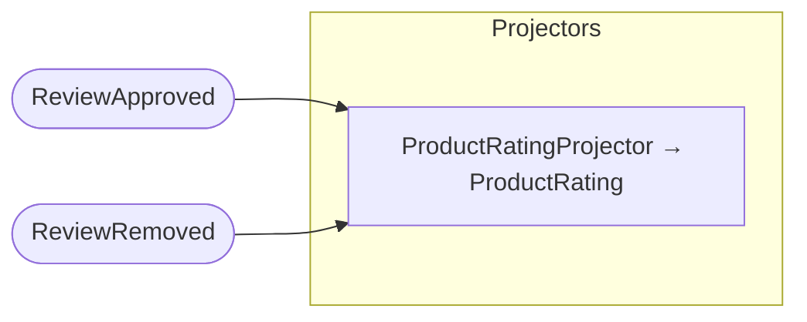
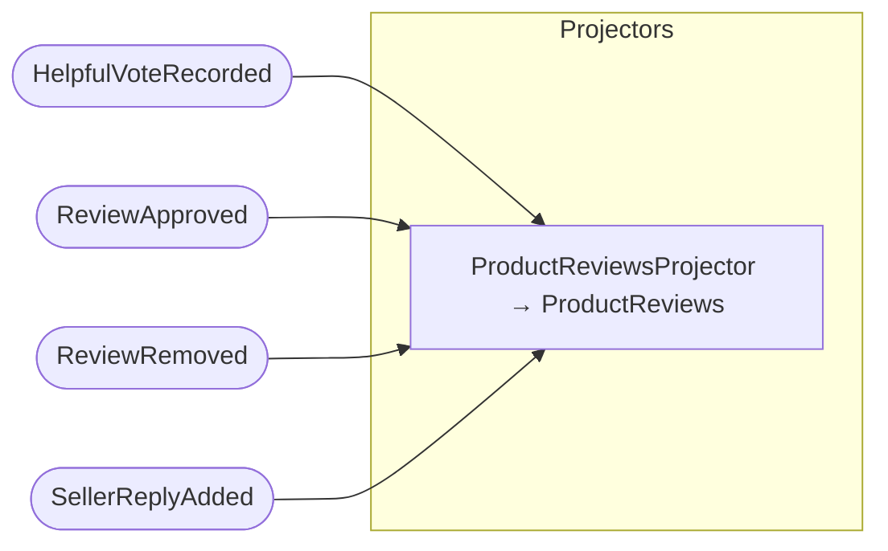
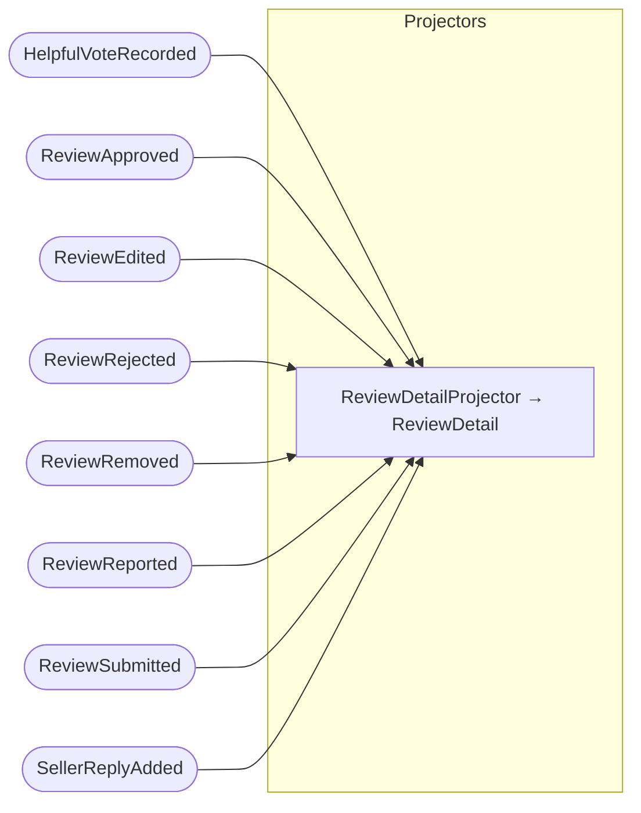

## Command Handlers: Review

## Subscribers

## Projector: CustomerReviews

## Projector: ModerationQueue

## Projector: ProductRating

## Projector: ProductReviews

## Projector: ReviewDetail

