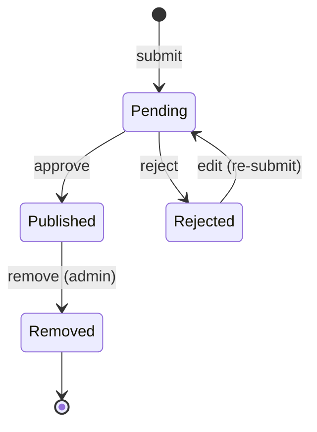
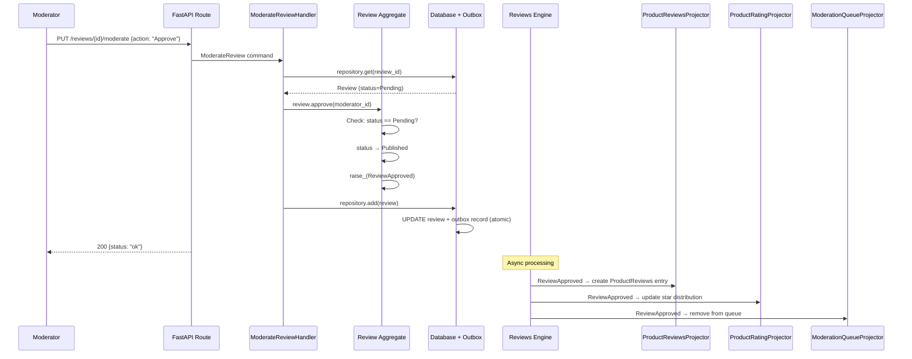

# Review Moderation: Approve and Reject

> A moderator reviews pending submissions and approves or rejects them, controlling
> what appears on the public product page.

## The Story

ShopStream's content team starts their day by opening the moderation dashboard. They
see a queue of pending reviews waiting for approval. They pick up Priya's keyboard
review (submitted yesterday) and read through it. The review is constructive and
on-topic, so they approve it. It immediately appears on the keyboard's product page,
and the product's rating is updated to include the new 4-star score.

Later, they encounter a review that contains profanity and personal attacks on the
seller. They reject it with the reason "Contains inappropriate language." The customer
can edit their review and resubmit it, which sends it back to the queue.

## The Flow: Approval

### 1. API Request

The moderator sends an approval request:

```
PUT /reviews/{review_id}/moderate
{
  "moderator_id": "mod-content-team-01",
  "action": "Approve"
}
```

&rarr; [source](../../src/reviews/api/routes.py) (`moderate_review`)

### 2. Command

The API route creates a `ModerateReview` command:

- **`ModerateReview`** -- the intent to approve or reject a pending review.
- Key data: `review_id`, `moderator_id`, `action` (Approve or Reject), `reason`
  (required for rejection).

&rarr; [source](../../src/reviews/review/moderation.py)

### 3. Aggregate Behavior (Approve)

`ModerateReviewHandler.moderate_review()` loads the review and delegates:

1. Handler loads the Review aggregate from the repository.
2. Since the action is "Approve," calls `review.approve(moderator_id, notes)`.
3. The aggregate's `approve()` method:
   - Validates the state transition: only Pending reviews can be approved.
   - Transitions status from Pending to Published.
   - Records the moderator_id and optional notes.
   - Raises a `ReviewApproved` event with the review_id, product_id, customer_id,
     rating, moderator_id, and timestamp.
4. Handler persists: `repo.add(review)`.

&rarr; [source](../../src/reviews/review/review.py) (`Review.approve`)

**What could fail?**
- Review is not in Pending status (e.g., already approved) &rarr; `ValidationError`.

### 4. Async Reactions (Approve)

The `ReviewApproved` event triggers updates across multiple projections:

| Event | Handled By | Effect |
|-------|-----------|--------|
| `ReviewApproved` | `ProductReviewsProjector` | Creates a `ProductReviews` entry -- the review is now publicly visible |
| `ReviewApproved` | `ProductRatingProjector` | Increments the product's total review count, updates star distribution and average rating. Checks verified_purchase flag to update verified count. |
| `ReviewApproved` | `ModerationQueueProjector` | Removes the `ModerationQueue` entry -- the review is no longer pending |
| `ReviewApproved` | `CustomerReviewsProjector` | Updates the `CustomerReviews` entry status to Published |
| `ReviewApproved` | `ReviewDetailProjector` | Updates the `ReviewDetail` entry status to Published |

This is when the review becomes real for shoppers. Before approval, the review
existed only in the moderation queue and the customer's personal review history.
After approval, it appears on the product page and affects the product's rating.

## The Flow: Rejection

### 1. API Request

The moderator sends a rejection request:

```
PUT /reviews/{review_id}/moderate
{
  "moderator_id": "mod-content-team-01",
  "action": "Reject",
  "reason": "Contains inappropriate language"
}
```

### 2. Aggregate Behavior (Reject)

1. Handler loads the Review, sees action is "Reject."
2. Validates that a reason is provided (required for rejection).
3. Calls `review.reject(moderator_id, reason)`.
4. The aggregate's `reject()` method:
   - Validates the state transition: only Pending reviews can be rejected.
   - Transitions status from Pending to Rejected.
   - Records the moderator_id and reason in moderation_notes.
   - Raises a `ReviewRejected` event.
5. Handler persists.

**What could fail?**
- Rejection without a reason &rarr; `ValidationError`: "Reason is required when rejecting a review."
- Review is not in Pending status &rarr; `ValidationError`.

### 3. Async Reactions (Reject)

| Event | Handled By | Effect |
|-------|-----------|--------|
| `ReviewRejected` | `ModerationQueueProjector` | Removes the `ModerationQueue` entry |
| `ReviewRejected` | `CustomerReviewsProjector` | Updates the `CustomerReviews` entry status to Rejected |
| `ReviewRejected` | `ReviewDetailProjector` | Updates the `ReviewDetail` entry status to Rejected |

Note: `ProductReviews` and `ProductRating` are not affected because the review was
never published.

## The Re-submission Path

After rejection, the customer can edit their review via the `EditReview` command.
The edit:

1. Validates the customer owns the review.
2. Allows partial updates (title, body, rating, pros, cons) using a `_UNSET` sentinel
   pattern -- only fields explicitly provided are changed.
3. Transitions the review from Rejected back to Pending.
4. Raises a `ReviewEdited` event.

The review re-enters the moderation queue for another round of review.



## Sequence Diagram (Approval)



## Edge Cases

| Scenario | What Happens | Why |
|----------|-------------|-----|
| Approve an already-published review | `ValidationError`: invalid state transition | Reviews can only be approved from Pending |
| Reject without a reason | `ValidationError`: "Reason is required when rejecting a review" | Feedback helps the customer understand what to fix |
| Reject an already-rejected review | `ValidationError`: invalid state transition | Reviews can only be rejected from Pending |
| Customer edits a rejected review | Review returns to Pending, re-enters moderation queue | Second chance to improve the review |
| Customer edits a pending review | Edit succeeds, review stays in Pending | Allows pre-moderation corrections |
| Approved review later reported | `ReviewReported` event re-adds it to ModerationQueue with enriched data | Published reviews can still be flagged by the community |
| Moderator queue entry missing for a reported review | ModerationQueueProjector enriches from the aggregate and creates a new entry | Defensive handling for out-of-order events or replay scenarios |
