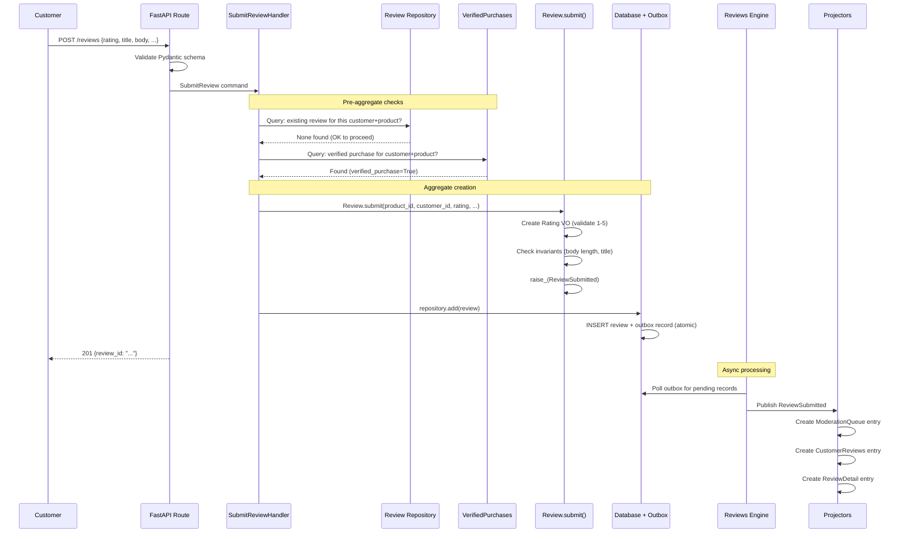

# Submit a Product Review

> A customer who purchased a product writes a review, which enters the moderation queue
> for approval before becoming publicly visible.

## The Story

Priya bought a wireless keyboard from ShopStream two weeks ago. Now that she's used
it daily, she wants to share her experience. She navigates to the product page and
clicks "Write a Review." She gives it 4 out of 5 stars, writes a title and body
describing her experience, lists some pros and cons, and submits.

Behind the scenes, the platform checks two things: (1) Priya hasn't already reviewed
this product, and (2) whether her order was actually delivered (to flag this as a
"verified purchase"). The review enters a moderation queue where a moderator will
approve or reject it before it appears on the product page.

## The Flow

### 1. API Request

The client application sends a review submission request:

```
POST /reviews
{
  "product_id": "prod-keyboard-001",
  "customer_id": "cust-priya-42",
  "rating": 4,
  "title": "Great keyboard, minor quirks",
  "body": "This keyboard has an excellent typing feel and the battery lasts forever. The Bluetooth pairing was a bit finicky at first, but once connected it's rock solid."
}
```

&rarr; [source](../../src/reviews/api/routes.py) (`submit_review`)

The API layer receives a Pydantic `SubmitReviewRequest` and translates it into a
Protean command. This is the anti-corruption boundary: the external schema (Pydantic)
is separate from the internal domain concept (Protean command).

### 2. Command

The API route creates a `SubmitReview` command:

- **`SubmitReview`** -- the intent to create a new product review.
- Key data: `product_id`, `customer_id`, `rating`, `title`, `body`, `pros` (optional
  JSON), `cons` (optional JSON), `images` (optional JSON).

&rarr; [source](../../src/reviews/review/submission.py)

The command is processed synchronously via `current_domain.process(command, asynchronous=False)`.
Protean routes it to `SubmitReviewHandler` based on the `part_of` relationship.

### 3. Handler Logic (Pre-Aggregate Checks)

`SubmitReviewHandler.submit_review()` performs two checks before creating the aggregate:

**One-per-customer-per-product check:**
The handler queries the Review repository to find existing reviews by this customer
for this product. Removed reviews are excluded (a customer can re-review after removal).
If a non-removed review exists, a `ValidationError` is raised.

**Verified purchase lookup:**
The handler queries the `VerifiedPurchases` projection for a record matching the
customer_id and product_id. If found, the review will be flagged as a verified purchase.
This is a local projection -- no cross-domain API call.

&rarr; [source](../../src/reviews/review/submission.py)

### 4. Aggregate Behavior

After passing the checks, the handler delegates to the aggregate's factory method:

1. Calls `Review.submit()` -- the factory method that:
   - Creates a `Rating` value object and validates the score (1-5 range enforced by
     invariant).
   - Constructs the `Review` aggregate with status=Pending and the verified_purchase
     flag.
   - Raises a `ReviewSubmitted` event with all the review data.
2. The handler persists the review: `current_domain.repository_for(Review).add(review)`.
3. Returns the new review's ID.

&rarr; [source](../../src/reviews/review/review.py) (`Review.submit`)

**What invariants are checked?**
- `Rating` validates score is 1-5 (post-invariant).
- `body_minimum_length` validates the body is at least 20 characters.
- `title_must_not_be_empty` validates the title is not whitespace-only.
- `images_cannot_exceed_maximum` validates no more than 5 images.

**What could fail?**
- Rating outside 1-5 range &rarr; `ValidationError` from `Rating` invariant.
- Body too short (&lt;20 chars) &rarr; `ValidationError` from aggregate invariant.
- Empty/whitespace title &rarr; `ValidationError` from aggregate invariant.
- Duplicate review for same product+customer &rarr; `ValidationError` from handler check.
- More than 5 images &rarr; `ValidationError` from aggregate invariant.

### 5. Persistence

The Unit of Work commits the new Review aggregate to the database and writes an
outbox record for the `ReviewSubmitted` event -- both atomically in the same
database transaction. The API returns the review ID to the client.

### 6. Async Reactions

The Reviews Engine's OutboxProcessor picks up the pending outbox record and publishes
the `ReviewSubmitted` event to Redis Streams. Stream subscriptions deliver it to
registered projectors:

| Event | Handled By | Effect |
|-------|-----------|--------|
| `ReviewSubmitted` | `ModerationQueueProjector` | Creates a `ModerationQueue` entry with all review data and status=Pending |
| `ReviewSubmitted` | `CustomerReviewsProjector` | Creates a `CustomerReviews` entry for Priya's review history page |
| `ReviewSubmitted` | `ReviewDetailProjector` | Creates a `ReviewDetail` entry with full review data |

Note: The `ProductReviews` and `ProductRating` projections are _not_ updated yet.
The review is not publicly visible until a moderator approves it.

## Sequence Diagram



## Edge Cases

| Scenario | What Happens | Why |
|----------|-------------|-----|
| Customer already reviewed this product | `ValidationError`: "Customer has already reviewed this product" | One-per-customer-per-product business rule |
| Customer's previous review was removed | New review allowed -- removed reviews are excluded from the check | Customers can re-review after content removal |
| Rating of 0 or 6 | `ValidationError` from `Rating` invariant: score must be 1-5 | Star rating range enforced at the value object level |
| Body with only 10 characters | `ValidationError`: body minimum length is 20 characters | Prevents low-quality one-liner reviews |
| Title is all spaces | `ValidationError`: title must not be empty/whitespace | Ensures reviews have meaningful titles |
| Order delivered but event not yet consumed | Review created without verified purchase flag | Eventually consistent -- the flag is an enhancement, not a gate |
| Customer never purchased the product | Review created with `verified_purchase=False` | Unverified reviews are still allowed, just not badged |
| Projector fails after commit | Event remains in outbox, retried on next poll cycle | At-least-once delivery ensures projections are eventually consistent |
